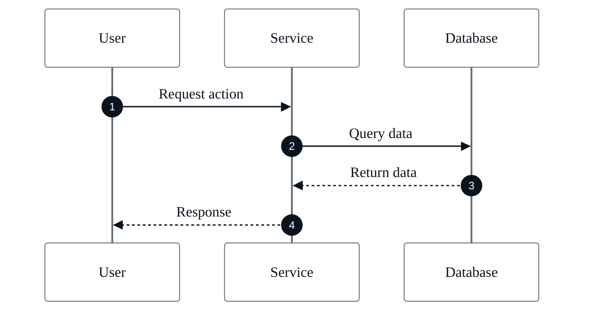
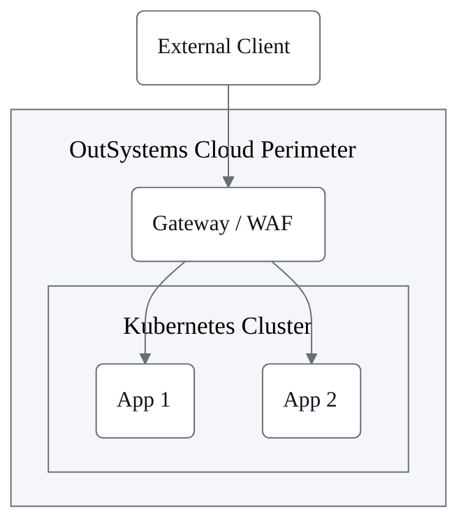
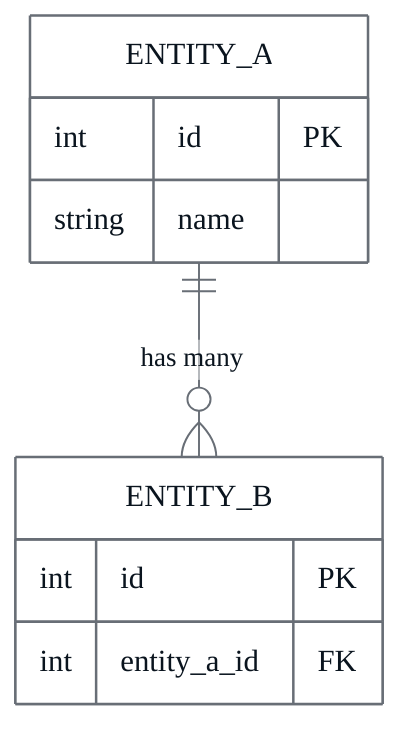
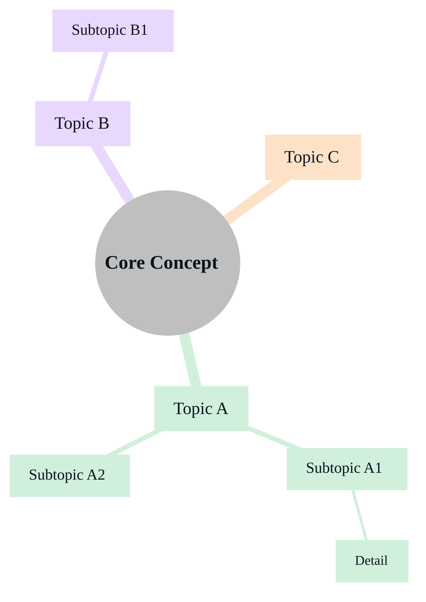

# OutSystems Mermaid brand guidelines

## Color palette

| Token | Hex | Usage |
| --- | --- | --- |
| red | #F22800 | Request arrows, "No" labels, warning/error nodes, icons |
| blue | #1783EF | Response arrows, app/service nodes, secondary elements |
| green | #00802D | Start node, end node, "Yes" labels |
| light-grey1 | #F5F6FA | Container/subgraph backgrounds (zones, clusters) |
| light-grey3 | #979CA2 | Text on connector/arrow labels |
| dark-grey | #686E76 | Arrow color, node borders |
| dark | #0A141E | Primary node text |
| white | #FFFFFF | Node fill (default), canvas background |

## Typography

* Font family: `NotoSans, Helvetica, Arial, sans-serif` — Noto Sans is the OutSystems docs site font; fallbacks are kept in case the renderer doesn't load it. Matching the production font is important for sequence diagrams, where Mermaid pre-calculates note/box widths based on `fontFamily` and the text overflows when the rendered font differs from the calculated one. **Do not write the font name with a space or wrap it in single quotes** (`'Noto Sans'`) — single quotes inside the `%%{init}%%` JSON break the directive parser in some renderers, which silently rejects the entire init block and reverts the diagram to Mermaid defaults.
* Node text: 16px
* Connector label text: 14px — use HTML label syntax (see Edge / Arrow Rules)
* Subgraph / container title: 18px, weight 500 (medium), no wrap, 16px horizontal padding — use HTML span in the subgraph label:
  `subgraph ID["<span style='font-size:18px;font-weight:500;white-space:nowrap;padding:0 16px'>Title</span>"]`
* **Nested subgraphs for containment**: when a concept requires showing a containment hierarchy (e.g. Environment → Zone → Servers), **use nested subgraphs** — do not flatten or restructure away the containment. Instead, fix title visibility by always declaring at least one sibling node _before_ the inner subgraph in the code. Mermaid positions nodes in the order they appear; a sibling node declared first occupies space at the top of the outer container, leaving the outer title visible above it. If the inner subgraph is declared first it fills the container from top-to-bottom and the outer title is obscured.

  Correct pattern — sibling node declared first, **plus `direction TB` inside every nested subgraph** to prevent Mermaid from choosing a horizontal auto-layout for the subgraph's children:

  ```
  subgraph ENV["<span style='...'>OutSystems Environment</span>"]
      direction TB
      DC(Deployment Controller):::process
      subgraph ZONE["<span style='...'>Default Deployment Zone</span>"]
          direction TB
          LB(Load Balancer):::process
          S1(Front-end Server 1):::process
      end
  end
  DC --> LB
  LB --> S1
  ```

  Without `direction TB` inside the subgraphs, Mermaid places the sibling node and the inner subgraph side-by-side horizontally even in a `flowchart TB` diagram — which makes both titles hard to read. Adding `direction TB` forces a top-to-bottom stack within each subgraph container.
* Sequence diagram message labels: 14px — add `"messageFontSize": "14px"` to the sequence diagram init block `themeVariables`
* Sequence diagram notes (`Note over`, `Note left of`, `Note right of`): override Mermaid's default yellow background by adding `"noteBkgColor": "#F5F6FA"`, `"noteBorderColor": "#686E76"`, and `"noteTextColor": "#0A141E"` to the init block `themeVariables`
* Mindmap font sizes by depth — wrap each label in an HTML span:
    * Root node: 20px bold — `(("<b style='font-size:20px'>Label</b>"))`
    * Level 1 (direct branches): 18px — `["<span style='font-size:18px'>Label</span>"]`
    * Level 2 (sub-branches): 16px — `["<span style='font-size:16px'>Label</span>"]`
    * Level 3+: 14px — `["<span style='font-size:14px'>Label</span>"]`
  Set distinct branch colors via `cScale` variables in the mindmap init block — see Mindmap recipe. **Do NOT rely on Mermaid auto-coloring** when `primaryColor` is overridden; it does not produce distinct colors in that context.

## Negative constraints

* NO shading, gradients, texture, or photorealism
* NO 3D effects; maintain a flat, clean, vector-style aesthetic

---

## Standard init block

Use this at the top of EVERY diagram:

```
%%{init: {
  "theme": "base",
  "themeVariables": {
    "primaryColor": "#FFFFFF",
    "primaryTextColor": "#0A141E",
    "primaryBorderColor": "#686E76",
    "lineColor": "#686E76",
    "secondaryColor": "#F5F6FA",
    "tertiaryColor": "#F5F6FA",
    "edgeLabelBackground": "#FFFFFF",
    "fontFamily": "NotoSans, Helvetica, Arial, sans-serif",
    "fontSize": "16px",
    "clusterBkg": "#F5F6FA",
    "clusterBorder": "#686E76",
    "nodeBorder": "#686E76"
  },
  "flowchart": {
    "subGraphTitleMargin": {"top": 16, "bottom": 16}
  }
}}%%
```

---

## Node style classes (flowchart / graph)

Define these classDefs at the top of every flowchart:

```
classDef start      fill:#00802D,stroke:#00802D,color:#FFFFFF
classDef stop       fill:#00802D,stroke:#00802D,color:#FFFFFF
classDef process    fill:#FFFFFF,stroke:#686E76,color:#0A141E
classDef decision   fill:#1783EF,stroke:#1783EF,color:#FFFFFF
classDef container  fill:#F5F6FA,stroke:#686E76,color:#0A141E
classDef error      fill:#F22800,stroke:#F22800,color:#FFFFFF
```

Apply them with: `class NodeId className`

### Node shapes

Use rounded shapes for `process` nodes — write `NodeId(Label):::process` instead of `NodeId[Label]:::process`. This gives process nodes rounded corners consistently across all diagram types.

* `NodeId(Label)` — rounded rectangle, use for all `:::process` nodes
* `NodeId([Label])` — stadium / pill, use for `:::start` and `:::stop` nodes
* `NodeId{Label}` — diamond, use for `:::decision` nodes
* `NodeId[Label]` — sharp rectangle, reserved for external system or data-store nodes when a visual distinction is needed

### Semantic color rules

Each class has a fixed semantic meaning — do not repurpose colors to indicate state:

| Class | When to use | When NOT to use |
| --- | --- | --- |
| `:::start` / `:::stop` | The literal entry or exit point of a process flow | Healthy or active component nodes in architecture diagrams |
| `:::error` | A failure or error outcome in a process flow (e.g. "Authentication failed", "Return 404") | Unavailable, inactive, or deprecated component nodes in architecture diagrams |
| `:::decision` | A branching decision point | Any non-branching node |
| `:::process` | All regular component, service, server, and step nodes — regardless of their operational state | — |

To show that a component is unavailable in an architecture diagram, use a dashed border or dashed arrows (`-.->`) and describe the state in a node label (e.g. `S2(Server 2 — offline):::process`) rather than changing the node color.

---

## Edge / arrow rules

* Default arrows: color `#686E76` (handled by `lineColor` in themeVariables)
* Request/action arrows: label text in `#979CA2`; add `%% red flow` comment for semantic clarity
* Response arrows: label text in `#979CA2`; add `%% blue flow` comment
* Yes/No labels on decision branches:
    * Yes → `|Yes|` with green-styled target node
    * No → `|No|` with red-styled target node (error/warning class)
* Connector label font size: 14px — wrap the label in an HTML span:
  `-->|"<span style='font-size:14px'>label text</span>"|`

### Cross-subgraph edge labels — avoid

When an arrow connects nodes in **different subgraphs** (e.g. Load Balancer → App Server, or Public Zone → Private Zone), the edge label renders at the midpoint of the arrow, which often coincides with the subgraph border and causes visual overlap.

**Rule: do not add text labels to edges that cross a subgraph boundary.**

If the relationship must be described, use one of these alternatives:

* Describe it in the surrounding prose instead of on the arrow
* Add a single-word label maximum (anything longer overlaps badly)
* Route the connection through an intermediate relay node placed _outside_ both subgraphs, and label that node instead of the edge

---

## Diagram-type recipes

### Flowchart (process / hierarchy)

```mermaid
%%{init: {"theme": "base", "themeVariables": {"primaryColor": "#FFFFFF","primaryTextColor": "#0A141E","primaryBorderColor": "#686E76","lineColor": "#686E76","secondaryColor": "#F5F6FA","fontFamily": "NotoSans, Helvetica, Arial, sans-serif","fontSize": "16px","clusterBkg": "#F5F6FA","clusterBorder": "#686E76"}, "flowchart": {"subGraphTitleMargin": {"top": 16, "bottom": 16}}}}%%
flowchart TD
    classDef start    fill:#00802D,stroke:#00802D,color:#FFFFFF
    classDef stop     fill:#00802D,stroke:#00802D,color:#FFFFFF
    classDef process  fill:#FFFFFF,stroke:#686E76,color:#0A141E
    classDef decision fill:#1783EF,stroke:#1783EF,color:#FFFFFF

    S([Start]):::start --> A(Step One):::process
    A --> B{Is condition met?}:::decision
    B -->|"<span style='font-size:14px'>Yes</span>"| C(Path A):::process
    B -->|"<span style='font-size:14px'>No</span>"|  D(Path B):::process
    C --> E([End]):::stop
    D --> E
```

### Sequence diagram (multi-actor interaction)

When using `autonumber`, add `"labelBoxBkgColor": "#F22800"` and `"labelTextColor": "#FFFFFF"` to themeVariables so the numbered circles render in OutSystems red with white text. Always include `noteBkgColor`, `noteBorderColor`, and `noteTextColor` so `Note over` boxes use the OutSystems palette instead of Mermaid's default yellow.

Some Mermaid renderers (notably VS Code's built-in Markdown preview) ignore these theme variables. Include a `themeCSS` block that targets the underlying CSS classes as a defensive override — it wins where theme variables don't.



### Architecture / infrastructure

Use `:::process` (grey border, rounded) for all component nodes. Use dashed arrows (`-.->`) and descriptive labels to indicate unavailable components — do not use `:::error` for component state.



### Entity - relationship (data model)



### Mindmap (concept hierarchy / remember)

Use HTML spans to set font size by depth. Set distinct branch colors explicitly via `cScale` variables — do **not** rely on Mermaid auto-coloring when `primaryColor` is overridden.



The five `cScale` values map to branches 0–4 in order of appearance. Add `cScale5`–`cScale9` if the mindmap has more than five top-level branches, using the same pastel palette logic.
