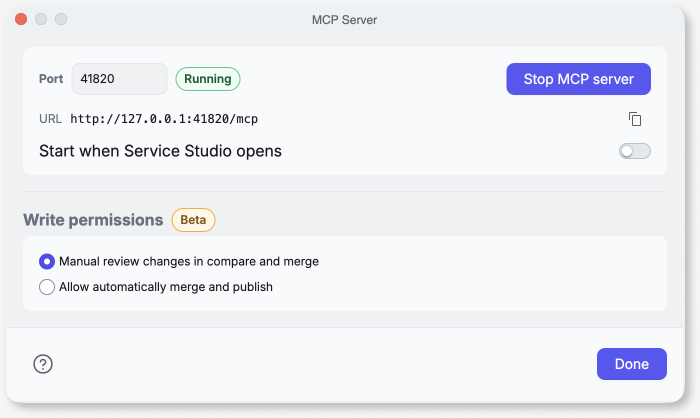

# Get started with OutSystems MCP

This page shows you how to start using OutSystems MCP in OutSystems 11 (O11). You install the OutSystems skill for O11 in your MCP host, start the Service Studio MCP server, and register the server in your MCP host. Then you approve the connection and confirm it with a first request about the module you have open. After that, the agent in your MCP host reads and changes that module for you.

The Service Studio MCP server runs inside Service Studio on your machine, so the whole setup happens locally. Each MCP host keeps its own MCP configuration, so you register the server once per MCP host. Service Studio then asks you to approve each new session. The troubleshooting section covers what to check when a first request returns no module content.

## Prerequisites

Before you connect, gather the following:

* An MCP host installed. Refer to [Supported MCP hosts](outsystems-mcp-overview.md#supported-mcp-hosts).
* Service Studio 11.55.91 or later running, with the module you want to work on open.
* Network access for your MCP host's own connection to its model provider. The module itself stays on your machine.

## Install the OutSystems skill for O11

OutSystems recommends that you install the OutSystems skill for O11 before you connect your MCP host. The skill provides the agent with the Model API contract and instructions for the Service Studio MCP server tools. Without the skill, the agent calls the tools without those instructions, which leads to failed requests and incorrect changes.

The skill is publicly available in the [outsystems11-mcp](https://github.com/OutSystems/outsystems11-mcp) repository on GitHub. To install it, follow the instructions in the repository's README for your MCP host.

## Start the Service Studio MCP server

You start the Service Studio MCP server from the app list or from a module you have open. To start the server, follow these steps:

1. In Service Studio, go to the **Edit** menu > **MCP Server**. The **MCP Server** window opens.
1. Select **Start MCP server**. The port status changes to **Running**, and the button changes to **Stop MCP server**.

The same window has two more settings:

* **Start when Service Studio opens:** Starts the Service Studio MCP server every time you open Service Studio, in place of starting it manually each session.
* **Write permissions:** Sets how a change from the agent reaches the module. **Manual review changes in compare and merge**, the default, routes every change through the **Compare and Merge** window. **Allow automatically merge and publish** merges a change without that review. Write capabilities are Beta Features. For the details of each setting, refer to [Write review](security-data-handling.md#write-review).

## Register the server in your MCP host

Your MCP host connects to the Service Studio MCP server through an entry in the MCP configuration of your MCP host. Each MCP host stores this configuration in a different file.

The **URL** field of the **MCP Server** window shows the endpoint to register, in the form `http://127.0.0.1:PORT/mcp`. Replace `PORT` with the port number that the **MCP Server** window shows. For more information about how the port is set, refer to [Local endpoint and port](outsystems-mcp-overview.md#local-endpoint-and-port).

To register the endpoint, follow the instructions for your MCP host in the README of the [outsystems11-mcp](https://github.com/OutSystems/outsystems11-mcp) repository.

## Authorize the connection

When the agent in your MCP host starts a new session, Service Studio shows the **Allow AI agent to connect?** dialog. Select **Allow** to let the agent proceed for that session. For more information about approval on reconnect, refer to [Connection approval](outsystems-mcp-overview.md#connection-approval).

## Verify the connection

To confirm the connection works, ask the agent to summarize the open module. For example:

* "Summarize the module open in Service Studio."

A summary confirms that the registration and the approval both succeeded, because the agent needs both to reach the module and read it. If the agent responds without any module content, or reports that it can't find a module, open a module in Service Studio and ask again.

## Troubleshoot a first connection

A connection failure has two common causes: the Service Studio MCP server isn't running, or your MCP host points at the wrong port. A `ConnectionRefused` error at the registered endpoint confirms one of these causes.

If your MCP host reports that it can't find the server, confirm the following:

1. The Service Studio MCP server is running.
1. The port in your MCP host matches the port in the **MCP Server** window.

To start the server every time you open Service Studio, turn on **Start when Service Studio opens**.

## Next steps

After you complete these steps, the agent in your MCP host reads the module you have open and changes it according to your **Write permissions** setting. To ask the agent about a module, refer to [Understand a module](understand-a-module.md). For reusable prompts, refer to [Prompt blueprints](prompt-blueprints.md).
