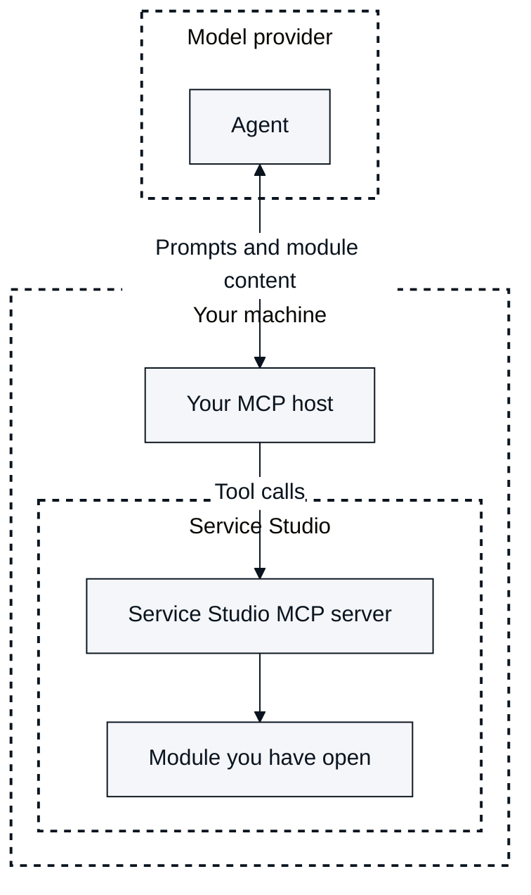

# OutSystems MCP

OutSystems MCP in OutSystems 11 (O11) connects the AI application you work in to the module you have open in Service Studio. You ask the AI agent in that application to explain, analyze, or change the module. OutSystems MCP works on applications you've already built in O11.

OutSystems MCP is also known as OutSystems Agent Experience. For more information about the names, refer to [Agentic development terminology](agentic-development-terminology.md).

OutSystems MCP uses the Model Context Protocol (MCP), an open protocol that connects AI applications to external tools. Two MCP terms describe your side of the connection:

* **MCP host:** The AI application you work in.
* **Agent:** The AI model that your MCP host uses. The agent interprets your requests and calls OutSystems tools.

OutSystems MCP in O11 has two parts:

* **Service Studio MCP server:** A local MCP server that runs inside Service Studio on your machine. It reads the module you have open and applies the agent's changes to a copy of the module.
* **OutSystems skill for O11:** Instructions that tell the agent how to use the Service Studio MCP server tools and how to write changes with the OutSystems Model API. Your MCP host loads the skill.

By default, a change from the agent reaches the module only after you review it in the **Compare and Merge** window.

The pages in this section cover connecting an MCP host, understanding a module, the capabilities of OutSystems MCP, reusable prompts, and security and data handling. For the terms these pages use, refer to [Agentic development terminology](agentic-development-terminology.md). For more information about how OutSystems MCP in O11 differs from ODC, refer to [OutSystems MCP in O11 and ODC](compare-o11-odc.md).

The following diagram shows how a request reaches your module and where data leaves your machine. Your MCP host exchanges prompts and module content with the agent through its model provider. The MCP host passes the agent's tool calls to the Service Studio MCP server, which reads the module you have open.

## Local endpoint and port

The Service Studio MCP server listens on a local endpoint that your MCP host connects to. This section explains how the port of that endpoint works.

The server accepts connections only on the loopback address, `127.0.0.1`. You configure the port in the **MCP Server** window, within the range 10000-49151. The default port is 41820. If the configured port is in use, Service Studio uses the next available port in that range. Because the port can change, the **MCP Server** window shows the endpoint that is valid for the current session. For the steps to read and register it, refer to [Register the server in your MCP host](get-started.md#register-the-server-in-your-mcp-host).

## MCP host and agent roles

The MCP host is the AI application where you type a request and read the response. The MCP host sends your requests to the agent and passes the agent's tool calls to MCP servers. It also manages your session and holds the MCP configuration that points to the Service Studio MCP server.

The agent is the AI model that your MCP host uses through its model provider. When you ask about a module, the agent selects which OutSystems tools to call, reads the results, and reports back to you in plain language. The OutSystems skill for O11 instructs the agent how to sequence those tools.

## Supported MCP hosts

The following MCP hosts have documented setup for the Service Studio MCP server. All of them connect to the same local server.

* Claude Code
* Codex
* Cursor
* GitHub Copilot
* Google Antigravity
* Kiro

Any other MCP-compatible host connects on a best-effort basis, without documented setup.

Each MCP host reads its instructions and its MCP configuration from a different location on your machine, because no single file format covers every MCP host. For the registration steps, refer to [Register the server in your MCP host](get-started.md#register-the-server-in-your-mcp-host).

## Environment fit

The Service Studio MCP server runs inside Service Studio on your machine, using the O11 installation you already have. OutSystems MCP works for cloud, on-premises, and air-gapped O11 environments.

Your MCP host connects to the Service Studio MCP server over your machine's loopback address. The connection works the same way on an open network and on an isolated one.

## Connection approval

Service Studio asks you to approve the connection when your MCP host starts a new agent session, before the agent reads or changes the module. The **Allow AI agent to connect?** dialog shows the agent name that your MCP host reports. Service Studio doesn't verify that name, so select **Allow** only for a session you started.

Reconnecting an already-approved session reuses that approval, so the dialog appears again only when a new session starts.

## Capability status

OutSystems MCP in O11 has two capability statuses. Reads are Generally Available. Write capabilities are Beta Features.

The write capabilities are the changes the agent makes to a module, and the actions that merge, reset, refresh references in, and publish a module. OutSystems provides Beta Features to collect customer feedback on non-final capabilities. A Beta Feature can change significantly, including through breaking changes, or OutSystems can discontinue it. For the terms that apply, refer to the [OutSystems Beta Features Agreement](https://www.outsystems.com/legal/beta-features-agreement).

The OutSystems skill for O11 instructs the agent to tell you when it first uses a write capability in a conversation. The agent states that the capability is a Beta Feature and shares a link to the agreement.

## Data residency

Your module files stay on your machine when you use OutSystems MCP in O11. Module content that the agent reads leaves your machine in your MCP host's calls to its model provider, and Service Studio sends telemetry to OutSystems. For the full data flow, refer to [Data flow](security-data-handling.md#data-flow).

## Next steps

Connect your MCP host first, then ask the agent about the module you have open. For example:

* "Walk me through what this module does and how it's structured."

For the connection steps, refer to [Get started with OutSystems MCP](get-started.md).
