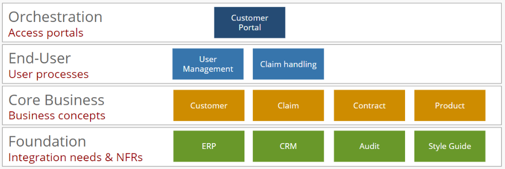
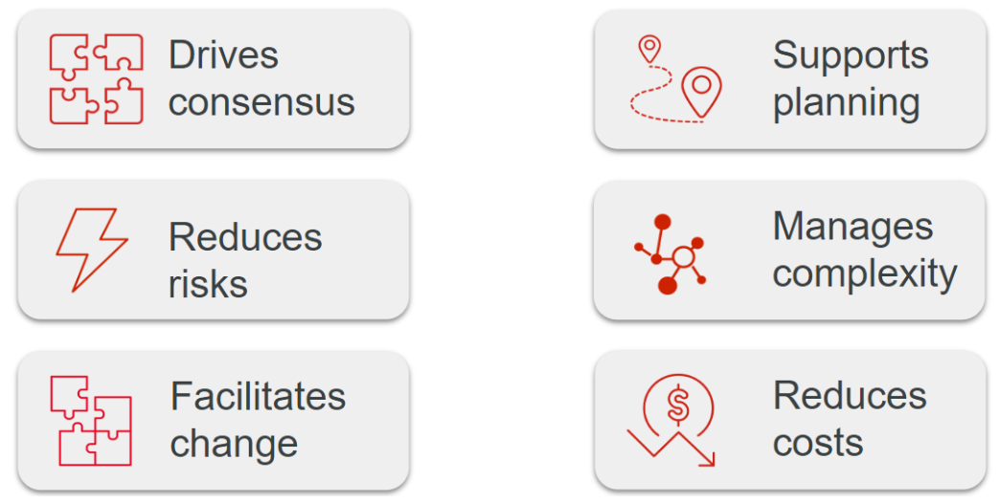
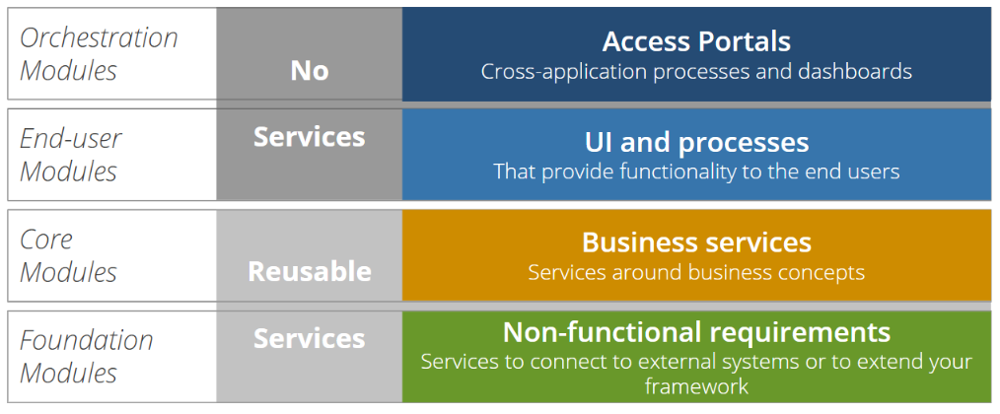
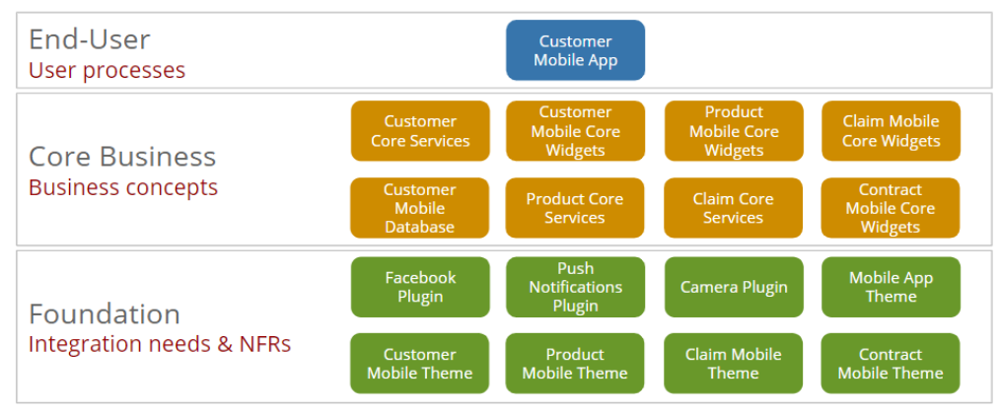
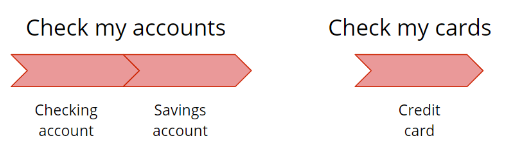
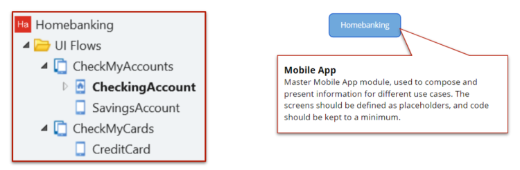
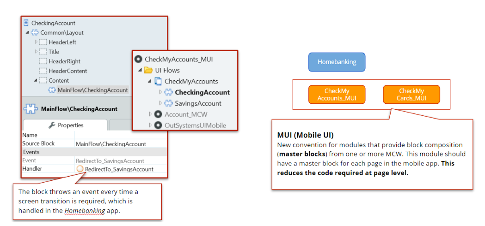
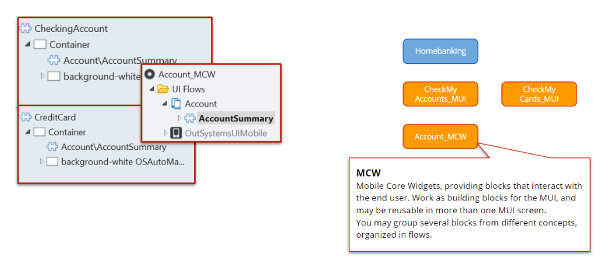

# Best practices for mobile architecture

The first step for your success is to understand the Architectural changes of a mobile application.

If you’ve had the chance to work with OutSystems in the past or have been exposed to some of our documentation, you might have heard about the Architecture Canvas. This canvas is the usual starting point of an application, from an architecture point of view.

This canvas clearly identifies what you should place in each one of the layers, making sure that you’re able to take advantage of the following aspects:

**We saw a sample of the canvas for a web application. Is this canvas different in a mobile application?**

The short answer is no; the long answer is yes.

* No, the canvas isn’t different, and the same layers apply to a mobile application:

    

* Yes, there are some differences in the way we create the modules for a mobile application:

    * First of all, we don’t use orchestration modules, as it doesn’t make sense in a mobile context since we won’t have cross-application processes or dashboards.

    * Secondly, we have slight changes on the naming conventions we use. For instance, instead of using the regular Core Services nomenclature, we try to prefix these with Mobile, so a Core Services (_CS) module would become a Mobile Core Services (_MCS) module in mobile.

    We have a dedicated module (or modules) for local storage, usually following the Mobile Database (_MDB) naming convention.

**But the biggest difference is that we only have one End-User Module.**

## Why just a single End-User Module?

Mobile applications are very UI-based applications. They’re very visual and very interactive, so performance is important. To maximize the performance of mobile applications, we follow the recommendation to have a single End-User Module.

This is related to the fact that our mobile applications follow a Single Application Page (SPA) approach.

Jumping from one SPA to another has a significant impact on the performance of applications, since several resources that they need have to be loaded, calculated, and pre-fetched.

Now imagine a mobile application scenario where, along with that, there is the need for offline scenarios, specific authentication, support of plugins, etc.

Does this mean that we’ll need to have all our content mixed together, even if we have different concepts involved? Of course it doesn’t.

The usual approach that we recommend is to have all the screens inside the End-User Module, but not the actual content of the screens. What? No content? That’s right. Screens in mobile should act as placeholders of information. All the content (and eventual logic) should be placed inside blocks that are public and that will be consumed in each screen of the End-User Module.

These blocks should be part of our Mobile Core Widgets (_MCW) modules, which are part of the Core Modules Layer in our architecture canvas:

Notice that in this example we have four different theme modules. This is a common scenario in big mobile applications.

This allows each team responsible for their own Mobile Core Widgets to have their own Theme, which they can edit and affect without having any impact on the other teams. At the same time, the other teams will not impact the UI of this team’s blocks.

There’s still a factory theme (in this case it’s the module called Mobile App Theme), but there are more specialized modules for each business line approached in the Mobile Core Widgets Modules.

## A real scenario Example

In more complex scenarios, we can use another type of module, the MUI (Mobile UI) that allows the composition of more than one MCW module.

As an example, let’s discuss a home banking scenario. Let’s say we have two main business use cases: checking the accounts and checking the card information.

We’ll start by evaluating the required elements in the End-User Modules layer and, as previously mentioned, we will only place one single module here.

In this example, we will use the aforementioned MUI modules to compose the blocks from the MCW modules. The goal is to make sure MUI modules have the exact content that will be displayed in the screens of the End-User Module.

So, as previously mentioned, the goal for the MCW modules is to provide blocks that will act as building blocks for the MUI modules. They should be separated into concepts, but for the sake of this example we will use a single MCW module.

