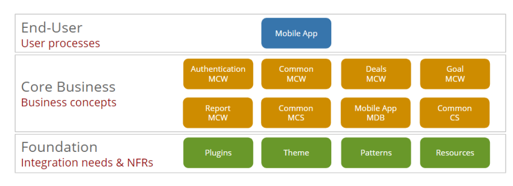
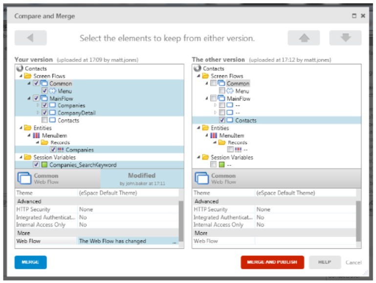
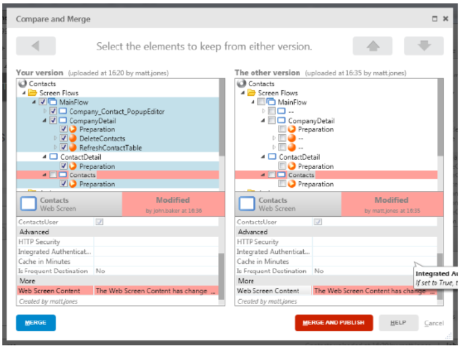
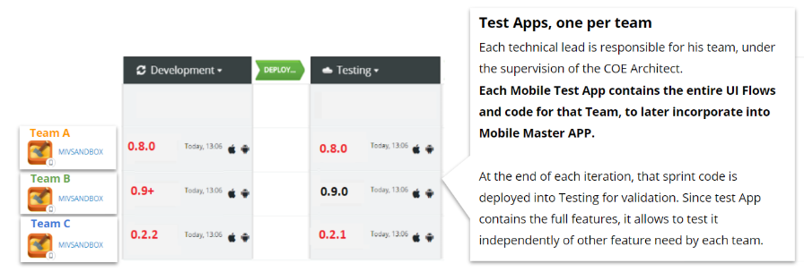
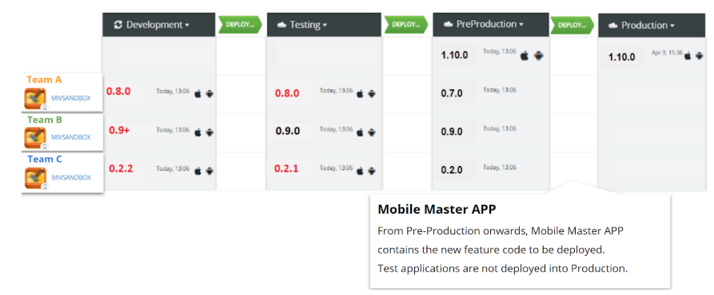
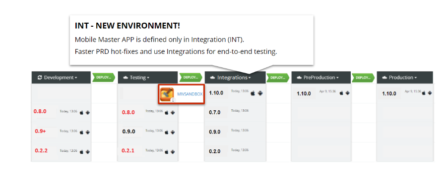

# Best practices for mobile development

## Use blocks for screen content

The best practice for mobile application development is to have a single End-User module with all the application's screens.

This doesn't mean that all the content and logic associated with screens needs to be done on that module, nor that the developers work in the same module if they want to change the screens.

The way to minimize the impact of this single End-User module is to make sure screens only act as placeholders of information and the actual content (and eventual logic) is developed inside blocks that will be part of the Mobile Core Widgets (MCW) modules.

In more complex scenarios, the Mobile UI modules (MUI) can provide block composition (master blocks) from one or more MCW, reducing the code required at the page level.

This way, the developers only need to develop the content/logic inside these particular modules.

## Separate modules by their concepts

We can have Mobile Core Widgets modules and Mobile UI modules with the blocks that will have the content/logic associated with the screens of our application.

**Doesn’t that mean that the developers will have problems in this Core Business layer instead of having them in the End-User layer?**

No. The idea is that modules should be separated by concept. Let’s say that we have an application with customer information and also products.

We can have a Customer Mobile Core Widgets module but also a Products Core Widgets module. This way, we guarantee that blocks related to customer screens belong to the Customer module and blocks related to product screens belong to the Products Core Widgets module.

**What if we have blocks/logic that applies to more than one concept?**

In that case, similar to the recommendation in the architecture designs, we can have a third Core Widgets module so this block (or set of blocks) isn’t tied to one particular concept. A usual scenario is having a Common Core Widgets module where blocks related to more than one concept are placed.

The following image shows us a real example of this. This example belongs to a customer, so for security purposes the name of some modules have been changed to hide internal information.

This means that developers working on the customer blocks will not clash into developers working into the common blocks or the product blocks.

## Communication, Communication, Communication

Even with all of this best practices there’s still a chance that we’ll have developers clashing into each other if they are working in the same concept.

For that we have the visual merging tool, similar to the one that you might be familiar with from the traditional web development.

This tool allows you to merge your work with another developer and is a great way to identify changes and see what has been affected in each one of the versions, allowing you to select one of the versions to keep.

**What happens if I’m working in the same module as another developer and we both change the same content?**

If a conflict occurs, you’ll still need to select one of the versions to keep, while the other will be lost. This means that if you don’t define priorities or if you don’t understand what was done in both versions, some work might be lost.

**That’s why good communication is crucial when dealing with these scenarios.**

Let’s imagine the above-mentioned scenario. If both developers had communicated well, the visual merge that we see could have been completely avoided.

The first developer simply needed to say something in the lines of, "I’ll be working on the contacts screen, please let me publish before changing anything." After the first developer publishes, the second developer would open the current running version and make the changes he needed to make to this screen, avoiding the conflict we see.

Obviously, this scenario also applies to blocks, as we’ve been analyzing.

## Denormalize your local storage

When developing a mobile app, it is very important to have a small number of local storage entities, to help with the application performance, but also to speed up the synchronization processes. But it is also very important to denormalize the entities that we have.

Our recommendation is that your define the local entities per screen use case.

Also, join operations are very inefficient in these tables, so we should really denormalize the information that we store in them. Instead of keeping a foreign key, let’s keep the label of the field that we’re trying to fetch, or any other relevant information. Instead of fetching the additional details of a person through a join, copy it directly to the table that you are joining with.

**Won’t denormalizing the entities increase the synchronization time?**

Yes. Most likely doing so might indeed increase the synchronization time.

That being said, synchronization should be done in screens that are acceptable to take a few seconds to load (for example, Splash screens), so even if somehow the denormalization affects the time that one of these screens takes to load, the benefit in the performance of our application, throughout all the other screens, is bigger than the loss.

## Use Sandboxes

Along with the scenarios we’ve been covering, there are also more complex scenarios where it is really convenient to have sandboxes that reproduce the UI, information, and logic that is being tested.

If a specific functionality is being thoroughly tested, or if several iterations need to be done, instead of forcing members of other teams to constantly merge their code or to be affected by your work, doing it in a sandbox guarantees that not only will it not affect any other person’s work, but also that your work will not be affected by any external change.

It also gives you an opportunity to independently test your features before putting them alongside all the other teams’ features.

**Be aware that these sandboxes need to be pushed along with the other modules we’re publishing in the new environment.**

But something very important to remember is that these sandboxes should **not** be pushed to the production environment.

Since these are test applications, it makes sense to have them in all non-productive environments, but we only want to have the final product in production.

Here are two examples on how to do it:

* **Example 1**  

    

    In this situation, we have a test app (or sandbox) per team. Since we need to test these sandboxes independently in the new environments to validate the new features, they need to be published along with the "normal" application.

    

    **In this scenario, the deployment lifecycle of the sandbox applications is Development → Testing → Pre-Production.**

    **For the mobile application, the deployment lifecycle is Pre-Production → Production.**

* **Example 2**
    

   In this scenario, there's a new environment, called Integrations, that has the responsibility of converting the screens and logic of the sandbox applications into the actual mobile application.

   This example has the advantage of having an additional environment similar to production (pre-production), allowing for easier troubleshooting and hot-fixing.
