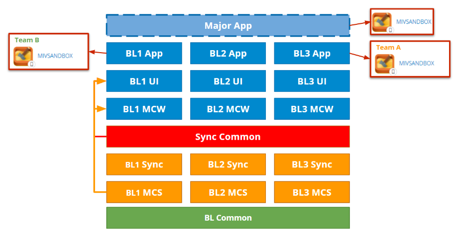
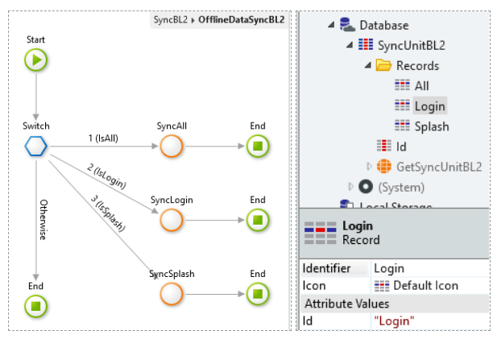
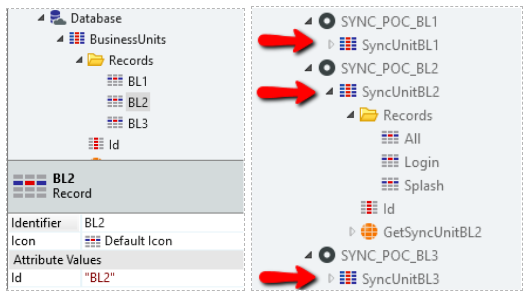
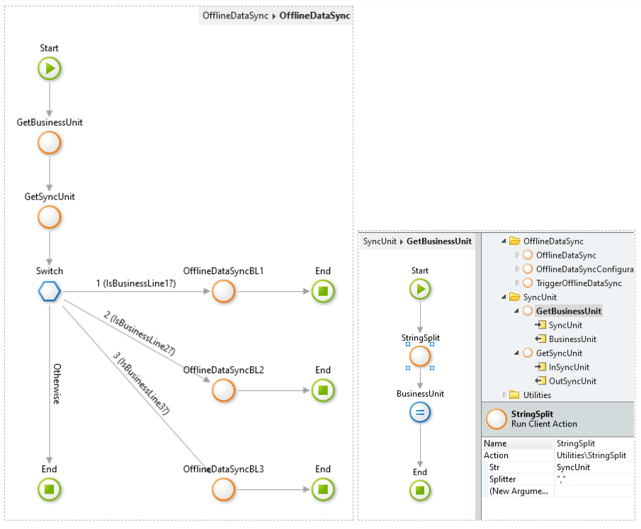
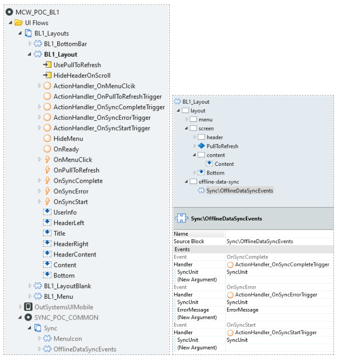
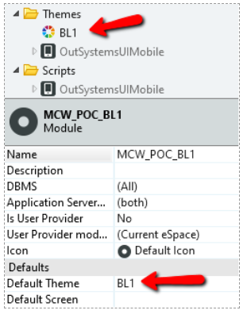
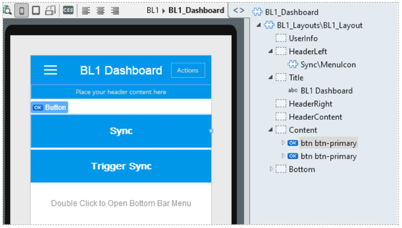
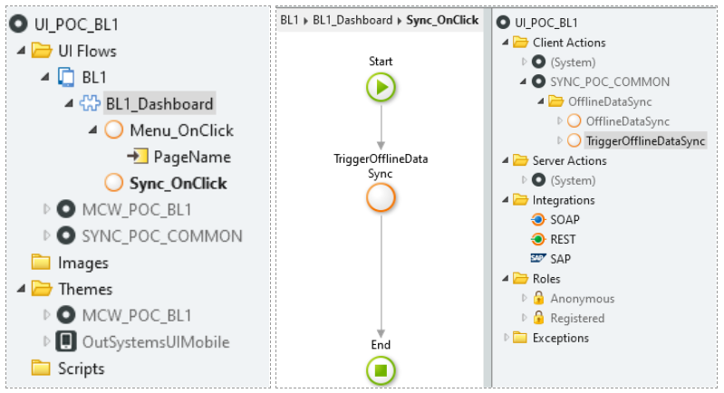
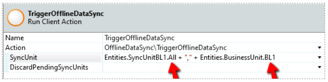
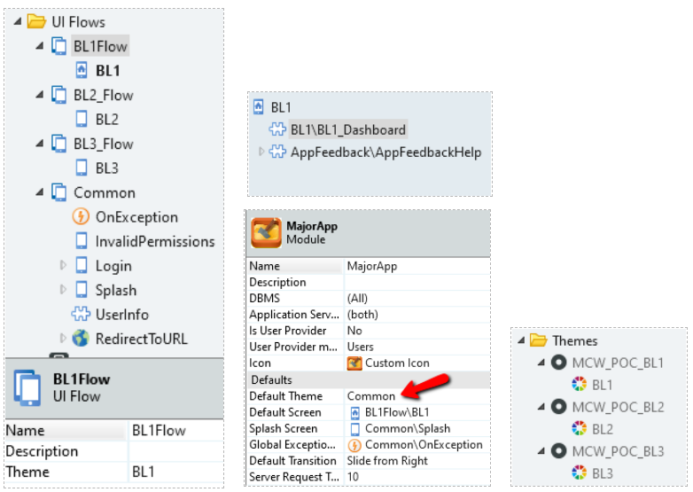

# Best practices with multiple teams

Now that you know about the best practices on mobile, let's see an end-to-end example of an app that has these best practices:

We can see that we will have the several layers organized by nature of functionality for each team.

From bottom to top we will have:

* **BL Common (Common for All Business Lines)**

    All common CS and MCS will live here, along with plugins, integration services, and the common mobile theme. These are foundation layer elements and core services with logic that the application will use and that are common to each team.

* **BL MCS (Mobile Core Services for each Business Line)**

    Where the LocalDataBase is managed. CRUD actions and business logic are created here. It will be used as a wrapper to compute and filter information from the CS server actions. Each team should have their own independent MCS in order to avoid conflicts with other teams.

* **BL Sync (Synchronization Process for each Business Line)**

    The synchronization process actions for a specific team will be managed independently here. This is where the SyncUnits for that team will be defined and made public to be used by the Sync Common and upper modules; for instance, (Login, Splash, All).

    

* **Sync Common (Common Synchronization process for all Business Lines)**

    This can be seen as the synchronization orchestrator.

    It will define a SyncUnit for each team (Business Line). At this level will be a BusinessUnit, and according to that, it will synchronize the requested SyncUnit for a specific team.

    

    In the architecture above we could define the SyncUnits at this level as BL1, BL2, and BL3. If the application requests the **login synchronization** moment for only the **BL1 team**, we would have for instance **"Login,BL1"** to identify it and the OfflineDataSync action of this module would call the OfflineDataSync action from the BL1 Sync module with "Login_BL1" as sync unit.

    

* **BL MCW (Mobile Core Widgets for each Business Line)**

    Where the layouts are defined, each can define their own layout here. The layout will use the OfflineDataSyncEvents from the Sync_Common module and manage the events in order to trigger them to the upper level.

    The blocks used to build each screen are also placed in this module. If a specific action triggers a navigation to another screen, an event for that will have to be triggered and pushed until the final layer, which then will perform the navigation between screens.

    

    This module will also define the specific theme for each team. That way, each team can have their own stylesheet with CSS that is not shared with the other teams and limit the merge between themes.

    

* **BL MUI (Mobile User Interface for each Business Line)**

    Used to create main blocks as wrappers for the screens. These blocks will use the layout and content blocks from the **BL MCW** module. Basically, these main blocks will be your screen.

    Screen navigation events triggered by the MCW layer will also have to be triggered here. The upper layer will then catch them and perform the navigation according to each specific event.

    

    

    

    The example above shows how the action triggers a synchronization process; in this case, it will call the process related to the SyncUnit All of the Business Line 1. The Sync Common will then filter the SyncUnit in the OfflineDataSync action and decide which specific synchronization process will execute.

* **BL App (Sandpox Application for each Business Line)**

    This module implements the mobile app for each team. It has the screens and uses the blocks from the BL UI module. The screen navigation is done at this level.

    This can be seen as a sandbox to isolate each business line and perform tests independently in order to facilitate the identification of issues and fix them. These sandbox modules should not be pushed to production.

* **Major App**

    This is the main application that will make each Business Line work.

    Each Business Line will be separated by its own UI flow that will use a specific theme. You can think of this module as the one that connects the UI from each team and will be the actual application.

    

    The Major Application module will have as default theme the common theme defined at the BL Common level. Each Business Line theme also depends on that common theme, so we can isolate the different Business Lines in flows with different themes, all depending on the same one.

    The generic OnException handler will also be declared here. The exceptions generated by the lower levels will be caught here and treated according to their type.

And that's it. You have an application prepared for multiple team development.

Take all this information to the practice, by downloading [this sample](resources/multiple-bl.oap) that we prepared for you.

