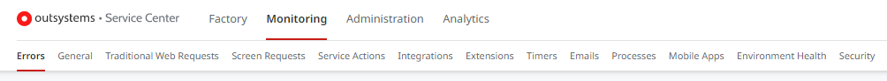
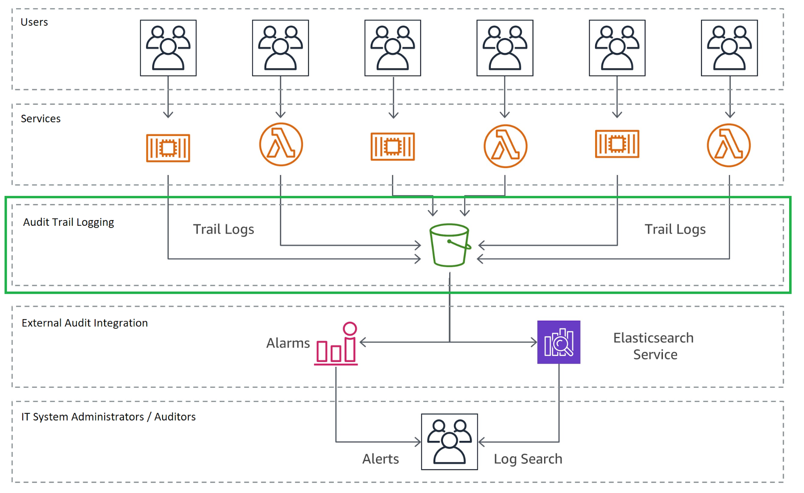
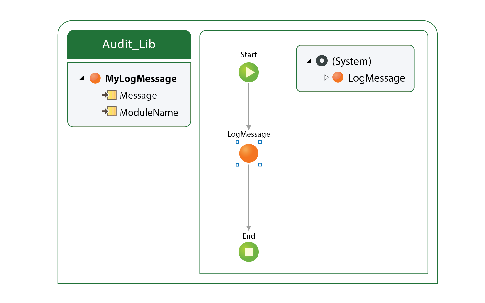
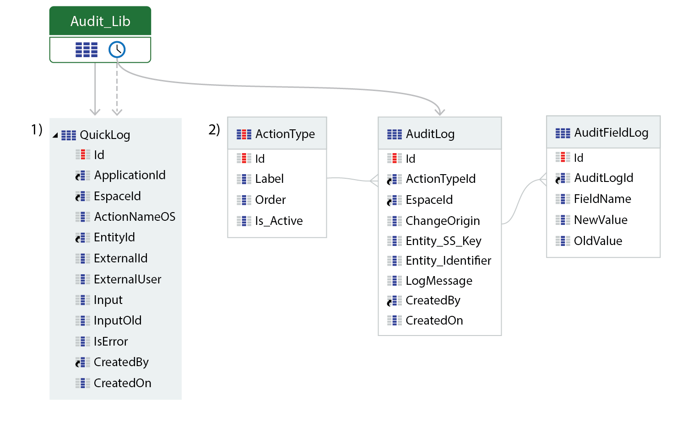
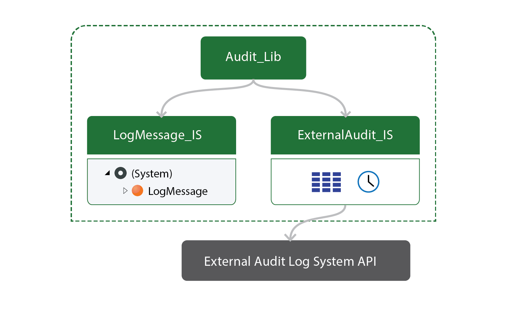
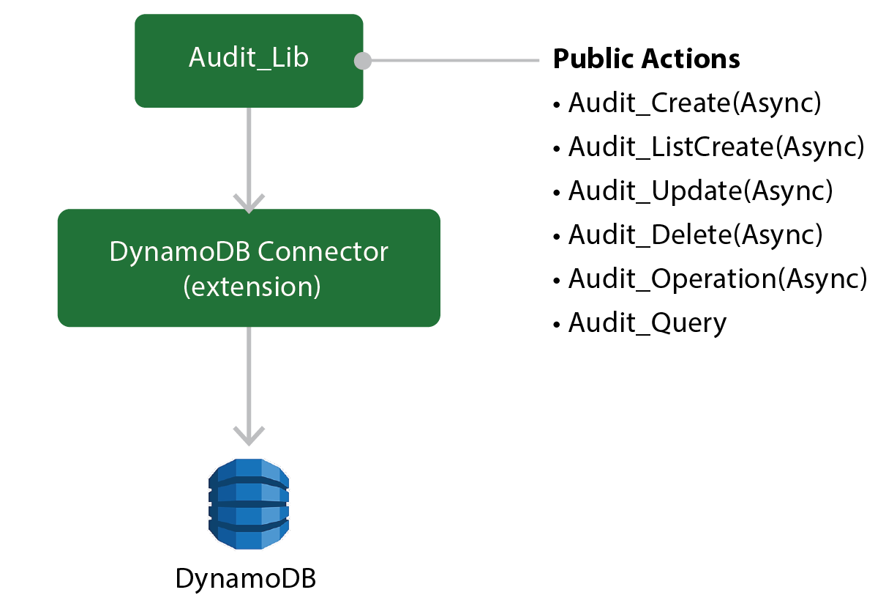

# Audit Trail

## What is an Audit Trail?

An audit trail (also called audit log) is a security-relevant chronological record, set of records, and/or destination and source of records that provide documentary evidence of the sequence of activities that have affected at any time a specific operation, procedure, or event to fulfill compliance initiatives or organizational policies. Most forms of Auditing are subject to Industry Standards (FISMA, HIPAA, GLBA, SOX) or by the country legal regulation.

Audit Trail is the simplest, yet also one of the most effective forms of tracking temporal information. Any time something significant happens, a record is created describing what happened and when. It needs to be collected in a central place where it can be searched, correlated and analyzed. Do not take it lightly. There can be significant business and system performance issues for making the wrong choice. You must consider several issues when setting up audit trails.

In this context, there are the following two types of Audit Trail in OutSystems:

* [Business Audit](#business-audit)
* [OutSystems Platform Audit](#outsystems-platform-audit)

In conjunction with appropriate tools and procedures, audit trails can help in detecting security violations, performance problems, and flaws in applications.

### Business Audit 
A Business Audit relates to business requirements to collect or track the application end users’ behavior or to provide information for Auditors. For example, log any update over a table record: “who” did “what” and “how” the system behaved, and what were the values before and after the update. The value to collect this information is, for example, to set up an alarmist process on top, to alert decision-maker teams if any business rules were violated or a threshold value reached.

Use Business Audits when there are business requirements to log a specific end user behavior or automatic system actions in an application:

* Detailed security log containing a list of end users and the information these can access in a database - This audit can be crucial for protecting sensitive data like health or financial information.
* Records of all financial transactions made by business users - these include all information, like bank account movements, employee payments, expense reports, etc.
* Tracking all customer communication - it can help a great deal with dispute resolution and also with keeping customers happy by providing relevant information about their past communications.
* Operational transactions. Imagine the example of a transportation network company. The ability to audit pickup and dropoff times, as well as routes, helps with pricing and staffing considerations.
* You can also use Business Audits associated with more Non-Functional Requirements (NFRs), such as tracing a user during a session: from the moment users log in until the logout.

Implementing a Business Audit system can prevent you against potential legal actions and accusations, but it can also give you important business intelligence to make business decisions based on facts. It may seem to be something not so relevant at the beginning, but it’s incredibly important.

Implement Business Audits wisely according to the minimum requirements first, and then evolve as needed. Focus on:

* **type of content to log** - a specific user interaction or any record updated by the system;
* **data integrity** -  avoid duplicated data or collecting wrong information;
* **abstraction** - convert different types of source system data into a universal format;
* **consistent timestamp format** - universal formats help making the calculation (for example, time averages);
* **retention time** - the amount of days, months, or years the information needs to be available;
* **sensitive data** - if the audit trail system collects sensitive information (for example, personal or financial information), then consider to encrypt it properly and make sure Auditors (or business Users) have clear roles configured to access such information.

### OutSystems Platform Audit

The OutSystems platform audit comprises a set of technical logs collected by OutSystems out-of-the-box, to help IT teams in monitoring or troubleshooting applications' behavior. For example, Application Exception Errors, External System Integration performance, Traditional Web Requests and Screen requests, Web Pages performance, Slow database queries, and so on.

Consider the following concerning the technical logs collected by OutSystems:

* By default, the logs are kept for 4 weeks: configurable using the configuration tool (only possible in On-Prem installations).
* For each module, you must enable the log setting.

These logs are stored in a dedicated set of OutSystems tables and can be consulted in [Service Center under Monitoring menu](https://success.outsystems.com/Documentation/11/Managing_the_Applications_Lifecycle/Monitor_and_Troubleshoot/View_the_Environment_Logs_and_Status):



Considering that the platform logs have a recycling rate, these should be collected periodically and stored externally. The recommendation is to build an ETL process to execute this task, due to the high number of records.

## Standard Audit Trail System (generic architecture)

For Standard Audit Trail systems, there is an industry common architecture pattern to consider, depicted by the following figure:



*[(Source)](https://docs.aws.amazon.com/en_pv/whitepapers/latest/microservices-on-aws/auditing.html)*

This implementation logs information about the end user activities. These logs help you to monitor  applications for security and troubleshooting purposes, which is a process often referred to as auditing. The audit logs are stored in buckets for convenient access with data security features for users who are responsible for monitoring activities in the application.

## Making Audit Trails in OutSystems

You can implement an Audit Trail system in OutSystems by using the [Platform Audit built-in actions](https://success.outsystems.com/documentation/11/monitoring_and_troubleshooting_apps/log_information_in_action_flows/), and/or extended actions by implementing a technical wrapper developed in OutSystems to integrate with an external system (if required). This wrapper represents a reusable module that contains typified audit messages and provides a set of custom public actions to be called by all OutSystems applications. For performance reasons, audit messages/records must be saved quickly.

Consider the following three architecture patterns/examples on how to implement Audit Trail to support business audit requirements:

### Based on OutSystems built-in LogMessage action



The **Audit_Lib** module provides a **MyLogMessage** public action, which references a **LogMessage** (system) built-in action.

All logged messages are available throughout the Service Center using the navigation menu **Monitoring > General**, filtered by the **ModuleName** value.

###  Centralized Audit Trail (using server entities)

Although OutSystems provides a system log audit action, we recommend building a centralized system log. You can define log levels in your log module, typified audit messages, and enable/disable logging per application without having to redeploy the modules (using the site properties or a small back office using the scaffolding built-in feature).

The following figure depicts the centralized Audit Trail:



1. The data is stored in the **QuickLog** entity quickly, due to performance reasons.
1. The timer moves the **staged** data from **QuickLog** into the main **AuditLog** entity asynchronously.

### Extended Centralized Audit Trail

This architecture pattern merges the previous two concepts with third-party system integrations.

The advantage of extending the previous patterns is to allow log normalization, getting more flexibility, and promoting scalability in your Audit system (for example, building audit reports or alerts on top), by defining a set of public log actions with mandatory input parameters.

Based on the message type, these public actions can decide internally to forward to an external system or to write into the platform built-in log tables by using the system log audit, and taking advantage of its asynchronous implementation and integration with the platform logs.

Use it to write a debug log that allows the IT teams to trace the application flow - debug logs are another type of message.

The following figure depicts the foundation application that supports all applications that log with an External Audit logging system integration:



* **Audit Library Application**

    Provides centralized business audit logging for different applications. The pattern allows applications to log for both external audits and OutSystems system audits.

* **Audit_Lib Module**

     Implements the public API which receives all audit logs requests within OutSystems applications, and triggers logging according to the consumer application’s requests.

    * **Audit_Lib API (public methods):**

        | Name              |Description  |
        |-------------------|-------------|
        | Audit_Create      |Async method to log new record Creation registration|
        |Audit_Update       |Async method to log an Updated record|
        |Audit_Delete       |Async method to log Deleted record|
        |Audit_OperationLog |Async method to log any Operation performed by User or System|
        |Audit_GenericLog   |Async method to log Generic information|
        |Audit_ListFilterLog|Returns a List of logs according to the filter provided|

* **LogMessage_IS Module**

    A module that logs messages to the platform using the out-of-the-box [LogMessage](https://success.outsystems.com/Documentation/11/Reference/OutSystems_APIs/System_Actions#LogMessage) action that registers information to present in Service Center in the module general log.

* **ExternalAudit_IS Module**

    A module that sends log information to an external log system. For performance reasons, audit messages should be saved first into a staging table, before being sent asynchronously (via timer) over an external API.

* **Entity Read-Only Pattern**

    To ensure all transactions are logged, expose your entities as read-only. This enforces the centralization of the create, update and delete operations into the module that defines the entities and logs every transaction.

    For bulk update operations, you can only log the overall operation, and not the individual changes.

## Advanced implementation

Due to the tons of logs required by the business, to keep these on-line and available as fast as possible, there are multiple ways and technologies to support Business Audit requirements. There is no single solution that fits all customers: it depends on what customers want to achieve and the complexity of the business.

To address complex enterprise scenarios, an advanced implementation for the Business Audits is to store these in an external NoSQL Database.

The following list shows good examples of when you should consider this approach:

* Each business record might have tons of audit records;
* You can keep audit records indefinitely, at least for the same period as the archived data;
* There is no idea of the number of versions a record can have, hence there are no volume estimates of the amount of records Auditing can have in the future;
* Relational databases are not great dealing with text and millions of records in the same table without partition support;
* NoSQL databases can support more operations per second than RDBMs;
* Auditing data in the same database as the transaction data can load or stress affecting usual business operations (connection, IOPs consumption, etc);
* Auditing usually requires a generic model to store all the data edit operations, since different audit records can have a different schema. Generic models with millions of records don’t go well with relational databases. A “static” normalized model makes maintenance of the auditings very hard;
* Audit records should be independent of the original data model since they can be used in an isolated manner. Hence they don’t need strict relationships with the source data, for example. Foreign Keys;
* You may need custom data retention policies for the audit records;
* NoSQL databases scale horizontally very well while RDBMS do not.

You can download from the OutSystrems Forge, a component that allows you to integrate with a NoSQL Database: the [Amazon DynamoDB Connector](https://www.outsystems.com/forge/component-overview/3549/amazon-dynamodb-connector).

The following picture depicts the pattern in OutSystems that can implement these Auditing operations:



The following list details the Public Actions:

```
Audit_Create(Async)                     Audit_Delete(Async)                     Audit_ListCreate(Async)
- ObjectName                            - ObjectName                            - ObjectName
- Operation                             - Operation                             - Operation
- JsonObject list (record to insert)    - JsonObject                            - JsonObject list (record to insert)
- UserId                                - UserId                                - UserId
- CreatedOn                             - DateTime                              - CreatedOn
- EntityId                                                                      - EntityIdAttributeName
- EntityId2                                                                     - EntityIdAttributeName2
- EntityId3                                                                     - EntityIdAttributeName2

Audit_Operation(Async)                  Audit_Update(Async)                     Audit_Query
- ObjectName                            - ObjectName                            - ObjectName
- Operation                             - Operation                             - Operation
- JsonObject                            - JsonObject list (record to insert)    - UserId
- UserId                                - UserId                                - AfterCreatedOn
- DateTime                              - CreatedOn                             - AfterUpdatedOn
- EntityId                              - EntityId                              - BeforeCreatedOn
- EntityId2                             - EntityId2                             - BeforeUpdatedOn
- EntityId3                             - EntityId3                             - EntityId
                                                                                - EntityId2
                                                                                - EntityId3
```
