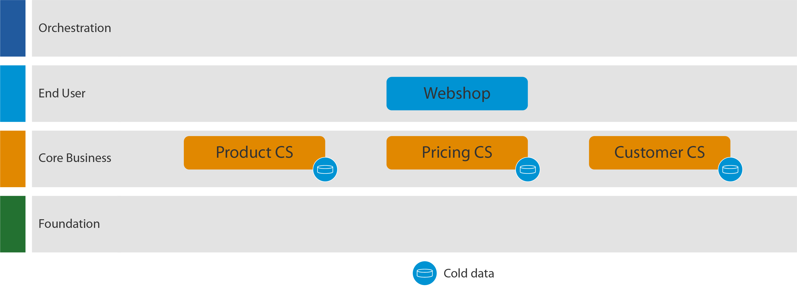
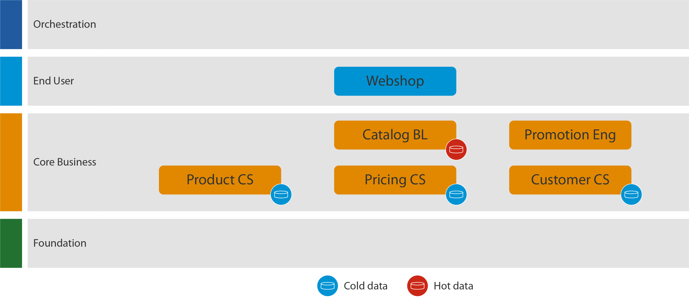

# Optimize Data For Your Use Cases Using Hot Cache

## Introduction

Users are more and more demanding, having less patience to wait for results. Slow applications can deeply influence user adoption and impact business needs. Besides the lack of development best practices, there are additional factors that can contribute to a good or bad performance of an application:

* Dependency with external systems of records, containing a large amount of data.
* Information that requires heavy calculations and data mashup.

To overcome the above factors, multiple architecture patterns may be considered at design time. This article is going to cover caching architecture patterns, that may help to prevent performance issues.

[Wikipedia](https://en.wikipedia.org/wiki/Cache_(computing)) states that "cache is a hardware or software component that stores data so that future requests for that data can be served faster; the data stored in a cache might be the result of an earlier computation or a copy of data stored elsewhere".

In context of this article, cache is referring to having a local replica (in the OutSystems database) of data that is externally managed (external master of records). The article does not focus on server in-memory cache, a built-in feature of the OutSystems platform ([Cache in Minutes](https://success.outsystems.com/Documentation/11/Reference/OutSystems_Language/Data/Handling_Data/Queries/Aggregate) property), that may also be used to mitigate performance issues.

## Multi-data layer pattern

This pattern consists in defining multiple layers of caching, each one with its purpose and dataset. Having different cache layers allows you to fine tune each layer, according to the requirements, to boost performance when dealing with large amounts of data.

This pattern is typically used in the following scenarios:

* Integrating with an external master of record.
* Pre-digest of hot business processes.
* Data mashup for dashboards.
* On mobile, to support an optimized data model.
* On mobile, to support offline.

These are the possible levels of cache (and their visual representation):

||Cache Level|Description|
|---|---|---|
||Client Side Cache|Local cache of specific data for a user. Normally set on the Mobile application as the local storage.|
||Hot Cache|Cached Pre digest or calculated data. Focus on active processes or requirements.|
||Cold Cache|Normalized data model with all relations. Relationships between entities are kept for easier searching.|
||Staging Cache|Cached staging data gathered from external systems, to be processed into the Cold data.|
||Master of records|External master of data|

Please note that, although there are multiple layers, you don't always need to have the full set of data layers - make sure you design your architecture according to the use case. Most of applications are only built around the normalized database (Cold Data Layer), and implement a local replica of the external master of records, to speed up data access and reduce the number of calls to the external system - learn more on how you can [abstracting your Core Services according to integration](https://success.outsystems.com/Support/Enterprise_Customers/Maintenance_and_Operations/Designing_the_architecture_of_your_OutSystems_applications/05_Integration_Patterns_for_Core_Services_Abstraction). For mobile applications, it's particularly important the usage of client side cache, to boost performance and decrease the number of server calls.

In this article we will focus mainly on the Hot Cache/Data Pattern, when we should use it and what benefits it can bring to the whole application.

## Hot Cache / Data Pattern

In some use cases (for example, Dashboards or conditional variable data), you may need to aggregate information from different sources or do any large number of calculations on a big number of raw data to fulfill the business requirement of the application.

While it's possible to gather the data required for this use cases directly on the source system as needed, normally this isn't a good option because the time taken to obtain the right data will be slow and will impact the end user experience.

This is where the **Hot Cache** pattern can bring great benefits. Instead of directly query and join data over multiple entities, in the moment that the end user wants to display the information, a cache layer is created, with a new entity that is designed to be optimized for the use case. This new entity is populated periodically and contains the pre-calculated data - this cache layer is called hot cache, because it should only contain data that's active.

For example, let's take a look at a simple web store. This web store (WebShop) differentiates the product pricing based on customer, customer type and product category. Let's also assume this is a large store, with over a million products and customers. Following the 4-layer canvas we could have the following architecture diagram:

**WebShop**: Showing online catalog, with correct prices per customer, requires costly computation and data mashup.

**Product_CS**: Products and product categories, with base price and product description.

**Pricing_CS**: Pricing rules, that affect the final product prices per customer, customer type and/or product category.

**Customer_CS**: Customer information, like personal data and customer membership level - Base, Silver or Gold.

For simplicity, we will assume that the data is only stored in the OutSystems database. This is represented by the blue database icon inside each of the Core Service (CS) modules - note that this layer maps to the Cold Data concept.

In this example, we have some requirements that will impact user experience if the information is obtained and calculated in real time:

* **Catalog per customer** -  each customer has its own product price catalog, with discounts based on the customer membership level, valid for a month;

* **Weekly special prices** - provide discounts over top 10 most seen products during last week;

* **Membership update** - customer membership level update, based on the amount of sales. E.g.: customer is promoted to Silver by when reaching 1000 dollars in sales, with the benefit of having bigger discounts.

## How to implement a Hot Cache?

### Architecture

The first step to implement the Hot Cache pattern is to analyze the requirements and design the hot cache data model that will hold the optimized data.

For example, in the WebShop, we need new entities that store all the catalogs per customer - campaign prices are pre-calculated in the moment the campaign is released. Data is persisted in this entity while it’s hot - during the 1-month campaign.

There are two new modules to support the hot cache implementation:

**Catalog_BL** - Business Logic (BL) module, where the Hot Cache entities are defined. It will contain the individual customer catalogs, weekly prices and price history.

**Promotion_Eng** - This engine is responsible to fill the Hot Cache entities. It implements the trigger processes and associated business logic.

### Trigger

Defining how and when the hot cache is filled can be challenging. There is no "one size fits all" pattern - every business case is unique, so the triggering of the cache creation should be aligned with the business requirements. Here are some options, based on the WebShop requirements:

* **Catalog per customer** - Pre-calculate the customer prices for all products before the promotion starting. This can be achieved by having a **monthly timer that, per customer, triggers the start of a BPT process to create the new online catalog**.

* **Weekly special prices** - **weekend timer**, schedule to run every Sunday, that gathers the top 10 products seen by all customers during last week, and apply a global discount price.

* **Membership update** - BPT process triggered after a new sale, that evaluates the current sale volume. In case of update on the membership level, it triggers the update of the customer online catalog.

### Synchronization

The next concern that you need to tackle is to make sure that the hot cache is always up-to-date - keeping hot data up-to-date is key for reliability.

Note that not all use cases require a recalculation of the hot cache. It's important to assess, per use case, which ones need to be updated when the cold data changes. And it's important to be smart about this update, and only update the records affected by the cold cache change.

Going back to the WebShop example:

* **Catalog per customer** - This main catalog is built monthly, so changes to the base price are only reflected at the month start. No synchronization is required other that the monthly re-creation of the catalog. The customer catalog may be updated either by weekly prices or membership level update, but these cases are described next. As optimization, you may decide to only build catalog for users that visited the web portal in the last X months.

* **Weekly special prices** - Weekly prices are only updated on Sunday and is not impacted by changes to the cold cache. The 10 weekly products need to be reflected in the customer catalog, so this process must trigger a second process that updates the 10 new prices (and only these 10 prices) on all customer catalogs. Since the catalog is monthly, the previous month prices also need to be reset to their original value, per customer catalog.

* **Membership update** - since the customer discount is affected by their membership level, whenever a customer changes its level, it must trigger the rebuild of that customer catalog.

### Purge

To ensure a fast response by the hot cache, it should only contain relevant and active data. Besides ensuring the synchronization is only considering relevant fields, it's also necessary to have a purge mechanism in place, to clean information no longer used. The purge strategy must be designed according to the nature of each entity and aligned with the business use case.

Some of the possible approaches on our described examples might be:

* **Catalog per customer** -  purge when a new version of the catalog is created - either because the current catalog expired or there was another event, such as the membership update.

* **Weekly special prices** - weekly purge the 10 previous special prices.

* **Membership update** - no action required, as the membership level is not part of hot cache. The process that is trigger to rebuild the customer catalog will take care of the purge of the old catalog.

* **Inactive users** - if a user becomes inactive, the associated catalog should be purged from the hot cache and no longer calculated monthly.

An important point to have in mind is that purge operations can be long running, impacting the overall usage of the Hot Cache system, so it's a good practice to schedule this type of operations for specific times where the WebShop application might have less load.

## Conclusion

The use of cache mechanisms can bring a great impact on how applications perform when working with great amounts of data and heavy processing info.

The Hot Cache pattern has a strong relation with the business needs. When designing this mechanism, keep in mind the following guidelines:

* Focus on the business requirements, check for the needed data and try to see if any type of pre-calculation and synchronization is needed to store into simpler and more efficient entities.

    * Store only active data into the hot cache entities.

* Design the triggering of the engine or synchronization mechanism in a way that will not impact the application. Think on the business requirement, plan long processings for off hours, and always have in mind the amount of data to synchronize.

    * Update only the records that have effectively changed. Use timestamp to support a delta synchronization

* Don't forget that master data can change and that the hot cache might need to be refreshed from the system of records, so you should correctly plan the triggering on these cases.

* Clean old unused cached data. Old unused data don't bring any performance benefits and might have a huge negative impact on the efficiency of the hot cache mechanism.
