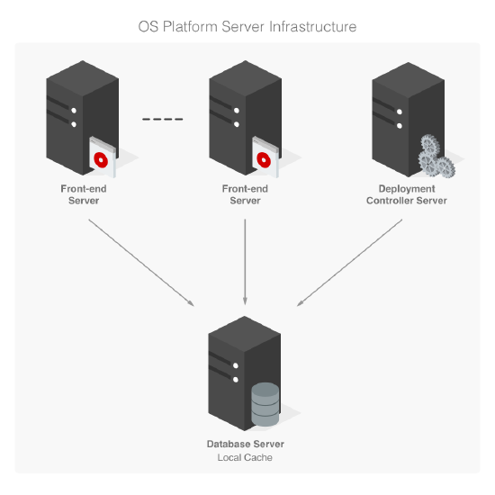
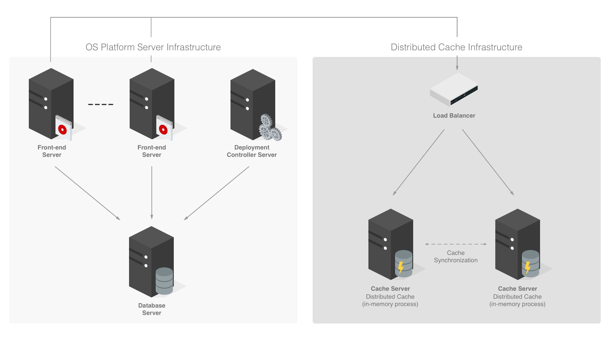
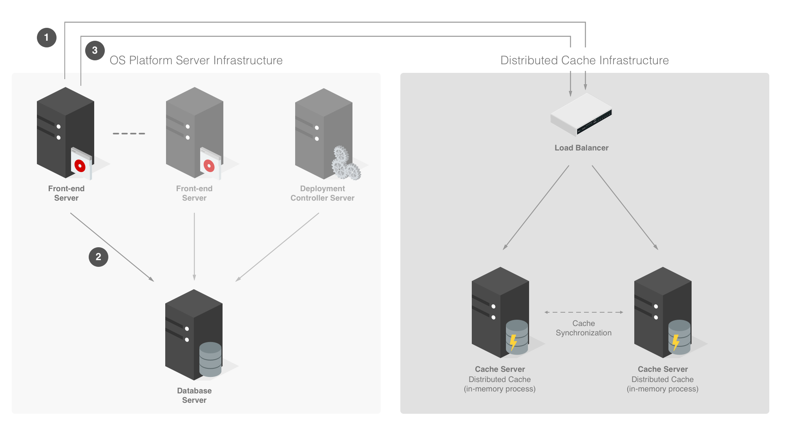
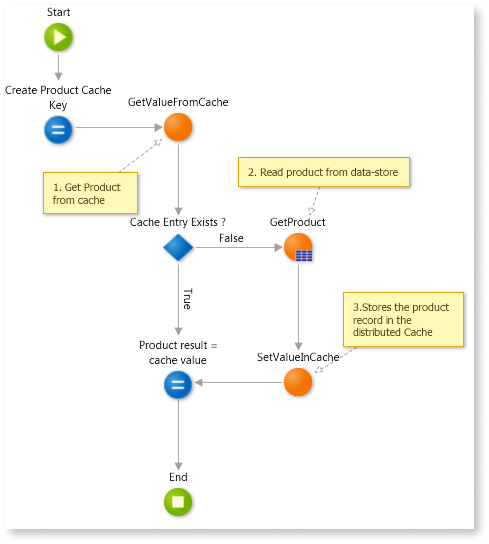
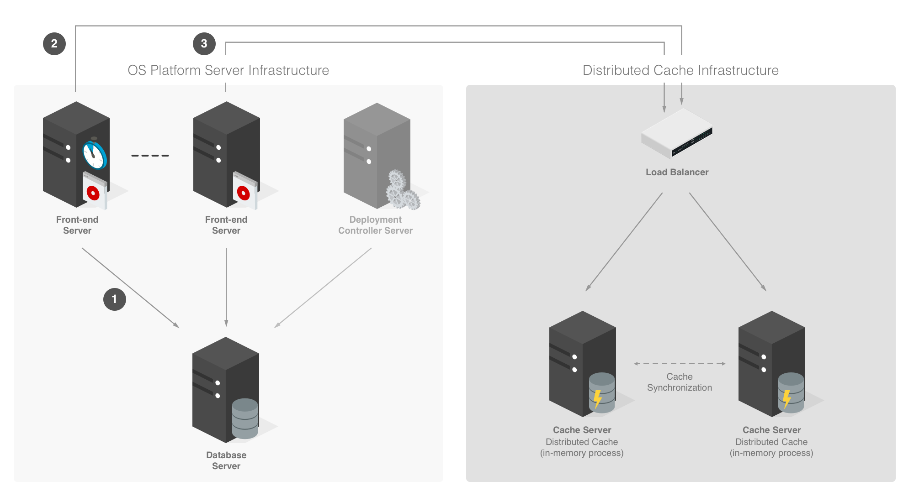
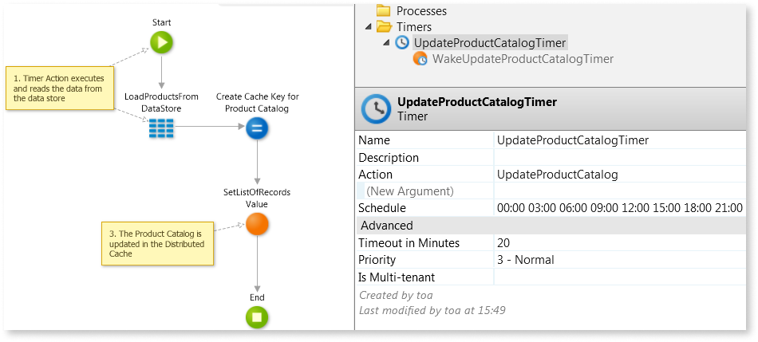
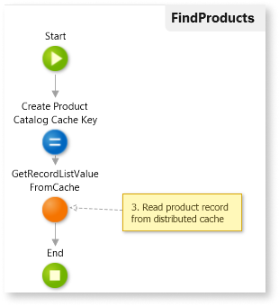
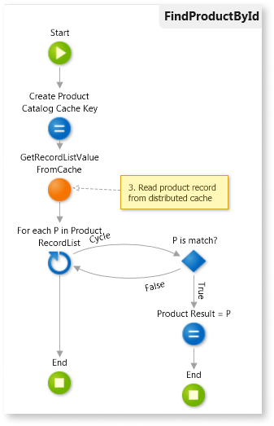

# Improving performance with distributed caching

## What is Distributed Caching

A cache is a component that stores data so future requests for that data can be served faster. This provides high throughput and low-latency access to commonly used application data, by storing the data in memory.

By avoiding the high latency data access of a persistent data store, caching can dramatically improve application responsiveness, if it's well used.

[Caching is very useful](https://dzone.com/articles/process-caching-vs-distributed) when application users share a lot of common data; for example, cache would not provide as many benefits if each user typically retrieves data unique to that user or request. An example where caching could be very beneficial is a product catalog, because the data doesn't change frequently, and all customers are looking at the same data.

In an OutSystems application that uses local cache to store query or action results, each **Front-end Server** stores the cache data into its own process memory using it as a cache storage. In this case, each **Front-end Server** will see only the cache data that sits in its own cache storage. Therefore, all the other servers will have to do another access to the data store to fetch the same data again.

A distributed cache, however, stores the cached data on other infrastructure resources and manages it in a synchronized fashion, making the same cached data remotely available to all the **Front-end Servers** in a transparent way. For example, the **Front-end Servers** don't have the knowledge of which infrastructure resources are used to store the cache data and what the topology of that infrastructure is.

That knowledge resides in the distributed cache synchronization and routing mechanisms. This way, the **Front-end Servers** only need to know the remote endpoint and socket port to connect to the distributed cache.

## Patterns for populating a Distributed Cache

To be able to retrieve data from cache, the data has to be stored there first. There are several strategies for getting data into a cache:

### On Demand / Cache Aside

The application tries to retrieve data from cache, and when there's a "miss" (cache doesn't have the data), the application is responsible for storing the data in the cache so that it will be available the next time.

The next time the application tries to get the same data, it will find what it's looking for in the cache. To prevent fetching cached data that has changed in the database, the application invalidates the cache data while making changes to the data store, through specific logic in an Action.

Another possibility is to update the cached stale data with the new data as part of the Action logic instead of invalidating the cache entry. In a situation where a continuous query is made to a set of Entities (read-only) that expose CRUD Actions it might be wiser to implement the cache access (reads and writes) inside the exposed CRUD operations, making it transparent for the consumers of those Entities.

This strategy is more suitable for cases where highly transient data needs to be cached, like data that would be otherwise stored in Session, or data that serves as support to business logic during a couple of web requests, relieving the size of the Session or the data store resources when providing the necessary data for those operations.

#### How you should implement this pattern

The following Action flow depicts the steps involved in this strategy:

1. Determine if the item is currently held in cache using the correct Cache key and scope.
1. If the item isn't currently in the cache, read the item from the data store.
1. Store a copy of the item in the cache.

### Background Data Push

A Timer background Action pushes data into the distributed cache on a regular schedule. Any consumer application pulls the same data from the cache without being responsible for updating the data.

This approach works great with high latency data sources or operations that don't always require the latest data.

A possible application scenario for this strategy is the integration with external systems:

* Where the same records are read and updated continuously, relieving the data store from possible wait locks

* Where the source data is updated on a regular schedule (well known interval).

* When there is a significant amount of data to push to the cache.

This strategy can be useful because it moves the responsibility of updating the cache from the business logic Actions to the background Timer.

#### How you should implement this pattern

The following Action flow depicts the steps involved in this strategy:

1. The Timer background Action executes and reads any data from the data store that needs to be updated in the cache.

1. The same Timer background Action updates the Cache Entries with the latest version of the data.

1. Any Front-end Server reads the data from the cache.

 

If your application can get data that is slightly out-of-date, you should rely on a configurable expiration time parameter (per cache entry) to set a limit on how old the cache entry can be. As a best practice, this limit should be set when the cache entry is created or updated.

## When to implement a Distributed Cache Pattern

The benefit of distributed caching becomes increasingly measurable as more Front-end Servers are added to the infrastructure. In these scenarios, the throughput limits and latency delays of the persistent data store become more obvious on overall application performance or the local cache struggles due to load balancer requests being routed to different servers. Therefore, the following facts or requirements are usually reasons in favor of a distributed cache:

* Sharing state between different Servers, Applications, Modules or even components that can be in the same or in different infrastructures.

* Continuous querying for the same data inside Actions, Screens and Web Services especially when the data changes frequently as in a few seconds.

* Moving user data from Session (due to performance reasons).

* Storing high transient data, for example, data that is created and deleted after a very short period of time.

* Caching significant amounts of data (hundreds of Megabytes).

* Keeping total control of the server resources used for cache (cache keys and metrics, memory, CPU):

    * Relieve the Front-end Server resources used for local cache.

    * Allow external access to the runtime cache (Service Ops team, external applications outside of OutSystems factory, etc).

    * Provide external methods for cache "warmup" and validation.

In addition to the previous reasons it's important to understand when the Local cache is not fit for purpose:

* Local Cached data is not synchronized between the different Front-end Servers. This means that different Front-end Servers might have a different copy of the source data or see a different state of the source data, failing to comply with use case scenarios that require a synchronized copy of the source data.

* Local cache benefits will decrease when adding more Front-end Servers.

* Local cache doesn't provide versioning. This is a mechanism that assigns a version to each cache entry per update, allowing it to verify if a cache entry was modified since last read. This is useful to implement Optimistic Locking of cached data.
