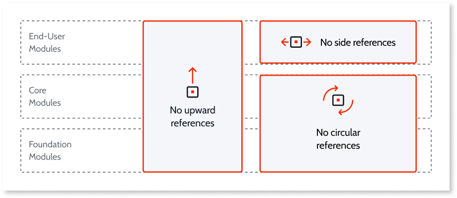
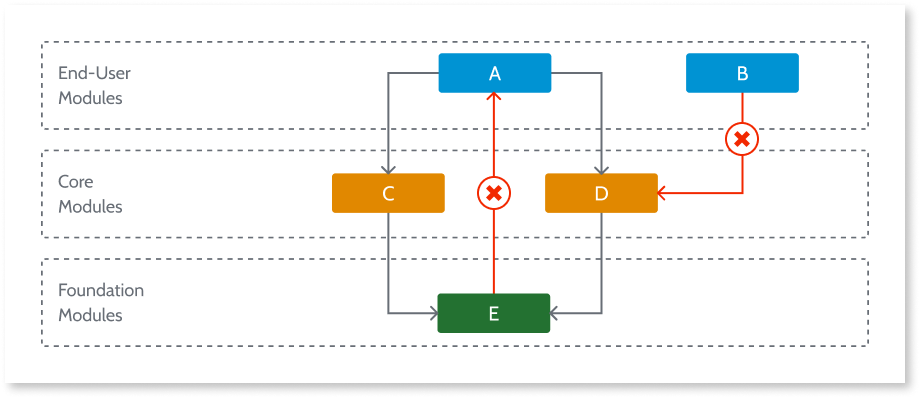
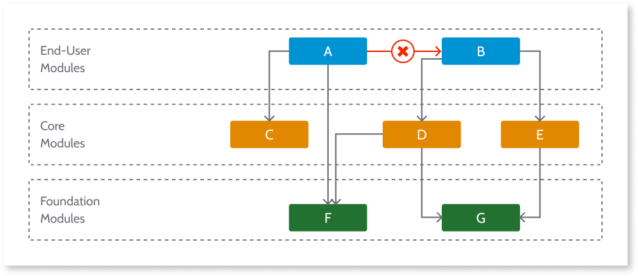
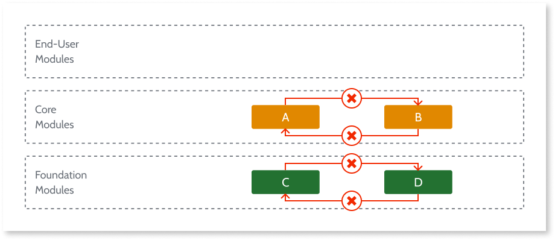

# Validating your application architecture

There are 3 rules you **must always** comply with in order to achieve a well-designed application architecture.

The compliance of the implemented modules with these architecture rules can be automatically verified using the [Discovery tool](http://www.outsystems.com/forge/component/409/discovery/). It analyzes the actual dependencies among modules, identifying violations and pinpointing the elements (actions, screens, entities) that are assembled in the wrong place. 

## Rule #1 - No upward references

An upward reference tends to create a cluster where any 2 modules, directly or indirectly, have a circular dependency.

In this example, since **Library E** consumes **End-user A**, any pair of elements inside the identified cluster is in a circular relation. Take **C** and **D** for example: **C** > E > A > **D** and reverse **D** > E > A > **C**.

Another unexpected effect is that **End-user B** is legitimately consuming **Core D**, and becomes dependent of the entire cluster. Not only its runtime will get an unnecessarily large footprint, but it will also be constantly impacted (outdated) with changes made in modules that it should not even be aware of.

### What is wrong?

An upward violation clearly identifies that services are not properly isolated.

### How to fix it?

Find the elements that are being consumed and move them to a lower layer. In this case, move the reusable service in **A** to a **Library**, eventually to **E** itself, if it fits in the same concept.

## Rule #2 - No side references among End-users or Orchestrations

In this example, **End-user A** is consuming some element of **End-user B** (maybe something as simple as a formatting function). Not only it got coupled to module **B**, but it unnecessarily inherited **D**, **E** and **G**.

### What is wrong?

**End-user** or **Orchestration** modules should not provide reusable services. This ensures that they are correctly isolated, allowing them to have different lifecycles - different versioning paces due to different sponsors or project teams.

This isolation is critical since **End-users** and **Orchestrations** are at the top of the hierarchy. A reference to suchs modules tends to bring along a huge set of indirect dependencies from lower layers.

### How to fix it?

Find out which are the elements of **B** being consumed by **A** and move them to a new (or an existing, if there is a conceptual fit) lower layer module:

* To a **Core** module if it is business related.

* To a **Library** if it is business-agnostic.

## Rule #3 - No cycles among Cores or Libraries

Respecting rules #1 and #2, **End-users** and **Orchestrations** cannot be involved in any cyclic references.

The third rule is about avoiding cycles among **Cores** or **Libraries**, since those are allowed to have side references.

A cycle is always undesirable, since it brings unexpected impacts and hard-to-manage code.

### What is wrong?

A cycle between modules indicates that the concepts are not correctly abstracted.

A cycle between **A** and **B** either indicates that:

* They are strongly coupled, or;

* One of the directions is undesirable. For instance, **A** should be conceptually consuming **B** because the concept in **A** extends **B**.

### How to fix it?

Most of the times, if there is clearly an undesirable direction in the relation concepts must be moved to another module.

For example, if it is **B** that should not be consuming **A**, then the elements of **A** consumed by **B** should be:

* Moved to a new module, if they represent another reusable concept, or;

* Moved to **B** itself, if they were misplaced elements of the same concept.

However, If **A** and **B** are too strongly coupled, they should be merged together.

If that merge results in a too large module, it may be necessary to create a third module on top of the two. The original two modules represent base concepts and the new module normally supply business rules, to support some end-user process, that need to handle both base concepts. This composition logic is the one causing the cycle.

## More information

To learn more about how to design your application architecture check the [Designing the architecture of your OutSystems applications](intro.md) guide.

