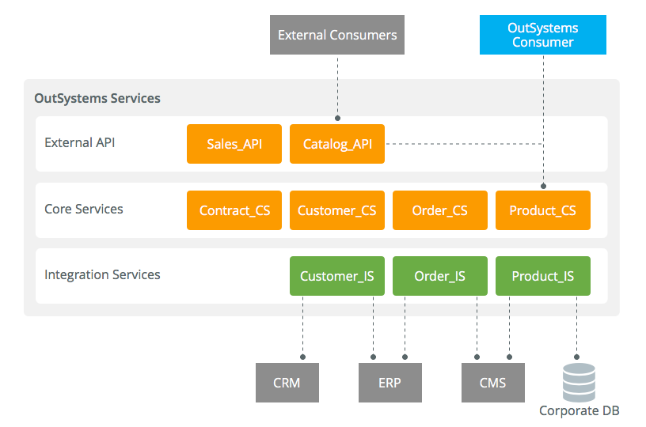

# Service-oriented architectures for OutSystems applications

When abstracting your concepts into OutSystems Services, you **must** make sure that the core of your Services is:

* Common to both internal and external consumers.

* Isolated from all external systems - to cope with ecosystem changes.

* Prepared to replace old legacy systems that are planned to be deprecated.

This is key to allow you to keep your architecture flexible and able to cope with changes.

## Implementing your Service-Oriented Architecture

In the example depicted below, you can see 3 levels composing the services:

* The **External API**

* The **Core Services**

* The **Integration Services**

Note that the example reflects how it is vital that **Core Services** are to be properly isolated from external systems.

### External API level

This level is a composition of APIs that exposes the services to external consumers - using REST, SOAP or other.

It is merely a technical wrapper for the real services implemented at the **Core Services** layer. This level translates those services to the APIs agreed with external systems.

No business logic should be added at this level.

Several versions of the API may be kept at this level to comply with different consumer specifications. For example, a consumer may be sending an input as a Record collection, while another consumer sends the same information via a XML input. Both versions must translate the different types of inputs into an *OutSystems Record List* before calling the actual service.

You can add integration audits at this level to keep track of external consumption of the service.

### Core Services level

This level implements the services, with all the business rules and core entities.

**Core Services** should be system-agnostic: 

* **External APIs**
Knowledge of external systems consuming the services is limited to the **External API** level. Any change, addition or removal of an external consumer should only impact the **External API**.
 

* **Integration Services**
If the **Core Service** extends an external system of records (an external producer), this should also be abstracted by the **Integration Services** level. If an external producer changes or is replaced, as long as that change is abstracted by the **Integration Services**, the Core Services are not impacted.

When integrating with legacy systems it is common to synchronize data (through **Integration Services**) into *OutSystems entities* (a local cache) in the **Core Services**. The approach enables:

* Coping with performance issues.

* Protecting **Core Services** from extra applicational load.

* Supporting the business logic without online calls to the legacy systems.

* Deprecating old legacy systems in the future, without impacting any consumer of the **Core Service**.

A business audit can keep track of all the business transactions, regardless if it is an external or internal call.

### Integration Services

This level is a technical wrapper of external producers, normalizing data structures and abstracting integration complexity (recovering from errors, authentication on external systems, among others).

No business logic should be added at this level.

An **Integration Service** can also abstract the fact that a certain concept is distributed across different systems.

For example, complementary Customer information is kept in both the **CRM** and the **ERP** systems. **Library** module **Customer_IS** integrates with both systems, providing all the APIs required to retrieve mashed-up Customer information into a normalized Customer data structure.

A **Core Service** consuming this **Integration Service**, has no knowledge of where the information is coming from. This gives you the flexibility to change the external systems without any impact on the **Core Services**.

## Service design patterns

Check some OutSystems architecture patterns to get further details on how you can implement the following cases:

* [Integration Patterns for Core Services Abstraction](05-integration-patterns.md)

## More information

To learn more about how to design your application architecture check the [Designing the architecture of your OutSystems applications](intro.md)) guide.

