# Integration Patterns for Core Services Abstraction

## Why do you need integration patterns?

If you need to integrate with an external system of records to retrieve master data or perform transactions, it is a good practice to follow patterns that abstract the concept you want to import into OutSystems to promote:

* **System independence**: changing or replacing the external system only affects the implementation of the concept abstraction and not the consumers of the concept;

* **Extensibility, normalization, and optimization**: opportunity to extend the concept with extra information and business rules, normalize representations and cache information to improve performance.

|||
|---|---|
|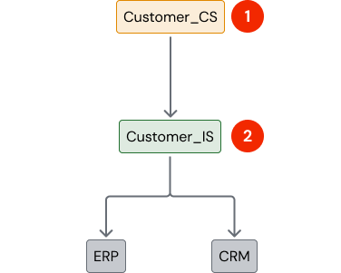|**1- Core Service** Extend the original service System agnostic (resilient to external changes) **2- Integration Service** Abstracts the original API(s), matching to internal structures and concepts (e.g. composing a customer concept with complementary information from different systems) Hide the integration type (SOAP, REST, XIF, HTTP request, file upload, ...) Cope with technical requirements (access credentials, authorization, error handling, integration auditing, ...)|

The idea is to have an **Integration Service** per independent concept (e.g. Customers) and not a single integration point per external system:

* One concept may be supported in different systems and the Integration Service abstracts that complexity;

* One system may support more than one concept (e.g. an ERP with Customers and Products) but each concept has it own life cycle (a consumer of Customers may not be interested in Products and should not be impacted by changes on the latter).

### Integration Services - wrapping calls to an external system

The Integration Service wraps-up any call to the external system, hiding the integration complexity and abstracting a service easy to be reused. The following canvas guides you on the major concerns that should be tackled when wrapping a call to an external system, regardless of the specific integration protocol being used (REST, SOAP, DLL Wrapper, etc.).

**Integration Wrapper Canvas**:

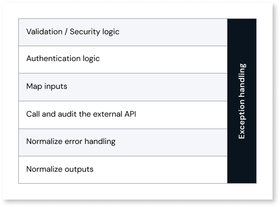

**Validation / Security logic** - Check consistency of inputs. If required, check if user in session is eligible to perform this call. Raise a user exception to propagate the error.

**Authentication logic** - Prepare any authentication credentials required to call the external API.

**Map inputs** - Map the normalized inputs into the format required by the external API.

**Call and audit the external API** - Call the external API and audit the call if integration trail is required.

**Normalize error handling** - Treat Success and Error message outputs, raising exceptions instead of returning those outputs - the expected OutSystems behavior.

**Normalize outputs** - Map the returned structures into the expected normalized outputs.

**Exception handling** - Normally not necessary, as errors should be trapped by the caller.
Can be used to audit integration exceptions or normalize exception messages that can end up in the user interface.

## Integration patterns according to data needs

This section presents several patterns, according to different needs (business concepts and non-functional requirements) . The key point is that no matter what kind of integration is required, consumers of the core service (in our example, **Customer_CS)** always get the same type of abstraction, and are unaware of the external system of records.

When fetching data from an external system of records we can classify two types of fields, according to the nature of data to understand your integration needs:

* **Summary fields**: Used for listing or searching entries. Typically these fields don’t change over time, like a **Customer name** or change very rarely like the **Customer city**.

* **Detail fields**: Only required to display details for a single entry. These fields are more subject to frequent changes and to be considered sensitive to be replicated, as a **Customer balance**.

Before explaining the integration patterns, use the following decision tree to help you select the patterns, according to your data needs. For your application, pick all the patterns collected in your selected path.

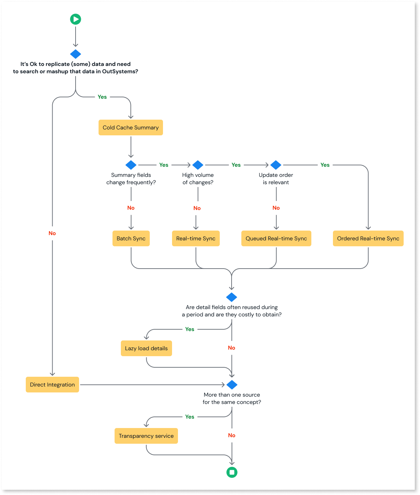

The bolded answers, show the most common and recommended path - it benefits from supplying entities for mashup, search and scaffolding in OutSystems, which accelerate the implementation without the remaining complexity that is rarely needed.

### Direct integration

This pattern simply represents a direct integration with the external system, using the Integration Service for service abstraction.

|||
|---|---|
|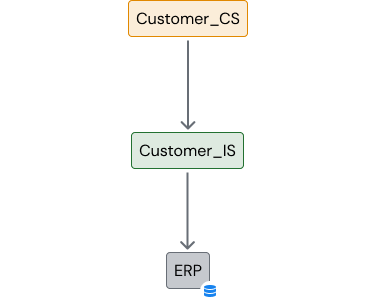|In this scenario, Customer data is coming from an **ERP**. **Customer_IS** interfaces with the **ERP**, abstracting a normalized API, both for retrieving information and performing transactions. This creates the flexibility to change the external systems without impact on core services, as long as the **Integration Service API** is maintained. Also, note that this scenario does not include entities in **Customer_CS** to keep a local replica of data. Not keeping replicated data outside the **ERP** might be due to a business constraint, or because (almost) real-time demand is incompatible with having a delayed data replication (information changes too often).|

However, this pattern has several **limitations**:

* Extra load on the **ERP** each time data is retrieved.

* More perceived latency caused by extra online communication with the **ERP**.

* Impossibility to maximize the power of OutSystems Aggregates and Advanced Queries to retrieve Customer data or to combine it with other information.

* A constant need to extend **Customer_IS** and a strong dependency on the **ERP** team to provide new APIs each time a different data retrieval is required (e.g.: to filter with some criteria or to include more or less detail). Typically, to avoid this dependency, developers tend to inappropriately reuse the available API, for instance, by using a method that returns 50 fields, when only 4 are required.

|Advantages|Disadvantages|
|--- |--- |
|Data is always up-to-date|More APIs (one per retrieval use case)|
||More latency|
||More hits on external system|

### Cold Cache Summary Data

When you feel the need to improve the performance of your integrations with external systems, a good starting point is to cache data that doesn’t change frequently. This data is called “cold data”, that gives the name to this caching pattern, **Cold Cache**.

Cold Cache is used when it is too costly to synchronize the entire database, and detail is only required for single entries (not lists). While summary data must be present to search for any entry, synchronizing the entire entry is unnecessary when only 10% of them will be actually visited in detail.

When this pattern is implemented:

* Only summary data that it’s frequently listed, joined or searched is cached (full detail for a single entry can be fetched directly on the external system);

* Full and frequent synchronization is avoided (summary information doesn’t change often​)

#### Cold Cache with Batch Sync

When implementing a Cold Cache, the simplest design approach is to create the caching data model and set up a batch synchronization process to manage the cached data.

Adding local entities to **Customer_CS** will overcome the limitations of the **Direct Integration** pattern and actually create a full-blown **Core Service**.

|||
|---|---|
|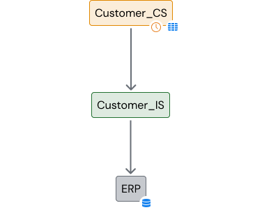|The **Integration Service** becomes simple and stable. Instead of providing a myriad of actions for different data retrieval needs, it only has to supply a method to fetch all customer relevant data, updated since the last sync. **Customer_CS** has a timer to regularly synchronize information through the **Integration Service**. This synchronization should be unidirectional, to avoid complex merges of information - from the **ERP** (the master of data) to the **Core Service**. On the opposite direction, when an update is made in **Customer_CS**, you must be careful to make sure that the update is successful and synchronously committed in the ERP first (a write-through policy).|

|Advantages|Disadvantages|
|--- |--- |
|Simpler API|Data may be outdated|
|Enable data mashup in OutSystems||
|Less impact on the source system||
|Core Service customers not affected by the synchronization||

Isolate synchronization logic

When the synchronization process is too complex and constantly tuned, it is recommended to extract it from the **Core Service**, further isolating **Customer_CS** from the external system.

|||
|---|---|
|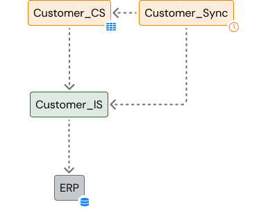|Another reason to do it is when the synchronization requires to orchestrate several integrations - for e.g., If Customers are stored in one system and Customer Contracts in another, then the synchronization needs to make sure that customers are synced before contracts since contracts refer to customers. Consumers of **Customer_CS** don’t need to be impacted by the synchronization code. Additionally, if in the future the ERP is deprecated and replaced by functionality built in OutSystems, stripping out the synchronization code has no impact. In this example, **Customer_Sync** is the one regularly fetching updated information through the **Integration Service**, to sync into **Customer_CS**. **Customer_CS** still consumes **Customer_IS** to perform online transactions.|

#### Real-Time Sync

Normally, a cold cache with summary data that is required for search, listing or mashup, is very stable not requiring real-time sync. However, some situations require summary information to include fields that need to be up to date in real time for the application to work consistently (e.g.: You need to retrieve the information of your fleet from an external system, and it is key to include the current position of each vehicle in summary listings - which is a frequently changing field).

|||
|---|---|
|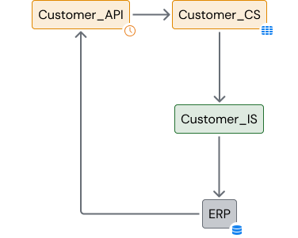|Real-time sync requires the external system of records to callback OutSystems, notifying some change in real time (in this example a customer update or insert). The **API** and the **IS** modules completely isolate the Core Service, making it agnostic to the external system and to the synchronization process.|

|Advantages|Disadvantages|
|--- |--- |
|Simpler API|More inter-system dependency|
|Enable data mashup in OutSystems|Not appropriate for a high load of changes, by not providing a queue|
|Less impact on the source system||
|Data is always current||

Queued real-time sync

While the default real-time sync is relatively simple to implement, it’s not appropriate for a high volume of changes. When this is the case, the solution is to implement a queue, so the synchronization is processed in parallel.

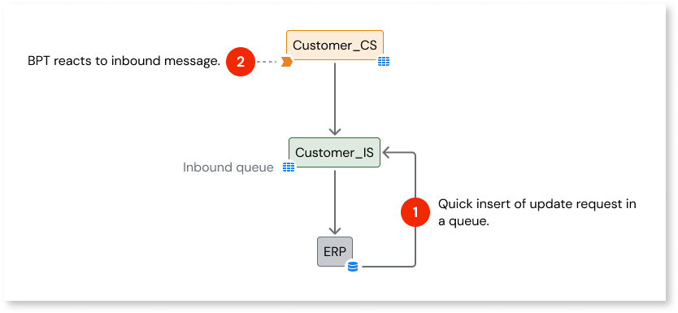

Ordered real-time sync

If the external system is prepared to fire multiple update requests concurrently (e.g., with multi-threading), there is no certainty that those requests will be received and processed in the correct order. Here is a variant to cope with that problem.

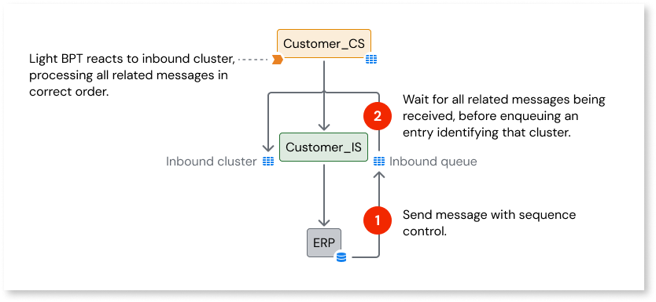

#### Lazy Load Details

The patterns above address the common integration patterns when dealing with summary **data fields**. What about the detail fields?
If it’s frequent to reuse details after fetching them from the external system, it’s recommended that you set up a lazy load pattern, as fetching details can be too costly to be done on demand.

**How to implement a Lazy Load Details pattern?**

* Try to fetch data from the local cache. If not found or outdated, get entry detail from the external system and cache it (read-through caching).

    * Cached details can have an expiration date, to force refreshing it from the source after a certain period;

    * Alternatively, before reusing cached data, ask the external system of records for the last update timestamp of that information to compare with the local timestamp and decide if the entry is outdated or not.

* If Summary data is also being cached, have a separate detail entity to cache details.

* To save space, have a timer doing regular cleaning of outdated detail data.

It’s common to combine different patterns: cache summary data regularly and lazy load details when needed.

#### Transparency Service

When there are multiple sources for the same type of information, usually with different formats and APIs, the synchronization process becomes more complex.

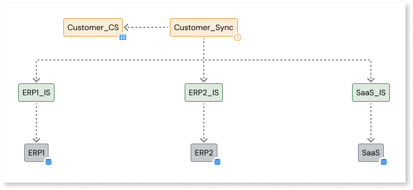

**Customer_Sync** orchestrates the synchronization with all Systems of records, updating a single Customer data replica in **Customer_CS**. This creates a **transparency service**.

In this example, **Customer_CS** is not able to update Customers. This pattern is the most common transparency service, where information comes from different sources but does not flow in the opposite way. Examples are electricity or toll readings coming from different sources/formats. They can be corrected or fixed locally, but never sent back to the source.

However, if sending changes back is a requirement, an extra module must be added. **Customer_IS** abstracts which interface (or driver) will actually send the transaction to the correct system.

|||
|---|---|
|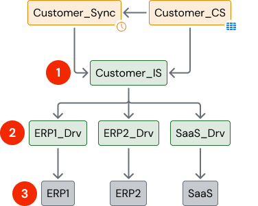|**1-** The integration service abstracts the existence of different systems, routing requests to the correct driver. **2-** Each system is interfaced with a different driver. All drivers provide an API with the same signatures. **3-** Different customers may be in different systems.|
