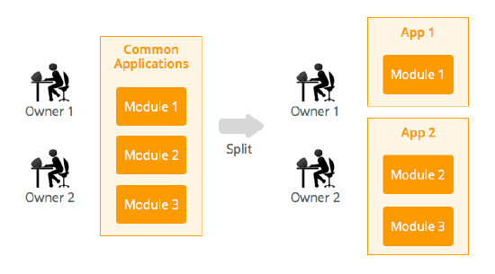
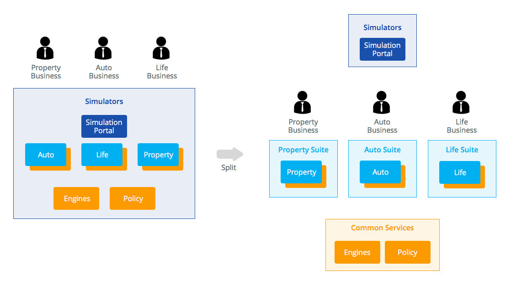

# The 4 Rules for Correct Application Composition

The need to split applications, after the reuse needs are known, is something you always need to address. However, splitting one application into smaller ones, upfront, is not always obvious.

These 4 rules guide application composition in order to:

* Minimize dependencies

* Simplify deployments

* Promote life cycle independence

The first two rules are the result of correctly using the [Architecture Canvas](../01-4-layer-canvas.md) methodology. The remaining two take into account other strategic considerations, driving the decision for creating smaller applications upfront.

## Rule #1 - Correctly layer your modules

Follow the [Architecture Canvas](../01-4-layer-canvas.md) principles. If the module architecture contains violations, it may be impossible to get to a correct and manageable application architecture.

## Rule #2 - Correctly layer your applications

Follow the [Architecture Canvas](../01-4-layer-canvas.md) principles when [applied to applications instead of modules](applying-4-layer-canvas-apps.md).

## Rule #3 - Don’t mix different owners

With different teams developing different projects simultaneously, it's common to get requirements from both projects that affect common services. To avoid bottlenecks, one common temptation is to allow both teams to change the common resources.

Having more than one owner for an application results in complex deployment management, as accountability for what has been changed becomes unclear.

Promoting ownership is key. If it's not possible to concentrate the ownership of one application, consider splitting it in such a way that ownership is clearly defined.

## Rule #4 - Don’t mix different sponsors

If a project affects several sponsors, it's important to isolate each LOB (Line Of Business) in a different application. Different sponsors have different budgets, requirements and change paces.

The following example shows a common Portal to grant web access to all sorts of insurance simulators, from different LOBs: Auto, Life, and Property.  

Splitting the application upfront, by LOB, enables the independent evolution of each one. The isolation of all the common services clearly sets the border between what must be carefully planned due to the expected transversal impact, and what can be flexibly changed inside each LOB.

## More information

To learn more about how to design your application architecture check the [Designing the architecture of your OutSystems applications](../intro.md) guide.

You can also check for further recommendations on how you should [compose your application landscape](06-app-composition.md).
