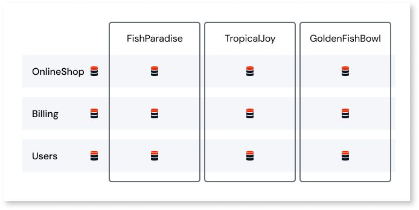
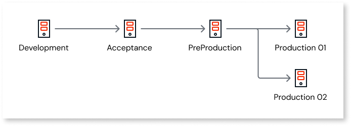
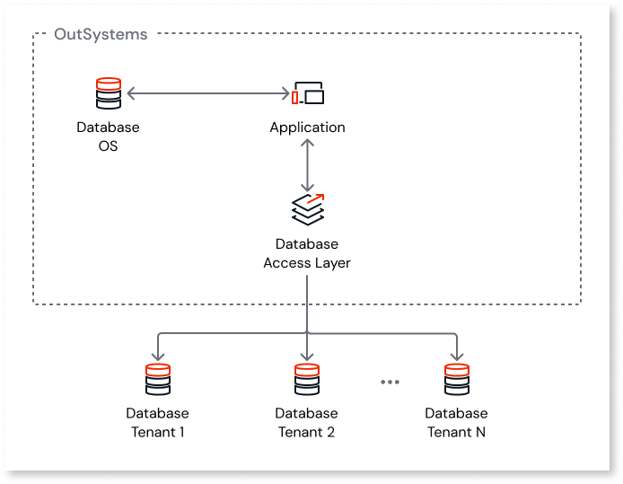

# Designing Scalable Multi-Tenant Applications

OutSystems enables you to the design of applications with data isolation between multiple client organizations — or tenants — for on-premise deployments and for software-as-a-service (SaaS) scenarios.

These multi-tenant applications are able to serve multiple organizations using the resources of a single software instance, while keeping the data of each separate from the others. This is vastly different from single-tenant applications, which require dedicated resources to serve a single organization.

## Logical Segregation of Tenants

When you are implementing logical segregation of tenants, there are two issues to consider:

* Data Segregation: The need to segregate data belonging to a single entity (tenant).

* Cross-Tenant Access: The need for a user who is part of a tenant to access data that belongs to multiple/all tenants.

OutSystems follows a multi-tenancy approach of logical segregation. A single application server and database server provide each customer with its own separate set of computing resources. Screens and application business logic applications are shared, but data and end-users are kept apart.

### Implementation

End-users use the same URL to access a multi-tenant application, and OutSystems automatically infers their tenants. Because OutSystems uses the username for this inference, the creation of end-users requires some attention to avoid name clashing. It is advisable (but not mandatory) to use unique usernames, for example: `<username>@<company>`.

At the database level, when defining one table as multi-tenant, a column with the Tenant ID is added to that table. This column is managed by OutSystems in a way that’s transparent to the developer. As for database access, it is automatic and only data belonging to the correct tenant is returned, significantly reducing development costs.

### Advantages

* Is fully supported and maintained by OutSystems as part of an installation or subscription.

* Decreases infrastructure operation costs.

* Enforces a strict security policy for data, end-users, sessions, and processes.

* Simplifies and speeds up application development because developers don’t have to write tenant-specific queries.

### Disadvantages

* Lower degree of data isolation: data from all tenants are in the same table, which has a column that identifies which tenant that row belongs to. See [Security Concerns](#security-concerns) which explains techniques for preventing one tenant from "seeing" data from other tenants.

* A higher number of rows per table. To overcome this potential performance bottleneck, you should:

    * Implement an archiving strategy, making sure relevant data is kept to a minimum.

    * Create a table index by tenant ID: OutSystems already creates this index for multi-tenant tables automatically.

### Ensuring Multi-Tenancy Scalability

The OutSystems strategy of storing data from different tenants in the same entities while ensuring that all queries only access data from a specific tenant is beneficial in terms of maintenance and ownership. However, it does raise concerns about scalability when compared to separate database catalogs for tenant isolation.

You can take the following steps to meet increasing database load while ensuring your application responds appropriately:

* Develop the application using a [fully multi-tenant method](https://www.outsystems.com/evaluation-guide/is-it-possible-to-build-a-multi-tenant-application-with-outsystems/), since this will give you the flexibility for later changes in the infrastructure.

* Use  purge mechanisms to minimize the amount of information stored in online tables.

* Scale the database vertically.

#### When the Database Reaches the Maximum Vertical Capability

When upgrading the single database server is no longer a viable option, there are 2 ways to resolve it:

#### Scenario 1: Multiple Production Environments

Separate specific tenants into their own production infrastructure. To achieve this, you should:

* Require the allocation of a new production infrastructure similar in configuration to the existing one but properly sized in terms of database and front-ends to accommodate the tenant(s) to migrate.

* Change the OutSystems LifeTime configuration for the new environment so it shares the same development and acceptance environments while ensuring you do not create different lines of development:

    

* After the environment is properly allocated, use the LifeTime application to publish the required applications to the new production environment.

* Migrate data from the previous production environment to the new one. There are three ways to do this:

    * ETL tool: Use of publicly available ETL tools — for instance, Attunity, Informatica or Pentaho — to extract the tenant information from all tables to the new tenant infrastructure, using the database connection credentials. Note: these will be provided by the OutSystems Cloud team, if you’re using the OutSystems PaaS.

    * Custom implementation: Develop an OutSystems application that is able to extract and import the tenant data into the new environment. This extraction and import may be accomplished either with data files (CSV for example) or web services that allow the communication between the two environments.

    * Backup restore: Request a full backup restore of the production database into a new database. After that, remove the data that does not belong to the migrated tenants from the new database. The newly created database is then ready to be used new infrastructure repository.

* If there is common Master Data, to complete the separation of tenants into their own production infrastructure, the application needs to ensure access to this common data, A database connection to a common catalog is one way to do this. Another option is through replication from a common source to the local database (to avoid performance issues). By using these strategies, the application will behave the same way whether it’s deployed with all tenants in the same infrastructure or not.

#### Scenario 2: Manually Partitioning OutSystems Entities

OutSystems does not have any mechanism for partitioning data from within the development tools, but changes to the meta-model can be applied manually.

### Security Concerns { #security-concerns }

It’s understandable there are concerns over one tenant seeing data that belongs to another. A common misconception is that only physical separation can provide an appropriate level of security. In fact, data stored using a shared approach can also provide strong data safety, but it requires the use of more sophisticated design patterns.

With OutSystems, the only way that a tenant can see data from another tenant is when the developer exposes data explicitly during development. There are two scenarios where the developer may expose tenant data:

1. Reference the multi-tenant table and explicitly check the "Show Tenant Identifier." This property should be used only in back-office applications to implement screens to list information (for example, users) independently of their tenant.

1. Explicitly reference the action "TenantSwitch(tenant id)", switching the application's TenantId to another tenant at runtime.

Besides these two scenarios, there is no other way that tenant data can be accessed incorrectly. To prevent them from happening:

* Coach your development teams not to ever expose multi-tenant tables as single tenants or call the TenantSwitch action.

* Control who uses these options: there are rare applications that require cross-tenant data access (such as tenant management applications). Those applications should be internal.

* Use fake or scrambled data in non-production environments.

Additionally, prevent human error by building automated validation processes. Since the OutSystems meta-model contains information on where actions and entities are referenced, it’s fairly simple to implement control mechanisms:

* Report that identifies all modules where TenantSwitch is used.

* Report that signals all multi-tenant tables that are used as single tenant.

* Have a scheduled job to run the reports and notify administrators.

* Always run the report before a production deployment.

## Physical Segregation of Tenants

An alternative option to logical segregation is to follow a physical segregation approach, where each tenant has their own database.

### Implementation

Like the logical segregation option, end-users access a multi-tenant application through the same URL and OutSystems automatically infers their tenants.

To have different databases per tenant, you need to implement a Database Access Layer to access the correct database per tenant. Once the user is authenticated, he needs to be mapped to the correct database connection and data is fetched from the corresponding database.

You may still use some tables in the OutSystems database that are not related to tenant data. But for all tenant data, make sure that all tenant databases have the same database model.

Before the staging process of one application (for example, from QA to the production server), the local DBA must be able to keep track of changes made to the database model and run a script on all production databases before the deployment.

### Advantages

* Highest degree of data isolation.

* Lowest number of rows per table: querying speed is near optimal.

### Disadvantages

* Higher infrastructure costs because each tenant requires additional resources.

* Slower development speed because the data model needs to be created outside the OutSystems IDE.

* Maintenance is more complex and time consuming because the data model of each tenant database needs to be kept synchronized.

## Recommendation

Logical segregation has several advantages over physical segregation. The biggest disadvantage is the potential risk of exposing tenant data by mistake. However, by enforcing guidelines, that risk is mitigated.

Since the implementation cost of automated processes is quite lower than the cost of having physical segregation, we recommend using the multi-tenant option available in OutSystems and with logical segregation.

Other advantages include:

* Shorter development cycles with table creation and updates directly in the IDE.

* Simpler application maintenance by keeping a single code base.

* Less dependency on DBA support during application development and staging.

## Documentation

[OutSystems Multi-tenant](https://www.outsystems.com/evaluation-guide/is-it-possible-to-build-a-multi-tenant-application-with-outsystems/)

[How to Build a Multi-Tenant Application in OutSystems](https://success.outsystems.com/Support/Enterprise_Customers/Maintenance_and_Operations/How_to_Build_a_Multi-tenant_Application)

[Multi-tenant SaaS database tenancy patterns](https://docs.microsoft.com/en-us/azure/sql-database/saas-tenancy-app-design-patterns)
