# Microservices Architecture in OutSystems

In a [Service-Oriented Architecture](04-soa-architectures.md) (SOA), core services are abstracted for correct reuse. But that does not constitute a microservices-style implementation, since all services reside in the same environment (installation), along with OutSystems applications.

In a microservices approach, each service has its own infrastructure and is decoupled. Communication with and between services is only achieved through a loosely coupled lightweight mechanism — like a REST API.

Although the SOA approach already enforces a modular approach, microservices enhance the following properties:

* Continuous deployment of services with fewer impacts to consumers.

* Smaller footprints as the consuming applications don’t include the service code.

* Less monolithic servers that can scale independently, according to each service demand.

The major disadvantage of microservices in OutSystems is that you can no longer benefit from the platform’s RAD (Rapid Application Development) capabilities as they can only consume a REST API:

* No entities to accelerate data fetching through aggregates.

* Because of the previous limitation, all data retrieval needs must be supplied through the microservice API.

* No reusable Blocks supplied by the services.

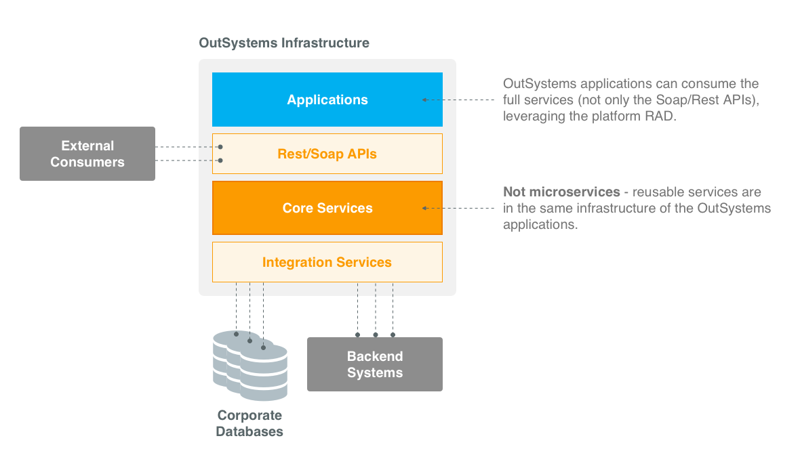

To adopt a microservices approach, services need to be placed in a different infrastructure and applications will consume those services through the REST API. To leverage OutSystems RAD, an application-side extension to microservices can be implemented.

Instead of consuming the microservice directly, Extended Services augment the core services by caching data in local entities, and providing reusable blocks, or composite business logic. None of these are new, as they match the recommendations for any external API.

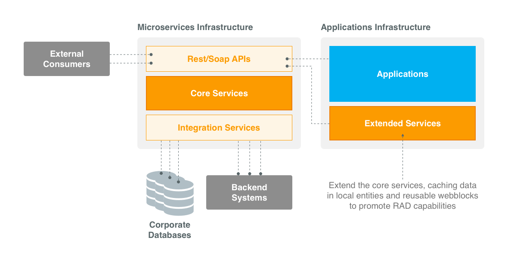

### Multiple Microservice Infrastructures

Usually in a microservices approach, each microservice resides in its own infrastructure. This allows each infrastructure to scale independently and not be impacted by the load of other microservices.

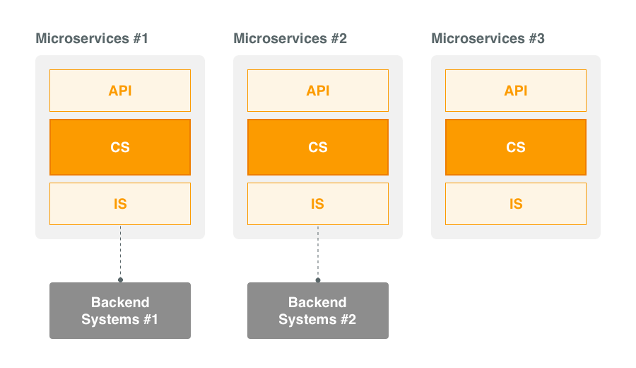

The split should be done between independent microservices. If two microservices are coupled with strong dependencies — for instance, with lots of database references — they should not be split into different infrastructures, to take advantage of the platform's full capabilities, and avoid the limitations of communicating only through a REST API.

You can start by having all your microservices in the same infrastructure, and isolate them as they demand their own infrastructure and growth policy. To ease this operation, when using a common infrastructure, isolate each microservice into a different DB Catalog.

### Central Services for Multiple Subsidiaries

Another fit for microservices is the support for central services: extending central back-end systems that need to be consumed by different subsidiaries. Those subsidiaries implement custom applications in their own installation.

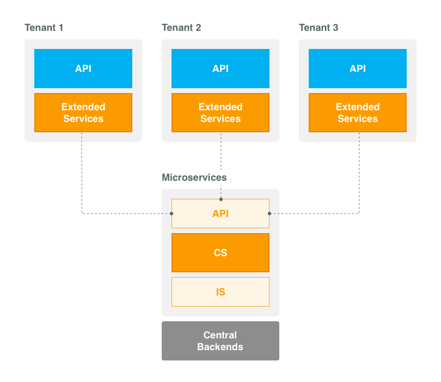

### Microservices Lifecycle — Managing Versions

Multiple versions of a microservice can be kept by:

* Exposing multiple versions of the service definition in the REST API.

* Having several versions of an action in the core module implementing the actual logic.

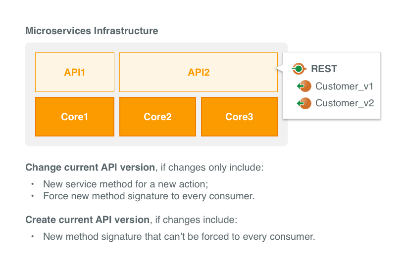

#### When to Create a New Version

The isolation of microservices allows their continuous deployment without impacting the consumers. There is no need to publicly announce a new version, as long as the API signatures don’t change.

When the API needs to be changed, we need to decide whether we can update the current version or need to create a new version of the microservice API.

1. Change the current API version, if changes only include:

* New method for a new action.

Consumers that don’t need the new method are not impacted, as they don’t have to refresh the definition of the REST service: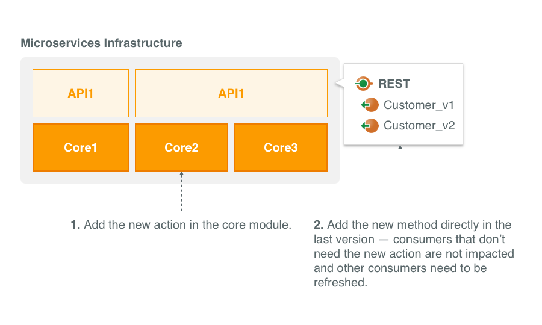

* Signature change that needs to be forced to every consumer. In this case, breaking the current version forces the consumers to refresh the REST service:

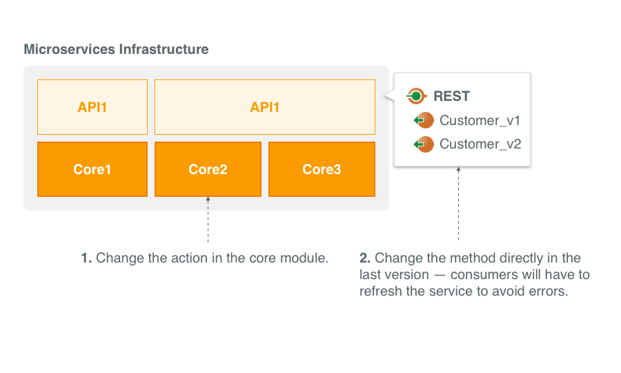

2. Create new API version, if a method signature changed and it can’t be forced to every consumer, so the previous version needs to be kept to preserve backward compatibility. There are two situations:

* Non-disruptive change of method signature.

A signature change is non-disruptive if it only includes new optional attributes:

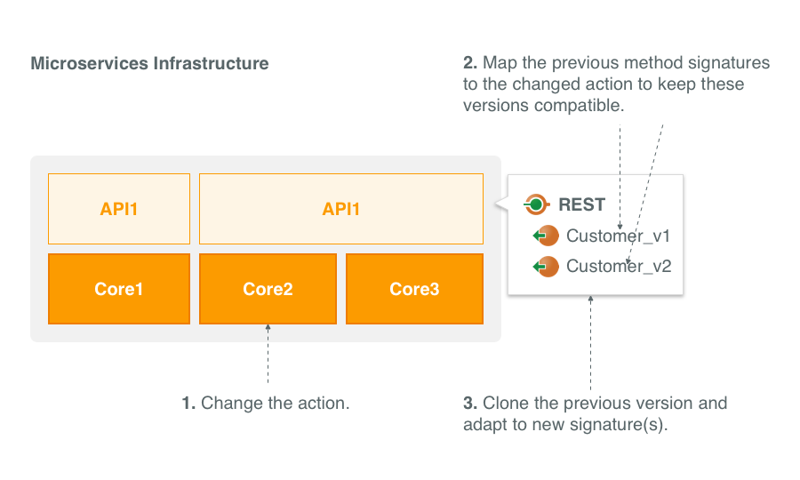

* Disruptive change of method signature.

A signature change is disruptive if it includes new mandatory attributes or changes existing attribute names or types:

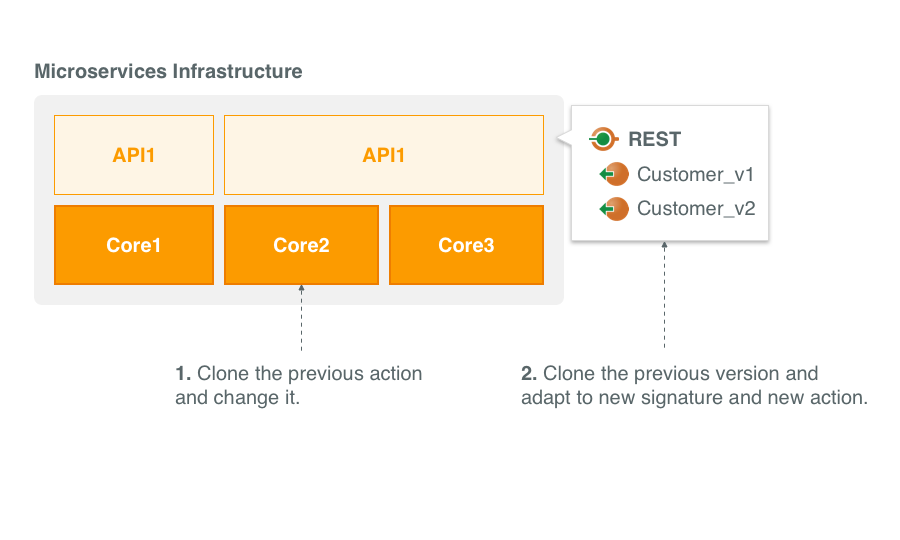

In this case, the previous versions should be deprecated since they can’t be made compatible with the new implementation. Hence, consumers should be forced to adopt the new version.

### Infrastructure Scenarios

#### Scenario A — Single Environment for Semi-isolated Microservices

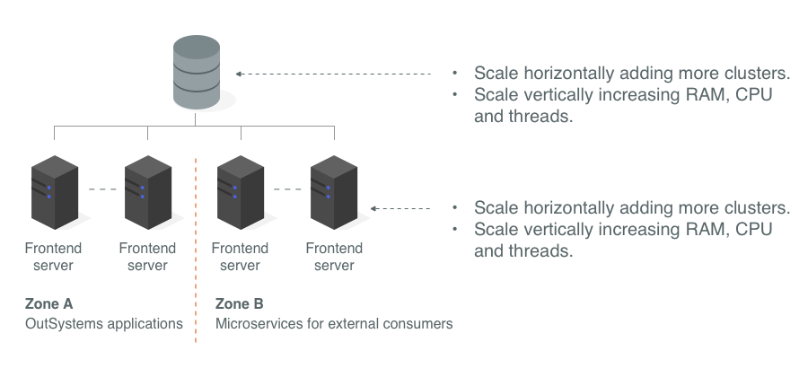

To isolate different microservices, simply add more microservices zones — Zone B example.

#### Scenario B — Separate Environment for Fully Isolated Microservices

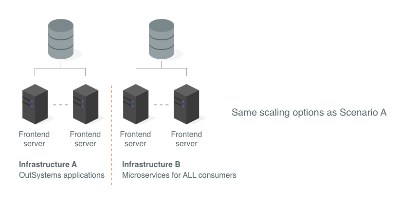

To isolate different microservices, simply add more microservices infrastructures — Infrastructure B example.

#### Comparing Scenarios

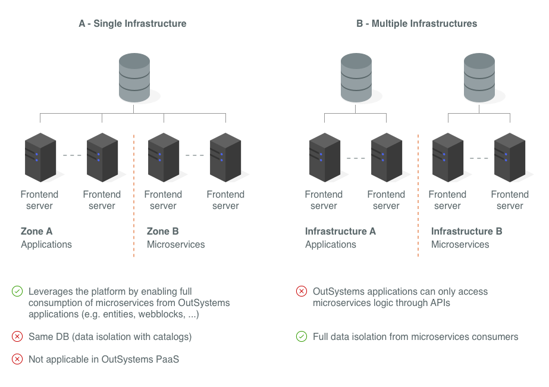

