# Domain Driven Design with OutSystems

With OutSystems 11, several features were introduced allowing users to create a domain architecture based in Domain Driven Design.

## When to adopt or leverage DDD?

So when's the right time to adopt or leverage the power of Domain Driven Design? That's a good question and normally one with a hard answer because each case has its own particularities.

You might decide to leverage it from day one, while others might tend to leverage it later on when things start to become more complex and convoluted. 

Be aware that sometimes, DDD would be a great fit, but in others it won’t. DDD is less useful when the applications have marginal domain complexity but conversely have a great deal of technical complexity.

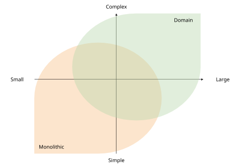

## Shaping Domain Driven Design

Shaping a DDD architecture in OutSystems follows 3 major steps:

### Design process

When designing the architecture of a complex system, the best approach is "*divide to conquer*", decomposing business into smaller blocks. This decomposition bases itself on lines of businesses or product lines. Since this is an iterative process, it should only stop when you find the right granularity for the block.

The iterative decomposition process has 3 steps:

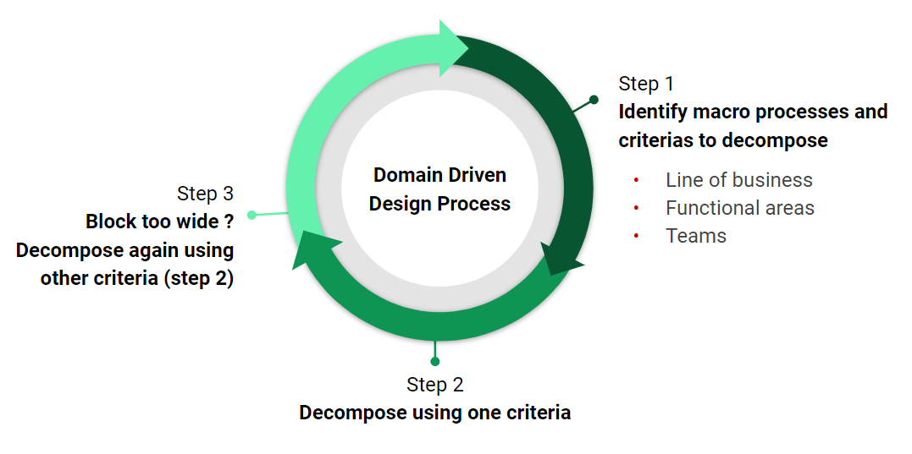

1. Identify the business’s macro processes and criteria

2. Decompose each macro process using predefined criteria:

    a. Line of Business

    b. Other functional criteria

3. Ask if the desired level of granularity has been achieved. If not, continue decomposing.

### Dedicate a multidisciplinary team

To promote ownership, control, and lifecycle independence, a team needs to be assigned to own a domain as soon as it's identified during the design process.

### Light and stable service interfaces

Public interfaces need to be created by each team inside each domain, providing service to other domains. This way, changes have  minimal impacts across unrelated domains.

## Concepts and mapping to OutSystems

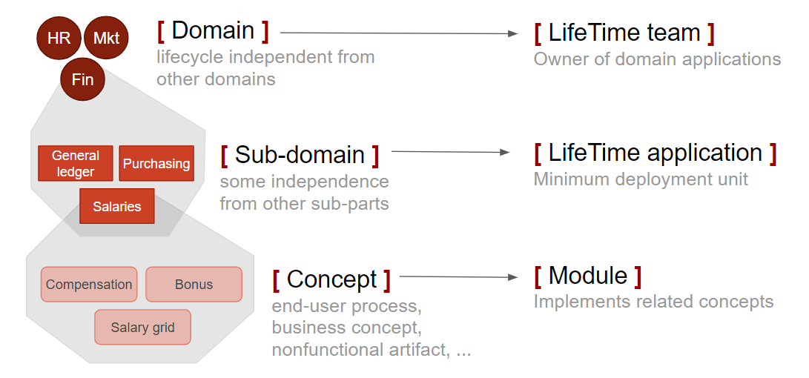

## Domain types

There are 3 domain types, each one with its own defined purpose.

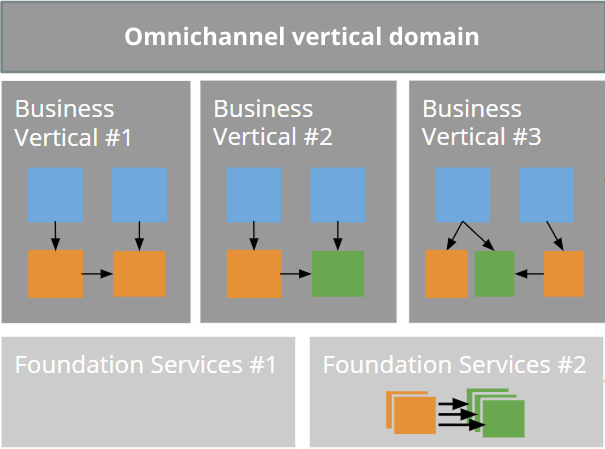

* **Orchestrator domain** - presented in the image as a Omnichannel, it provides the end user with a unified view of the independent business verticals.

* **Vertical domain** - supports a line of business.

* **Horizontal domain** - provides reusable core business services shareable to multiple vertical domains.

## Retain the best of monoliths and microservices

OutSystems allows you to design your architecture with a balanced compromise between the monolithic and microservices approaches. You can leverage all the good things that both have while designing and developing your applications.

### Inside a domain

While inside the same domain, keep strong coupling between elements.

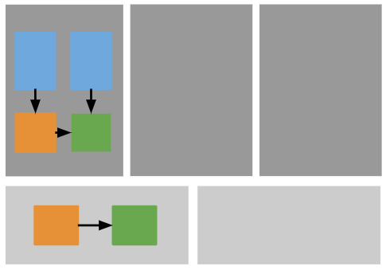

This benefits tight processes, by enforcing:

* In-process communication

* Common database transaction

### Across domains

Across domains, keep loose coupling relationships, providing domain APIs divided in two parts:

* **Public entities** 

Read-only entities to allow consumers to list, search or mashup with other entities

* **Service actions**

Data transactions and detail retrieval

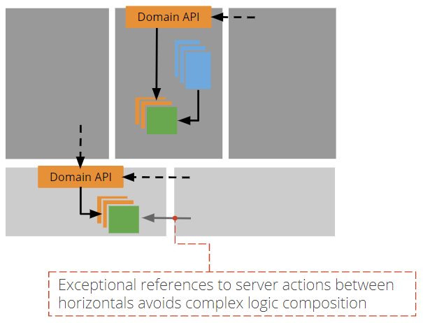

Strong relationships between horizontal domains can be made as an exception to orchestrate composite logic or transactions.

### With foundation applications in horizontals

Strong coupling with foundation applications in horizontals with non-functional requirements can be referenced directly by other domains. This is useful for themes, UI patterns, and plugins. 

## Domain architecture

A healthy domain architecture should provide data isolation, promote ownership and reduce impacts on changes.

It should also help the organizations to have a better understanding of the current landscape of services being provided and map those into business in a better and easy way.

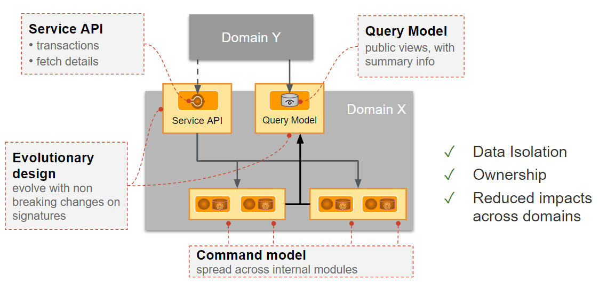

### How decoupled should domains be?

When starting a domain architecture, it's always recommended to start simple and add complexity when needed, so leveraging existing capabilities is the right way to start.

As the complexity, team structure and monolith increases, the architecture needs to be reviewed and new patterns should be implemented, as in the following diagram:

To achieve this, some rules must be followed.

### Domain validation rules

Reference objects between domains **are allowed within the following rules**:

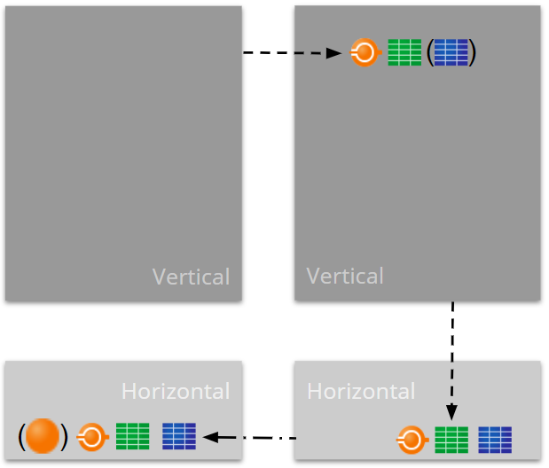

( ) optional references set by configuration

**Allowed references between vertical domains**

* Weak references like Service Actions and Structures (optionally references to Entities are allowed upon configuration)

**Allowed references between horizontal domains**

* Weak references like Service Actions, Structures and Entities (optionally references to Server Actions are allowed depending on configuration)

* Weak downward reference between a Vertical and Horizontal Domain Service Actions, Structures and Entities 

**Allowed references vertical to horizontal domains**

* Weak references like Service Actions and Structures

* Strong reference between a Vertical and Horizontal if the referenced element is part of a Foundation App

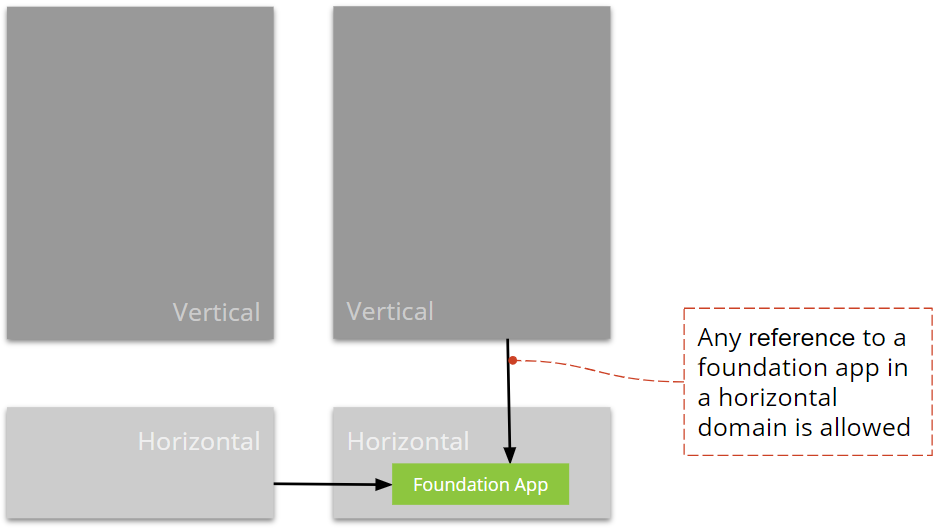

All remaining relationships between domains are considered architectural findings and not allowed.

As a note to remember, the orchestration domain in the [domain types section](#domain-types) is to be considered as a vertical domain when validating domain relationships.

### Architecture Principles

The same Architecture Canvas principles are applicable both within and across domains.

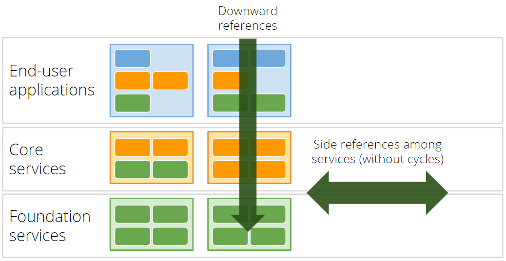

### Advanced Architecture Patterns

In some situations, it is necessary to implement advanced patterns that will support business use cases. 

In this section, we will cover the most important ones related to domain architecture.

#### Managing Multiple Transactions

Sometimes it is necessary to orchestrate seamlessly in one single transaction logic that is part of a different domain, because customers should not worry about custom exception handling or with API coordination of any kind.

The way we achieve this is by creating a Service Action that will then centralize in a single transaction multiple server actions, as follows:

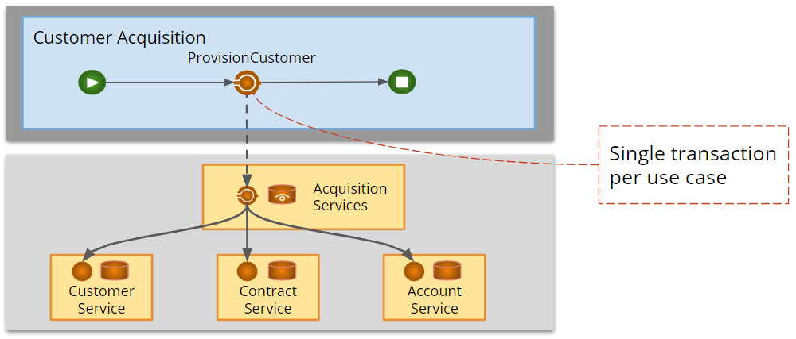

#### Mashing up data

When the need arises to mash up data that do not change often, a query model pattern can be used as follows:

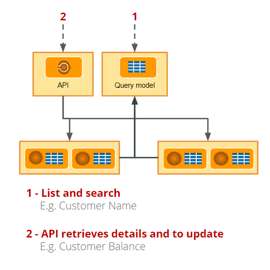

The query model should only expose a subset of data, the only data needed to provide list and search capabilities, and so avoiding the need to expose the entire database model and avoiding complex synchronizations. For the remaining operations like get record details or update a record, a Service Action or Rest API are to be used. 

### How to validate the domain architecture

In order to validate the architecture, there is a tool called Discovery, available in the OutSystems [forge](https://www.outsystems.com/forge/component-overview/409/discovery).
