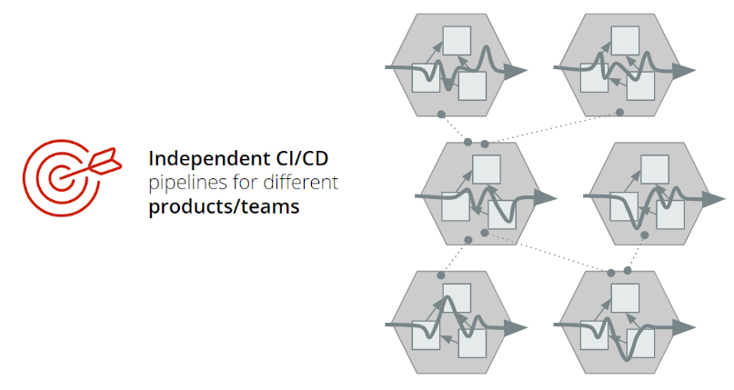

# Domain Driven Design

Domain Driven Design (DDD) is a way of more easily developing complex software by translating it into small connected pieces in an ever-evolving model of the core business logic. It's a methodology and process prescription for the development of complex systems. The focus of DDD is mapping business processes within a problem domain into the technology artifacts of a solution domain.

Its premise is:

* Place the project’s primary focus on the core domain and domain logic

* Base complex designs on a model

* Initiate creative collaboration between technical and domain experts to iteratively cut ever closer to the conceptual heart of the problem.

A simple premise, right? It seems like it, but pulling it off in the messy real world is hard. It calls for new skills, discipline, and a systematic approach.

## What's a domain?

A domain is a boundary for a business problem that needs to be solved by software. But how can one know the domain? By involving specialists, also called domain experts. These are the people who transfer knowledge, enhance a domain and allow you to understand it. They also help you to model the domain based on decomposing business into blocks based on lines of businesses, promoting ownership and increased control, simplifying into blocks and reducing the risk of change.

## Rules of thumb when designing the model

1. Focus on the core domain

1. Design a model in a creative collaboration between domain people and software people

    a. Design by business

    * Strong dependencies aren't allowed between each domain, avoiding collision and promoting independence.

    b. Loosely coupling between domains

    * Strong dependencies aren't allowed between each domain, avoiding collision and promoting independence.

    c. Ensure independent life cycles

    * Ensure that every line of business translated into domains, have a clear and isolated life cycle

1. Speak a ubiquitous language so that all stakeholders fully understand each other and can work efficiently
