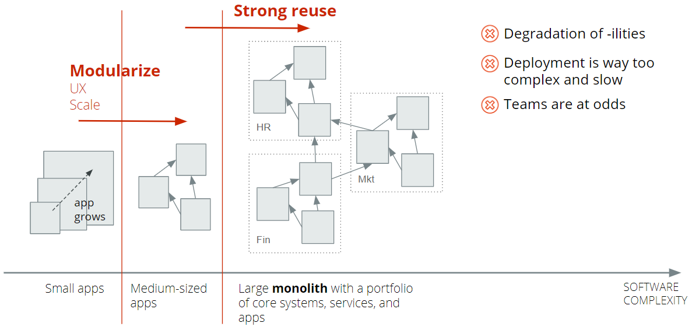
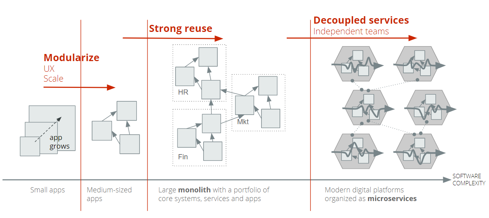
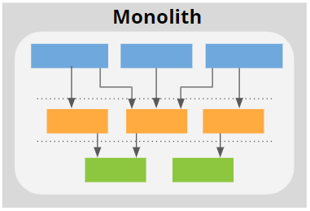
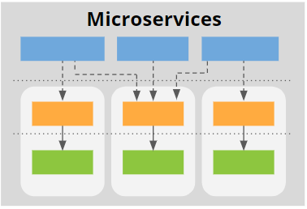
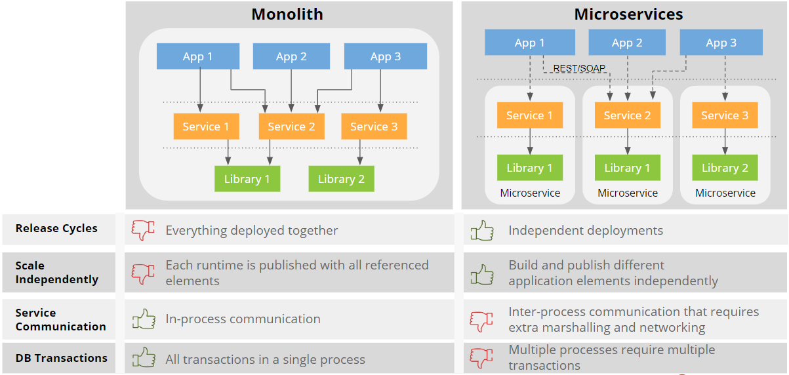

# OutSystems Domain Driven Architecture

In this section you can find information on all aspects of using a Domain Driven Architecture in OutSystems. The when and how to leverage and validate such solution is discussed, along with the existing methods and tools that you can use to validate your architecture.

## The architectural challenge

With the **growth of a software factory**, it becomes more and more difficult to isolate development and deployment. Both become more complex and slow. Small change requests become harder to implement. Planning becomes hard. This all means that the teams are at odds with each other. 

The teams start facing growing pains to cope with the interests of the business because everything starts to become interdependent. It becomes hard to avoid ripple effects where changes impact other businesses. Decisions are harder to make as more decision-makers are involved. 

The need to decouple the large monolith into small, serviceable pieces becomes imperative, providing team isolation and lifecycle independence.

As the software complexity increases, it also increases the need to split and organize the software into smaller serviceable pieces that can be independently managed by teams.

## The strategic and technical approaches

The strategic approach is to align software development and teams with the interests of the business. This approach is required to guide the teams on what to focus on and which specific area of business is related with business needs. It also helps keep major efforts devoted to what’s most important to the business now.

The technical approach is to guide development with the goal of preventing the software development model from becoming corrupted. The balance between both approaches it's covered next.

Is this always true? Does it apply to any software factory? Let’s look into both approaches.

|Simple logic and faster centralized development?|Continuous integration, continuous delivery and scalability?|
|--|--|
|||

   
Each option has advantages and disadvantages. Let’s look into the main ones:

