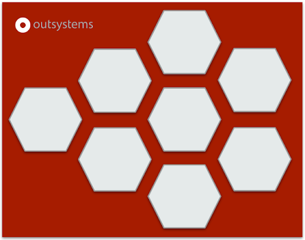
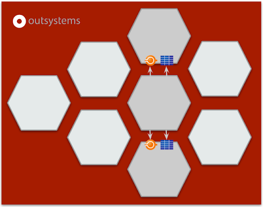

# Understanding microservices

Microservices (also known as the microservices architecture), according to James Lewis and Martin Fowler:

_is an approach to developing a single application as a suite of small services, each running in its own process and communicating with lightweight mechanisms, often an HTTP resource API. These services are built around business capabilities and independently deployable by fully automated deployment machinery. There is a bare minimum of centralized management of these services, which may be written in different programming languages and use different data storage technologies_.

With the hype of microservices and the fall of monoliths, it became clear that as the constituent services are small, they can be built by one or more small teams from the beginning, separated by service boundaries. All in all, this makes it easier to scale up the development effort.

|Microservices have many benefits...|...but come with additional burdens|
|-----|-----|
| **Strong Module Boundaries** Microservices reinforce modular structure, which is particularly important for larger teams. The structure of a software system mirrors the communication structure of the organization that built it.| **Inter-process communication** Dealing with network latency and hiccups, data marshalling **Multiple transactions** Handling and coordinating multiple independent commits|
|**Independent Deployment** Simple services are easier to deploy, and since they're autonomous, are less likely to cause system failures when they go wrong. Continuous delivery becomes a must, as the organizations that do this can respond quickly to market changes and introduce new features faster than their competition.|**Fault tolerance** Recovering from and handling communication errors and service consistency **Limited data mashup** Executed in memory and limited to APIs **Security** Access management and authentication|
|**Technology Diversity** With microservices, you can mix multiple languages, development frameworks and data-storage technologies.|**Debugging & troubleshooting** Drilldown to the root cause, because it may be inside of the chain of services **Monitor & logging** Need to centralize effective monitoring & logging|

As you can see, all the initial benefits create additional burdens. What was promised to speed up the process has now become a huge complexity problem.

Monoliths and microservices aren't a simple binary choice, and you must not forget that there are systems out there that don't quite fit into either category.

That said, the normal assumption is that, because of the cost of microservices on productivity, they can only be made up for in more complex systems, but this isn't absolutely true.

OutSystems already solves some of these burdens by:

|1. Adopting a single stack||
|--|--|
|   OutSystems provides you with built-in capabilities that handle: * Security * Debugging and troubleshooting * Monitor and logging||

|2. Exposing a query model||
|--|--|
|   By exposing a query model, data mashup is now possible, as you can query entities directly to read data and use APIs to write data. * Limited data mashup||

With this initial context in mind, it's now time to ask the question: when should you adopt a domain architecture (and therefore a microservices architecture) in OutSystems? Let’s dig into it!
