# Developing from the architecture blueprint

This article focus on putting into action the final architecture blueprint.

The [previous article](intro.md) explained the use case of a fictitious client. The Soccer Fields Fictitious client wants to build a web application to allow their clients to reserve soccer fields online.

Before proceeding, download from the OutSystems Forge the [Soccer Fields App](https://www.outsystems.com/forge/component-overview/8895/soccer-fields-app) resources, the [Soccer Field Sample API](https://www.outsystems.com/forge/Component_Overview.aspx?ProjectId=8896), and the [Field Core Services App](https://www.outsystems.com/forge/component-overview/8894/field-core-services), and install them on your personal environment to better follow the instructions provided.

## Requirements

The application must:

* Display a list of soccer fields, together with each field characteristics (size, availability, price/hour, …)

* Allow players to select a soccer field and book it.

An external system provides the list of soccer fields, meaning it’s not in the scope of this application to handle the actual field management or payment.

## Architecture design

In the [previous article](intro.md), you ended up with a final architecture blueprint. The image below shows it and sets the starting point of the development phase.

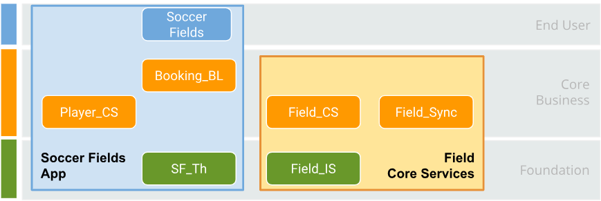

The following sections explain the process of translating a blueprint into an actual OutSystems application.

## Understanding the blueprint

This is the first step. To understand what you are looking at:

* You need to be able to identify which elements are modules and which elements are applications.

* You need to understand the nature and goal of each element, so you can place your code in the right place.

The following table shows some conventions:

|Conventions | |
|------------|-|
| Rectangles with round corners represent the **modules**. The rectangle color allows mapping each module to the level in the [Architecture Canvas.](https://success.outsystems.com/Support/Enterprise_Customers/Maintenance_and_Operations/Designing_the_architecture_of_your_OutSystems_applications/01_The_4_Layer_Canvas) |  |
| Rectangles with modules inside represent **Applications**. The rectangle color is lighter than the module color, and it also allows you to map the application to the architecture layers. | 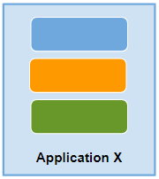 |

The architecture design must document the nature of each element. The architect is responsible for adding such details.

To proceed, you must think about the business requirements, and try to understand the goal and the scope of each module.

In this example, there are two applications:

* **Soccer Fields App**: this is the main application that contains the code to interact with the users and book the fields

* **Field Core Services**: this is a supporting application, that allows you to connect and obtain field information coming from an external source.

## Identify module dependencies

A good way of making sure the architecture is solid and you understand it, is to identify relationships and hierarchies between modules. Understanding which module depends on which, it’s a good first step to avoid breaking the [Architecture Canvas validation rules](https://learn.outsystems.com/training/journeys/validating-an-architecture-600/validating-modules-architecture/o11/1479), validated with the [Discovery](https://www.outsystems.com/forge/Component_Overview.aspx?ProjectId=409) tool.

This is most important at the core level, where incorrect dependencies lead to circular reference, due to the lack of proper concept isolation. This results in code refactoring, that tend to have high risk and costs.

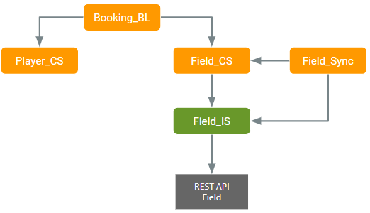

Here are some insights:

1. **Booking_BL** works by the composition of two core concepts, fields, and players. These two core concepts are independent, meaning that when a player books a field, the **Booking_BL** module keeps that association.

1. **Field_CS** contains a local replica of the existing fields, for performance reasons. The **Field_Sync** module synchronizes this local replica, and reads the information from **Field_IS** and writes it into **Field_CS**.

* Writing operations into the external system uses the connection between **Field_CS** and **Field_IS**: when the user books the fields, it informs the external system.

* Note that **Field_IS** is the only module that connects to the external REST API, normalizing the retrieved information into an internal format. This level of abstraction is crucial for your system to evolve independently of the external systems.

The architecture blueprints must contain this information. If not, the recommendation is that you make this exercise and validate the results with your architect.

## Creating the modules and applications

This section goes through the development of modules and applications. The first step is to open Service Studio and get your hands dirty!

### The end-user application

Following your architecture design let’s create the first application and modules:

1. In Service Studio, choose **New Application**, select **Web App**, and pick the **Liverpool** theme. Name the application "Soccer Fields" and click on **CREATE APP**.

1. Now that you created the first application, it’s time to create the first module.

    Note that the first module to create in an end-user application is a theme module. The theme module allows you to isolate and customize the style of your application, following the best practices.

    * By default, it's a good practice to create the module with the application name without spaces. Therefore you need to rename it to **SF_Th**, select the **Responsive** module type, and then click on the **CREATE MODULE** button:

    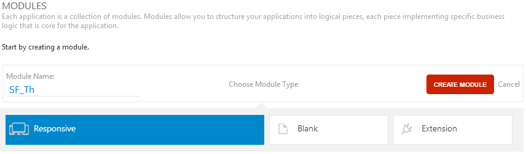

1. Before publishing your application, you may want to delete the **Emails** and the **MainFlow** UI flows. After this, you are ready to Publish your application by clicking on the **1-Click Publish** button:

    1. Delete "Emails" and “MainFlow” UI flows:

    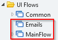

1. Create the front-end module for this application: **Soccer Fields**. Create a new **Responsive** module and publish it:

    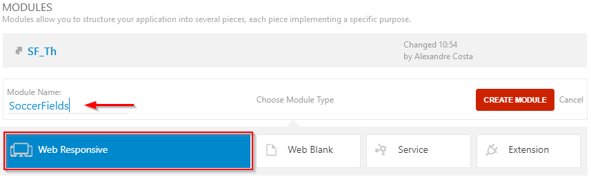

1. Set the **SoccerFields** module as the Home module.

    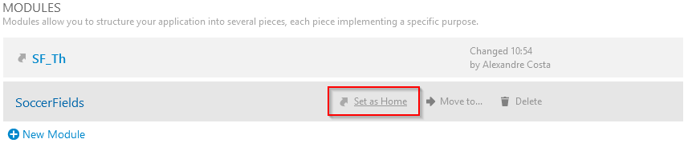

1. If you had a good look at the application composition, you noticed that this application is going to include two new modules: **Booking_BL** and **Player_CS**. Create these two new modules and remember to select the **Blank** module type, depicted in the figure below:
    * **Booking_BL**:

        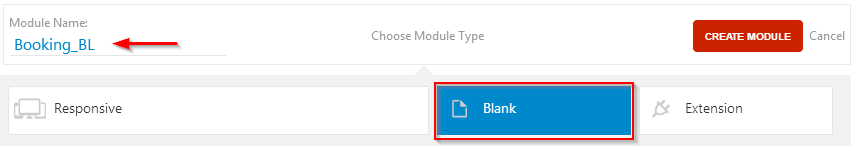

    * **Player_CS**:

        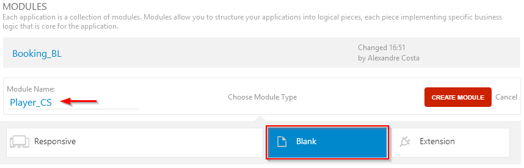

### The core application

1. Repeat the first step done for the "Soccer Fields" application, but this time name the application “Field Core Services”.

1. Create the first module for the "Field Core Services" application. As depicted in the picture below, the first core module (**Field_IS**) has the **Blank** module type instead of **Responsive**. The reason is the “Field Core Services” is a core services application and it shouldn't host any end-user screens, according to the best practices.

    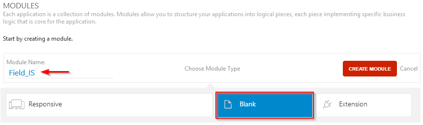

1. After clicking on **CREATE MODULE**, publish your application by clicking on the **1-Click Publish** button.

1. Now that you have your Core Application and your first module create the remaining modules: **Field_CS** and **Field_Sync**. For each module, click on the **New Module** button, rename the module accordingly, and select the **Blank** module type. Click on the **CREATE MODULE** button and publish it.

### The foundation application

For this sample, it's not necessary to have a foundation application due to the simplicity of this example and reusability needs.

#### Implementation

Now that you have your applications and modules created, let’s start programming.

To simulate the fields API that your application consumes, this example bases on an OutSystems pre-created simple fake API module that exposes only what you need. Other technology could apply because you are going to use REST to communicate with it.

 Remember: this article refers to the OutSystems architecture and how to put it into action. It doesn't discuss the best approach to implement an API using OutSystems.

The API is very simple, as there's only one resource: the fields. Every request needs to send the **API_KEY** request header with a valid key. Since this is a sample, the valid **API_KEY** is "_outsystems_is_awesome_".

#### Architecture patterns

As referred before, the architect has to document the architecture patterns in the architecture design.

For this use case, there is an important integration pattern, to retrieve the soccer field information.

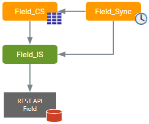

In this partner, focus on 3 architectural patterns:

1. Integration with an External System

1. Local Replica of data

1. Synchronization of data

#### Translating the pattern into code.

1. **Integrating with an External Service**

    Start your implementation by the integration with the external API. The **Field_IS** module is the right place to do this since it's your technical wrapper for consuming and normalizing the data from the external API. This module is responsible for abstracting and isolating all the particularities of the external API.

    1. Consume the external API

        Open the **Field_IS** module, click on the **Logic** tab, and under the **Integrations** folder, right-click on the REST node and select **Consume REST API…**. Let’s assume the team that developed the external API provided you with a swagger spec. In this case, you're using the sample fake service already mentioned. So, you just need to click on **ADD ALL METHODS** and fill the URL of the swagger file.
        After clicking **OK** , the external API should look like this:

        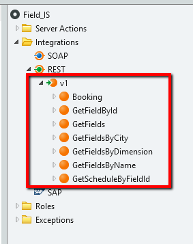

    1. Send the API Key

        To complete the integration with the external API, you need to send a valid key in the **API_KEY** request header. To accomplish this, implement the **OnBeforeRequest** event. You just need to select the endpoint, click on the dropdown next to the **On Before Request** property and select **New OnBeforeRequest**, like you can see on the picture below:

        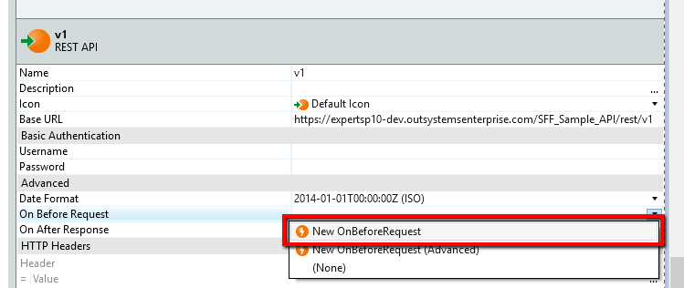

        The implementation of the **OnBeforeRequest** event should look like this:

        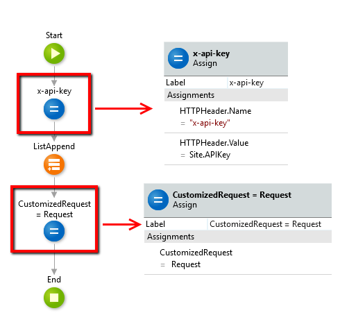

    1. Retrieve a list of Fields with summary data.

        First, create a structure named **Field_IS_Summary**, which is going to be the output of an action that provides the list of Fields fetched from the external API to the upper layers.

        To abstract the consumers from these external data types, and consequently prevent the impact of future changes of the external data types, in this particular case the **Field_CS**, don’t reuse the structure auto-generated by the external API.

        The structure attributes should look like this:

        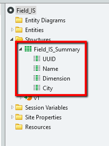

        Now you're ready to create the server action that the core service is going to consume. Click on **Add Server Action** and name it **Field_IS_GetSummaryFields**. Set the Public property to “Yes” and implement the following logic:

        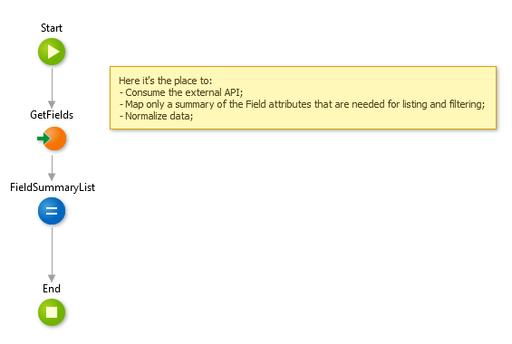

1. **Local Replica of data**

    To increase performance and provide a better user experience to the end user, create a local replica of data on the application side. To accomplish this, create a local entity where you're going to store the data that's going to get from the external system.

    1. Public Local Entity Read only

        On the Field CS, create a new entity Field entity. Add all the fields that the Field IS summary structure is going to return. Remember to set some fields mandatory (like Name and Dimension), required to identify a field record.

        Set the Public property, and also the Expose Read-only property to **yes**. You want to avoid that other external modules can change data directly. The following screen shows how the entity should look like.

        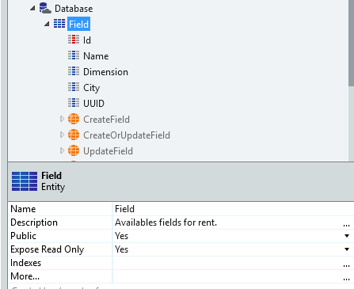

    1. Creation of CRUD (Create, read, update and delete) actions

        Because you're exposing the entities as read-only, you need to set actions that are going to centralize the creation of the data in these entities. One other advantage of this approach is that this way you can also centralize any general operations (like logging) on a central action. Avoiding any sort of duplicated code.

        For this scenario, create actions for the 2 major operations that are normally used for creating any type of field records. Create a new folder on the server actions and add the **Field_Create** action. Add a Field as an input parameter and an **id** as a Field identifier as an output parameter. On the body of the action just drag the **CreateOrUpdateField** internal action, and add one assignment at the end for returning the created **id**.  

        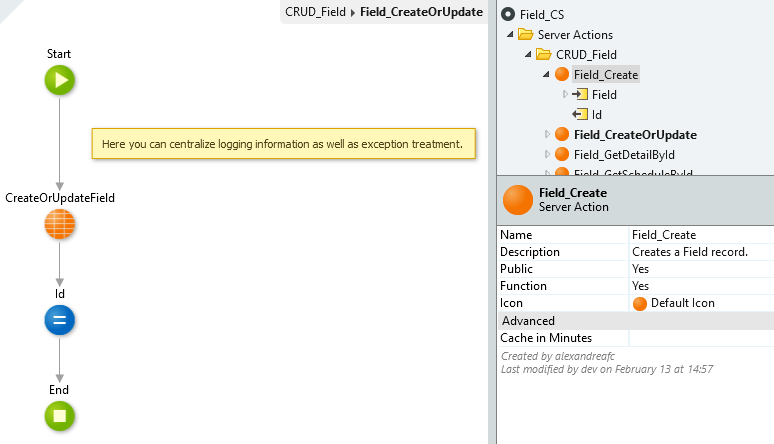

        Repeat the same receipt for creating the **Field_CreateOrUpdate** action.  

1. **Synchronization of data**

The **Field_Sync** module is going to make the asynchronous synchronization logic from the external system into the local cached one. This module holds the timers and the logic, referencing the **Field_IS** and **Field_CS**.

At a specific time, the sync timer triggers. Then, the sync algorithm gets a subset of data fields from the external system using the **Field_IS_GetSummaryFields**"** created on step 1. The following screen and the described steps exemplify the sync field data algorithm.

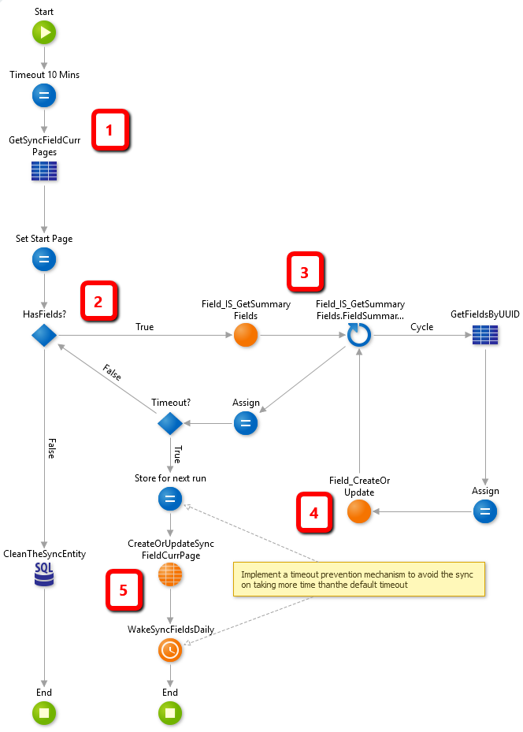

1. Set a logic timeout (10 minutes). The **GetSyncFieldCurrPages** aggregate gets the possible stored progress of a previous timer to continue processing. This scenario is to follow best practices when designing timers (never times out, doesn’t repeat work, ensures completeness, ensures data integrity);

1. This **if** logic guarantees the start and recursion of the sync flow in case that you still have data to sync to your local cache;

1. The actual call to the action on the IS module occurs here. This triggers the call to the external system and returns a number of records to sync;

1. On this loop, cycle through all the results and insert/update them on your Field Entity;

1. At the start of this condition, check if you're reaching the logic timeout (best practice) defined on step 1, and if you still have any more records to process.

    1. If you didn’t reach the 10 minutes timeout and you still have records to process, continue cycling the algorithm once more;

    1. If you reached the logical timeout of 10 minutes, store the progress so far and wake the timer again before ending your current execution (ensure best practices on timers);
