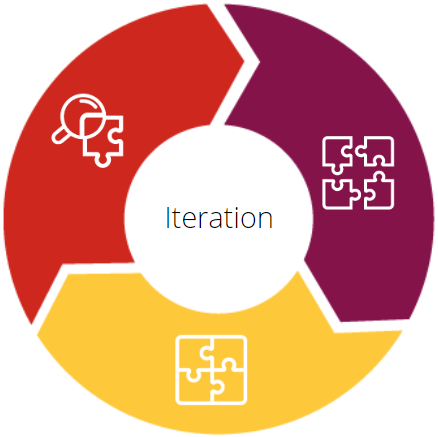
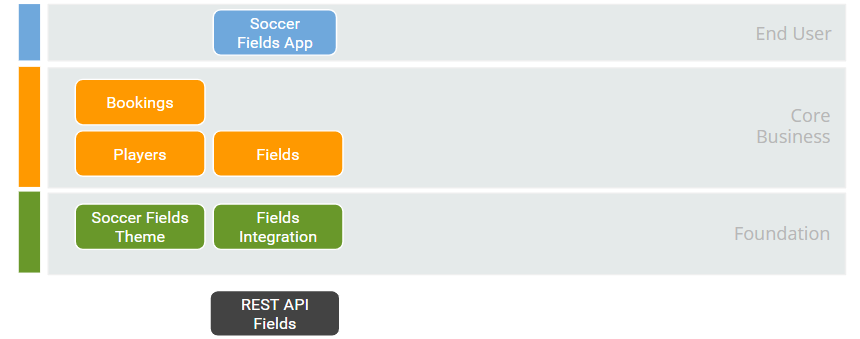
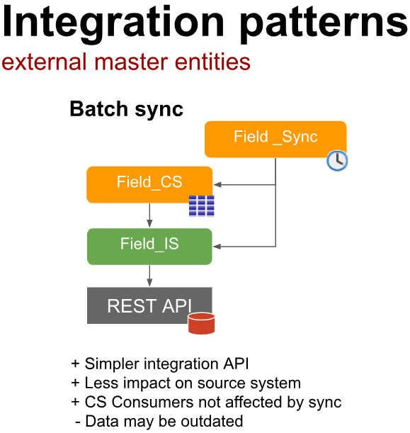
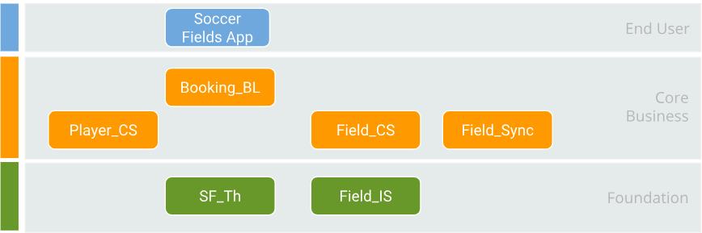
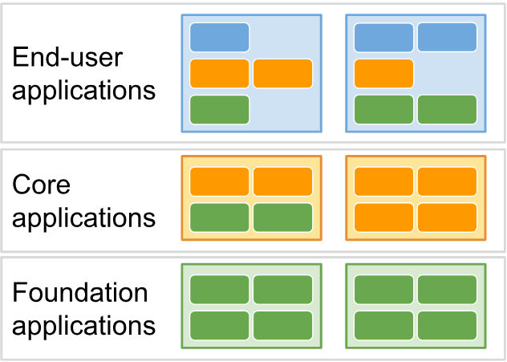
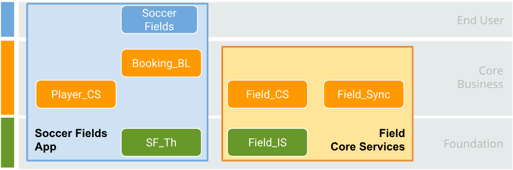

# From architecture to development

This set of articles provide guidance on how to translate an architecture blueprint into a real [OutSystems](http://www.outsystems.com/) application.

This article focuses on how to design the architectural blueprint of the application. [The second article](arch-to-dev.md) guides you on how to start developing the application based on the blueprint. It also includes the code sample where you can evaluate the coding and architecture best practices put into action.

## Architecture blueprint design

Imagine you have a customer, the Soccer Fields Fictitious, that wants to build a web application to allow their clients to reserve soccer fields online.

_Disclaimer: this is a hypothetical use case, from a fictitious client._

### Requirements

The application must:

* Display a list of soccer fields, together with each field characteristics (size, availability, price/hour, ...)

* Allow players to select a soccer field and book it.

Note that an external system provides the list of soccer fields, meaning it's not in the scope of this application to handle the actual field management or payment.

## Architecture design process

The architecture design process follows a 3 step approach.

|||
|---|---|
||**Disclose** business concepts and integration needs|
||**Organize** concepts on the architecture Layer canvas|
||**Assemble** Matching recommended patterns|

It's important to understand that you should iterate these three steps multiple times, until you feel comfortable with the design, and eventually repeat the process during the implementation, as you discover new concepts and/or details.

This article exemplifies a simple application and makes a single iteration only.

### Disclose (business concepts and integration needs)

First of all, let's understand the functional and non-functional requirements. In this step, you need to find out all the user stories as you can, understand the integration needs, and the UX expectations.

**Functional Requirements**

1. Search for a Field using the following filters:

    * Name of the field
    * City
    * By field size (how many players can play together)

1. Allow the booking of fields by players planning to use them.

**Non Functional Requirements**

1. Be compatible with the leading browsers on the market.

1. Retrieve the list of soccer fields from an external system, by consuming a REST API.

1. The system needs to work online and the UI must adapt to mobile devices.

### Organize (concepts on architecture canvas)

Let's have a quick recap of the [Architecture Canvas](https://success.outsystems.com/Support/Enterprise_Customers/Maintenance_and_Operations/Designing_the_architecture_of_your_OutSystems_applications/01_The_4_Layer_Canvas) principles:

| Layer | Description |
|---|---|
|  | User interfaces and processes, reusing **Core** and **Library** to implement the user stories. |
|  | Services around business concepts, exporting reusable entities, business rules, and business widgets. |
|  | Business-agnostic services to extend the framework with highly reusable assets, UI Patterns, connectors to external systems, and integration of native code. |

Keep in mind this article doesn't focus on the architecture design process, but on the process from the architecture to development, so it mentions only the essentials in this part. For detailed information about the Architecture Canvas and on the design process refer to [OutSystems Architect online training](https://www.outsystems.com/training/courses/193/designing-apps-using-an-architecture-framework/).

Based on these principles, you end up with the following concepts of the application on the following layer canvas:

The main concepts identified were:

* **SoccerFields**: The main application that holds the interaction with the users.

* **Bookings**: The functional requirement, that allows players to book fields.

* **Players**: The players that use the application and use/book the fields.

* **Fields**: The main field concept, used for searching and to do the bookings by the players.

* **Fields Integrations**: An external system stores the Soccer field, so you need a non-functional requirement module to connect to the external system through an API.

* **Soccer Fields Theme**: The look and feel of the application needs to be mobile responsive.

### Assemble (matching recommended patterns)

And now, Assemble! Let's remember the principles involved here:

* Join concepts if they're conceptually related.
* Don't join concepts if they're too complex or have different life cycles.
* Isolate the reusable logic from all the integration logic that consumers don't care about.

Based on these principles and looking into the architecture patterns and best practices, this article focuses on the following concepts:

**Online**: To access an external API, use the **Field_IS** module (IS means integration service). The responsibility of this model is to know the external API and normalize the data for internal access so the **Field_CS** and **Field_Sync** modules don't need to know any particularity of the API. In terms of abstraction, this is very important. Using this pattern makes your application more resistant to the API changes, and it's not forced to absorb what you don't want from the API in your data model.

**Batch Sync:** Use this second pattern to facilitate filters and to deliver a better user experience (by enhancing performance). Keep on your side a summary of the Field entity so that you can do the main searches in the local entity without accessing the external API. To achieve this, the **Field_Sync** module is going to synchronize field data once a day.

The figure below shows these patterns design:

**Business Logic Module:** Another recommendation is to isolate **B**usiness **L**ogic (Actions) or **C**ore **W**idgets (Webblocks), to manage complexity, composition or to have its own lifecycle. In this case, it wasn't necessary to create a _CW module. Maybe you can have it later, but for now, the **Booking_BL** module addresses all business logic required.

By applying these architectural patterns and using a common [naming convention](https://learn.outsystems.com/training/journeys/architecture-framework-593/naming-conventions-for-modules/o11/988) to the module names you end up with the following architecture blueprint for the modules:

Looking at the main functionalities and responsibilities of each module, you have the following:

* **SoccerFields**: End-user application with all screens for finding and booking soccer fields.

* **Booking_BL**: Contains all logic related to managing a booking, combining the logic of field and player concepts.

* **Player_CS**: Reusable core service with the player entity and related entities.

* **Field_CS**: Reusable core service that hosts a local replica of external data, namely field entity and related entities - the cold cache.

* **Field_Sync**: Logic to synchronize data from an external system into **Field_CS**. This module is responsible for isolate all logic to keep a cold cache only with a summary of the Field entity.

* **Field_IS**: Technical wrapper to consume and normalize the Field API. This module is responsible for abstracting and knows all particularities of the external API.

* **SF_Th**: Theme module (non-functional) for the main look and feel of the Soccer Field application.

### Application composition

You need to think about architecture not only when creating your modules, but also when creating your applications and how to organize them.

An OutSystems application is a set of modules defined in Service Studio that constitute a minimal deployment unit for LifeTime (tool responsible for application lifecycle management in OutSystems).

Consider the figure below:

Applications need to respect layers as modules need, but what defines an application layer is the topmost layer of the modules inside it. In other words, if you have an application composed of modules from the Foundation layer only, then this application is a Foundation Application. If you have another application with modules of the foundation layer but also with one or more modules of the core layer, then this application is a core application.

Here's the application composition for the Soccer Fields App:

As you can see, there are two applications:

* **Soccer Fields App**: Contain the **SoccerFields** user module, the front-end application users interact with, used for style customizations too. Inside, there's also the **SF_Th module**, in case the application has any custom style applied.

* **Field Core Services:** Contain all the field related modules.

To learn how to put into action the final architecture blueprint, see the [Developing from the architecture blueprint](arch-to-dev.md) article.
