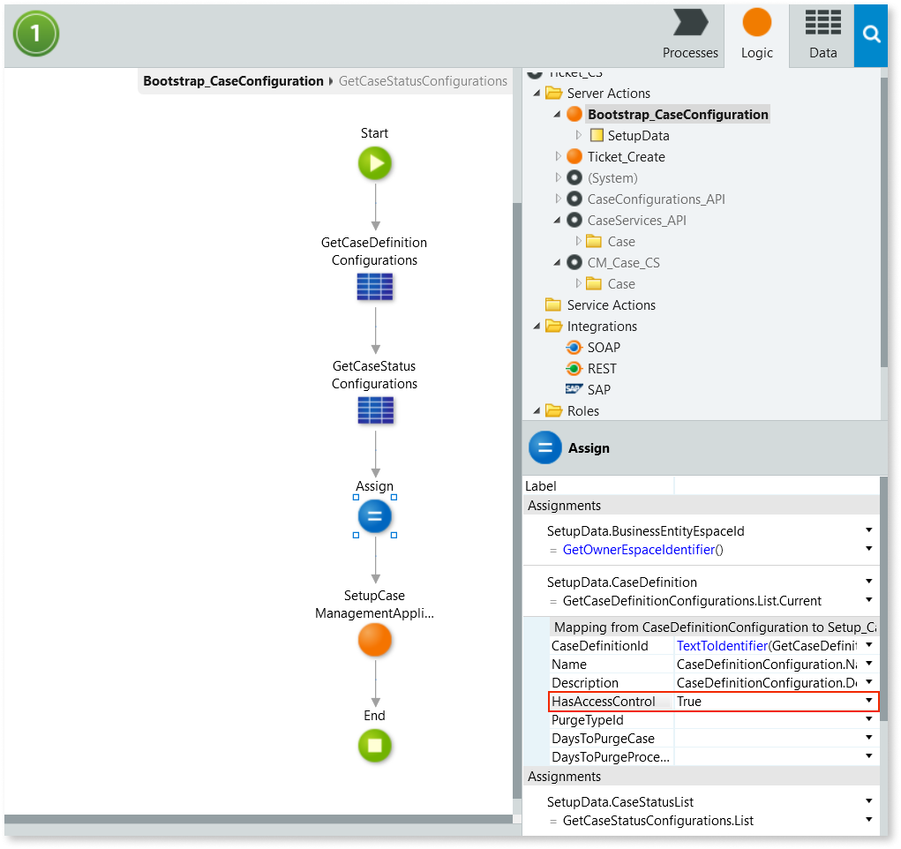

# How to enable access control

In the Case Management framework, access control is managed at the case definition level.

Before granting access to a single case instance or to all instances of a case definition, you must start by enabling access control for that case definition.

If your case management app includes more than one case definition, you must enable access control for each of the case definitions that you want to restrict access to.

To enable access control for a case definition, follow these steps:

1. In the **&lt;business-entity&gt;_CS** module, go to the **Logic** tab, and open the **Bootstrap_CaseConfiguration** action flow.

    

    The &lt;business-entity&gt;_CS module is the module that contains the case definition for which you want to enable access control, where &lt;business-entity&gt; is the name of the business entity associated with that case definition.

    

1. In the action flow select the **Assign** and set the **HasAccessControl** to `True`.

    

1. Publish the module by selecting **1-Click Publish**.

After publishing the app, the Bootstrap_CaseConfiguration timer runs, updating the configuration of the case definition and enabling access control for all case instances of that case definition. After enabling access control for a case definition, when using the [Case Management framework actions take access rights into account to interact with that case definition](permission-actions-ac.md).
