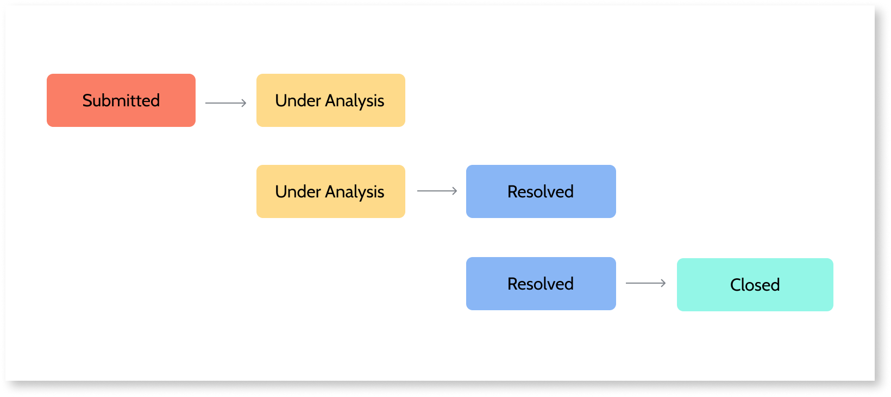
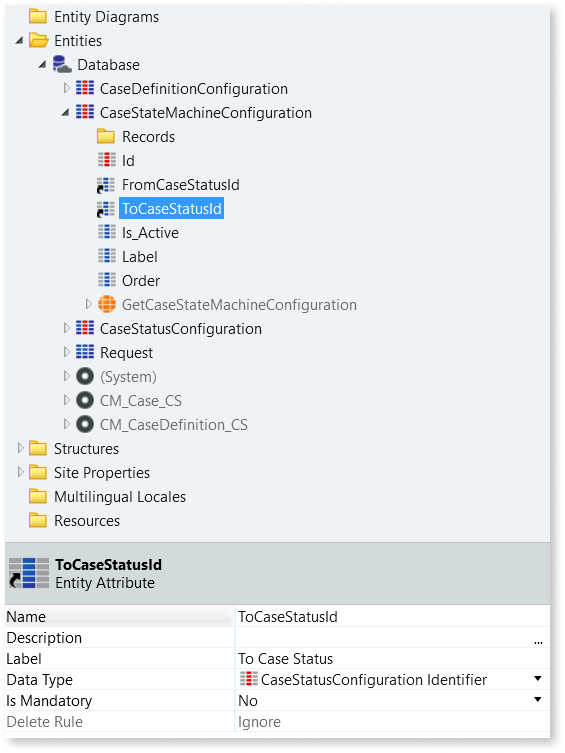
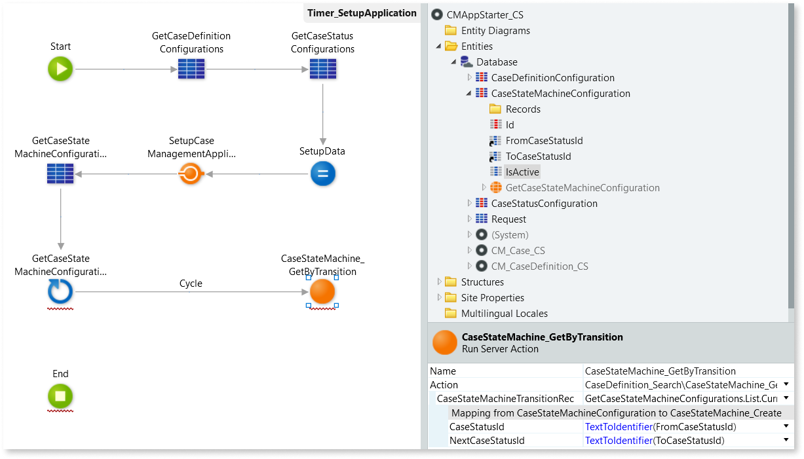
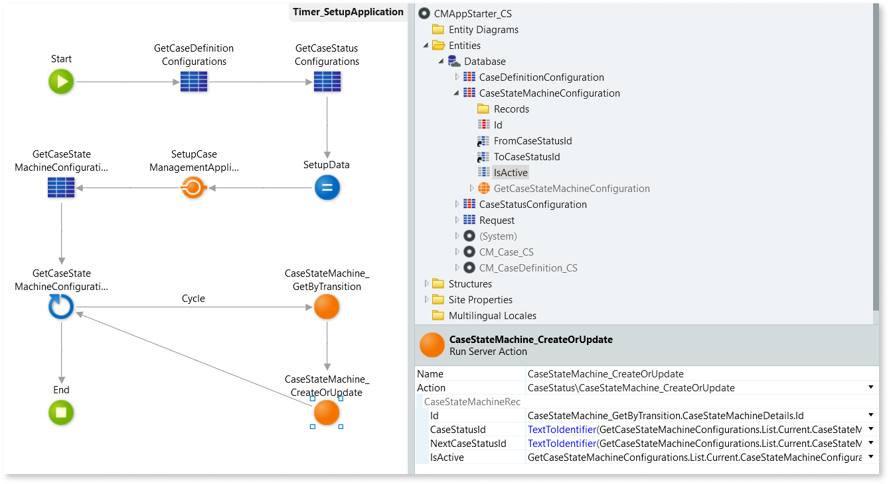

# Defining allowed case status transitions with a case state machine

A case state machine defines what transitions between case statuses are allowed. For example, you can use the case state machine to allow a case status change from "Under Analysis" to "Resolved", but not from "Submitted" to "Open".

A case state machine is important when status updates aren't done programmatically, and the end user of the app can choose between the different possible status.

To use a case state machine with the Case Management framework, you start by [setting up the case state machine](#create-the-case-state-machine), and then you [add all the  allowed case status transitions](#add-allowed-status-transitions).
If a status transition isn't defined in the case state machine, it's considered invalid and an exception is thrown when an end user tries to do that status transition.

## Create the case state machine

Before you start make sure you [set up your app to work with the Case Management framework](bootstrap-app.md).

To define a case state machine, follow these steps:

1. In the **&lt;business-entity&gt;_CS** module, open **Manage Dependencies**, and add the **CaseStateMachine_CreateOrUpdate** and **CaseStateMachine_GetByTransition** actions from the **CaseConfigurations_API** producer.

1. In the **Data** tab, create a `CaseStateMachineConfiguration` **Static Entity**  with the following attributes:

    * `Id`, with the **Data Type** set as **Integer** and **Is AutoNumber** set to **Yes**.

    * `FromCaseStatusId`, with the **Data Type** set to **CaseStatusConfiguration Identifier**.

    * `ToCaseStatusId`, with CaseStatusConfiguration Identifier data type.

    * `IsActive`, with boolean data type.

    

1. In the **Logic** tab, open the **Timer_SetupApplication** server action.

1. In the action flow, drag the **CaseStateMachineConfiguration** static entity before the **End**, to add an aggregate that fetches all records in CaseStateMachineConfiguration.

1. After the aggregate created in the previous step, add a **For Each** to the flow.

1. Set the **Record List** of the **For Each** as `GetCaseStateMachineConfigurations.List` (the output list of the aggregate).

1. Add a [**CaseStateMachine_GetByTransition**](ref/auto/CaseConfigurations_API.final.md#CaseStateMachine_GetByTransition) action next to the **For Each**.

1. Connect the **For Each** to the **CaseStateMachine_GetByTransition** action.

1. Set the **CaseStateMachineTransitionRec** of the **CaseStateMachine_GetByTransition** as `GetCaseStateMachineConfigurations.List.Current.CaseStateMachineConfiguration`.

1. Set the inputs of the action with the data from the aggregate as follows:

    * Set **CaseStatusId** as `TextToIdentifier(FromCaseStatusId)`.
    * Set **NextCaseStatusId** as `TextToIdentifier(ToCaseStatusId)`.

1. Add a [**CaseStateMachine_CreateOrUpdate**](ref/auto/CaseConfigurations_API.final.md#CaseStateMachine_CreateOrUpdate) action next to the **CaseStateMachine_GetByTransition**, and connect the **CaseStateMachine_GetByTransition** to the **CaseStateMachine_CreateOrUpdate** action.

1. Connect the **CaseStateMachine_CreateOrUpdate** to the **For Each**.

1. Connect the **For Each** to the **End**.

1. Expand the **CaseStateMachineRec** input of the **CaseStateMachine_CreateOrUpdate** action by clicking **+**, and then set the attributes as follows:

    * Set **Id** as `CaseStateMachine_GetByTransition.CaseStateMachineDetails.Id`.
    * Set **CaseStatusId** as `TextToIdentifier(GetCaseStateMachineConfigurations.List.Current.CaseStateMachineConfiguration.FromCaseStatusId)`.
    * Set **NextCaseStatusId** as `TextToIdentifier(GetCaseStateMachineConfigurations.List.Current.CaseStateMachineConfiguration.ToCaseStatusId)`.
    * Set **IsActive** as `GetCaseStateMachineConfigurations.List.Current.CaseStateMachineConfiguration.IsActive`.

1. Publish the module by selecting **1-Click Publish**.

After these steps you can add the allowed status transitions.

## Add allowed status transitions

After creating the case state machine, add the allowed status transitions to the state machine by following these steps:

1. Still in the **&lt;business-entity&gt;_CS** module, add a record to the **CaseStateMachineConfiguration** static entity.

1. Set the **FromCaseStatusId** as the CaseStatusId of the starting status.

1. Set the **NextCaseStatusId** as the CaseStatusId of the ending status.

1. Set **IsActive** as **True**.

1. Repeat the previous steps for every allowed case status transition.

1. Publish the module by selecting **1-Click Publish**.

After these steps the bootstrapping action loads the allowed status transitions and associates them with the case definition.

Whenever you [update the status of a case](case-state.md#update-the-status-of-a-case), CMf automatically validates the transition for you.
