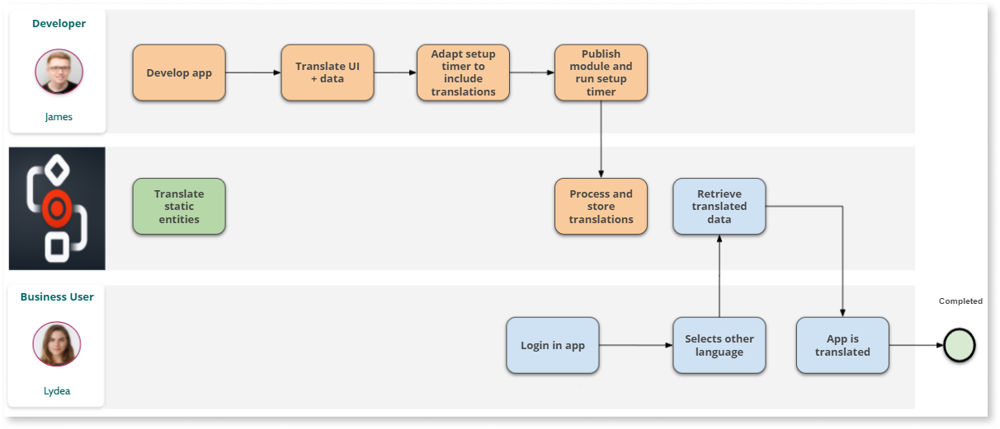

# Introduction to multilingual Case Management framework

Case Management framework (CMf) now includes multilingual capabilities allowing you to build OutSystems Case Management (CM) applications in different languages. 

The supported languages are:

* English
* Portuguese
* Arabic
* Japanese
* Spanish
* Italian
* Dutch
* German

## Process Overview

To build translated Case Management applications on top of the framework, first you need to create the CM app and then translate the UI content, business data, and any of the following CMf static entities in Service Studio:

* CaseDefinitionConfiguration
* CaseStatusConfiguration
* Milestones (if applicable)
* CaseActions (if applicable)

The CMf APIs return data translated to the current locale language selected at the application level. Following this, the setup timer **Bootstrap_CaseConfiguration** must be adapted to include the translations and it then needs to be executed. Finally, CMf processes the setup data and stores the translations.

A typical process flow is shown in the diagram below.

The full procedure on how to [enable Multilingual CMf can be found here](enabling-multilingualcmf.md).
