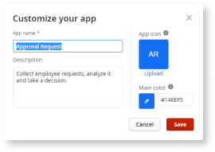
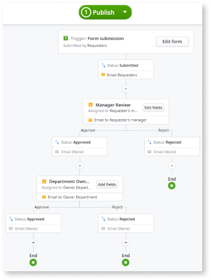

# Using the Approval Request template

To start creating your app using the Approval Request template, follow the steps below.

1. On the initial screen, select the **Approval Request** option. Workflow Builder then displays a preview about creating apps with the selected template.

1. Click on the **Select** button to proceed.

1. Enter the app's basic information:

    * **App name** — the name of the app you are developing.

    * **Description** — a brief description of the outcome of the app.

    * **App icon** — upload an icon for the app that you are about to create.

    * **Main color** — Pick up the color to apply to the main actions (buttons) and menus background on the generated app. If you upload an icon for your app, Workflow Builder selects the main color based on it, for example, your company brand color.

        

1. Click on the **Save** button. Workflow Builder then creates and displays the workflow of your app.

    

1. On the initial form at the top of the workflow, click on the **Edit form** button to edit the form fields of the template. You can rename, change the properties, add, or remove fields.

    For detailed information about editing forms, go to the [Set up form](how-create-app-from-scratch.md#set-up-form) section of the [Creating a Workflow Builder app from scratch](how-create-app-from-scratch.md) document.

1. On the **Status** rectangle below the form, set the status for the form to have when your users submit it. The default status is **Submitted**.

    For detailed information about setting the form's status, go to the [Set form status](how-create-app-from-scratch.md#set-form-status) section of the [Creating a Workflow Builder app from scratch](how-create-app-from-scratch.md) document.

1. Click on the **Manager Review** manual task below on the workflow to create an assignment to the user or groups of users you want to assign the task, and to edit the manual task fields.

    For detailed information about assigning tasks, go to the [Manual tasks](how-create-app-from-scratch.md#manual-tasks) section of the [Creating a Workflow Builder app from scratch](how-create-app-from-scratch.md) document.

1. Click on the rectangles below the **Manager Review** manual task on the workflow to edit the predefined statuses.

1. To edit the **Department Owner Review** manual task, and its fields, repeat step 7 of this procedure. You can always delete steps on the workflow if you don't need them.

To learn how to publish and test your Workflow Builder app, go to [Publishing and testing your app](publish-test.md).