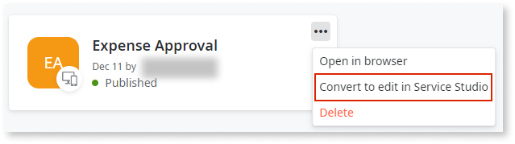
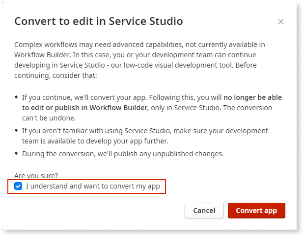
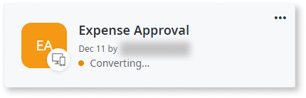
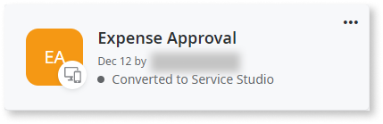
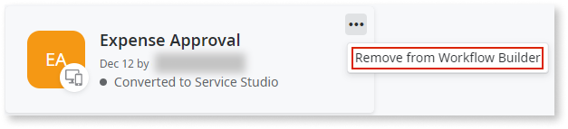

# Converting a Workflow Builder app to Service Studio

If you want to evolve your app by adding features unavailable in Workflow Builder, you need to convert the app to Service Studio. 
Once you convert your app to Service Studio, you can no longer use Workflow Builder to edit it.
 
To convert your app you must be a [**Workflow Builder administrator**](how-works.md#workflow-builder-administrator) and follow these steps:

1. On the **My Apps** screen, click the three dots (**...**) in your app.

1. From the dropdown menu, click **Convert to edit in Service Studio**.

    

1. Read the disclaimer carefully, and click the **I understand and want to convert my app** checkbox.

    

1. To start the conversion, click **Convert app**. The conversion process can take several minutes to complete.

    

1. Once the conversion ends, the app shows the status **Converted to Service Studio**. From this point on, you can now edit the app in Service Studio and you can't edit the app in Workflow Builder.

    

1. If you want to remove the converted app from the **My Apps** screen of Workflow Builder, click the three dots (**...**) in your app and click **Remove from Workflow Builder**.

    
