# Creating a Workflow Builder app from scratch

The instructions that follow use the example of creating an expenses approval app.

To start creating your app from scratch, follow the steps below.

1. On the initial screen, select the **Blank Canvas** option. Workflow Builder then displays a preview about creating apps from scratch.

1. Click on the **Select** button to proceed.

1. Enter the app's basic information:

    * **App name** — the name of the app you are developing.

    * **Description** — a brief description of the outcome of the app.

    * **App icon** — upload an icon for the app that you are about to create.

    * **Main color** — Pick up the color to apply to the main actions (buttons) and menus background on the generated app. If you upload an icon for your app, Workflow Builder selects the main color based on it, for example, your company brand color.

        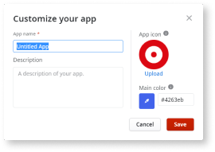

## Workflow design

Once you fulfill the overall information about the app, you can start designing the workflow.

All applications created in the Workflow Builder start by creating a single request **form** used to gather the required information from your app end users. These forms are the trigger of every workflow, so the first thing to do in your new app is to create a form. For example, if you are building an app to manage expenses from your employees, you need to add the form that they're going to fulfill for the expense request, to trigger the approval process of that particular expense.

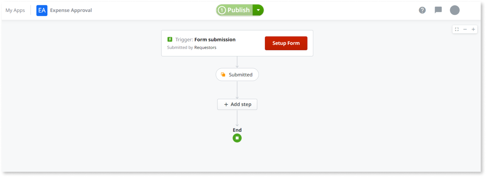

## Set up form { #set-up-form }

To create the form to gather information from the end users, follow the steps below.

1. Start by clicking on the **Setup Form** button. In this screen, you can define the request form your end users are going to see. To publish your app, you need to define at least one form field.

    

1. Click on the **+Add a field** button. The **New field** window opens.

1. The **Type** of the field is automatically pre-filled based on the field name, but you can select another one that better fits. Each selected type shows different input parameters, for example, the Dropdown type allows you to add several options for your users to select from:

    * Number
    * Text
    * Currency
    * Date
    * Checkbox
    * Dropdown
    * Database Entity - Read more about using OutSystems database Entities  in the [Using the existing OutSystems database Entities](#use-outsystems-entities) section.
    * File upload

    

1. To make a field visible depending on the user inputs, click **Add visible rule** to set the conditions to make it visible. Learn about this feature in the [Adding conditional fields](#add-conditional-fields) section.

1. Click **Save**.

1. To add other fields to your form, repeat steps 2 to 4.

1. To preview your app's form, select the **Preview** button on top of the screen. The form preview opens in a new tab and you can test it by interacting with it.

### Adding conditional fields { #add-conditional-fields }

When building your form, you can choose to make fields visible depending on your user's inputs. To add conditions to a form field, follow these steps:

1. On the **New field** window, enter the field **Label** and **Type**.

1. Click **Add visibility rule**.

    

1. From the first **If** dropdown (1), select the field name you want to add to the condition. You must have previously defined other fields in the form.

1. From the second dropdown of the **If** condition (2), select the relevant condition logic, for example, **greater than**.

    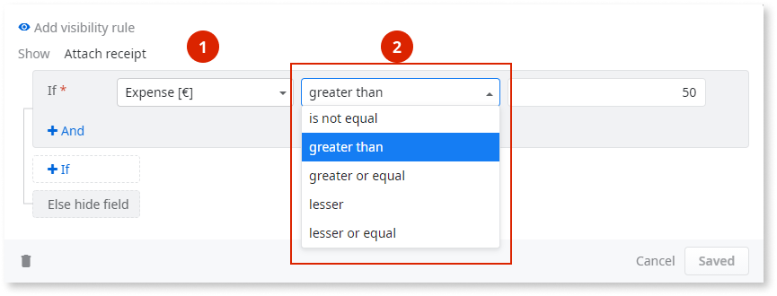

1. In the right-hand field (3), enter the value for the rule. In this example, **If** the `Expense [€]` value is **greater than** `50`, then show the `Attach receipt` form field.

    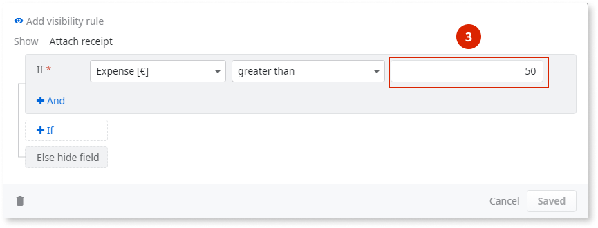

1. Click **Save**.

1. Check if the new fields setting you set are correct. To edit the visibility rule again, click **Edit rule**. To close the field definitions, click **Save**.

    

1. To test the new conditional field, select the **Preview** button on top of the screen and then interact with the form preview.

    

### Using the existing OutSystems database Entities { #use-outsystems-entities }

One of the available fields you can add to a form is the **Database entity** field. This field allows you to use public OutSystems Entities you have in your development environment. By reusing existing Entities, you don't need to add all the list items manually to the form.

To use OutSystems Entities in Workflow Builder apps, your development environment must use Platform Server 11.9 or higher.

To learn about OutSystems Database Entities, read the [Entities](../../data/modeling/entity.md) document, and watch the [Database Entities](https://www.outsystems.com/learn/lesson/1774/database-entities) lesson from the OutSystems Training.

To use an Entity in a form field, follow these steps:

1. In the **New field** window, from the **Type** drop-down list, select **Database entity**.

1. To browse the existing public Entities in your development environment, click **Browse entity** .

    

1. Select the Module that contains the Entity by clicking the **>** symbol. If you're not sure which module has the Entity you need, ask your IT administrator.

    

1. Select the Entity by clicking on the radio button, and then click **Save**.

    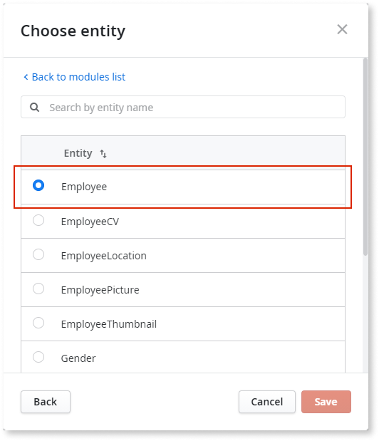

1. From the **Choose attribute** drop-down menu, select the relevant attribute.

    

1. Click **Save** to add the new form field.

## Setting the form status { #set-form-status }

The default status of a form when you complete designing it in the workflow is **Submitted**. If you want change the form status, perform the following steps:

1. Click on the **Status** workflow block below the form.

    The Change status window is displayed.

    

1. From the **Change status to** drop-down, select one of the following options:

    * **Submitted** - default status.
    * **Create new status** — add a new status to the list, for example, **Pending**.
    * **Manage status** — create and manage all the statuses your request has.

    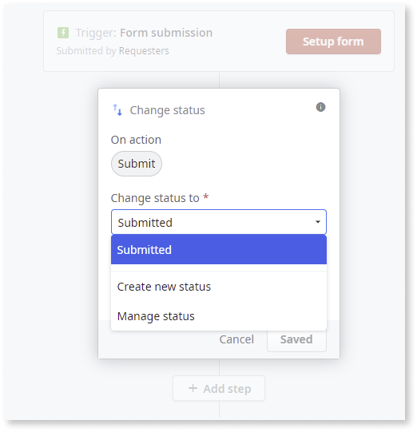

1. To notify the users (Requesters) who submitted the form about the request status, select the **Send email to requester?** checkbox. You can preview the email by clicking the preview icon.

    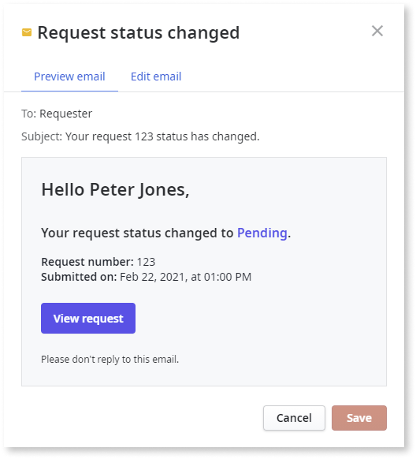

1. To edit the email, click **Edit email**.

    You can edit the email by directly typing in the **Subject** and **Message** fields. You can also edit the dynamic fields by choosing a value from the **Dynamic field** drop-down.

    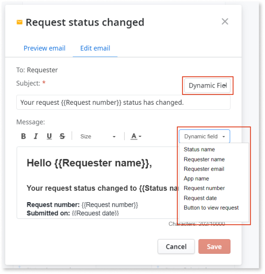

    The dynamic fields are placeholders that allow you to customize the email by automatically inserting the recipients data into these placeholders. In this example, we change the email message and add the **{{Request number}}** dynamic field.

    

    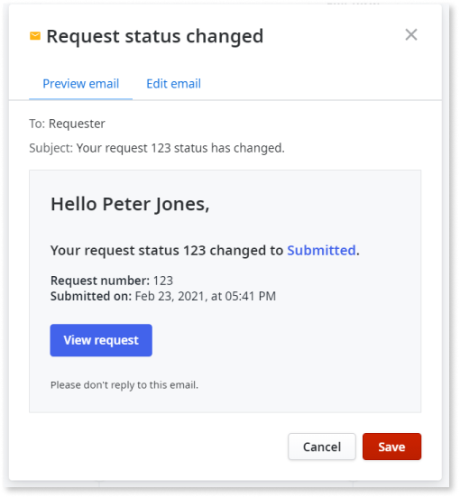

1. Click **Save**.

## Adding steps

Once you have your form created, start adding steps to your workflow.
To add a step, click on the **+ Add step** button.
There are two kinds of steps: Manual task and Condition.
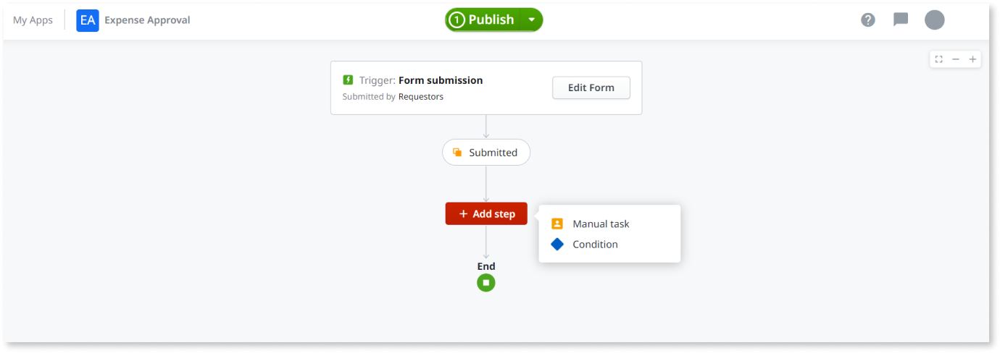

## Manual tasks { #manual-tasks }

A specific group of people perform tasks manually. Using the example of the employee expenses approval app, a manual task could be the approval step of a manager.

The Workflow Builder targets simple applications with two to three steps of approval and simple business rules. It supports applications with up to 20 manual tasks with at least one task field per manual task. Workflow Builder can support an unlimited number of manual tasks without task fields.

If your workflow application has more than 20 manual tasks, with at least 1 task field per manual task, we advise building your application in Service Studio using the Case Management framework and Business Process Technology (BPT).

To define a manual task, perform the following steps:

1. In the **Name** field, enter the task name.

    

1. From the **Assign to a group** drop-down menu, select one of the following options:

    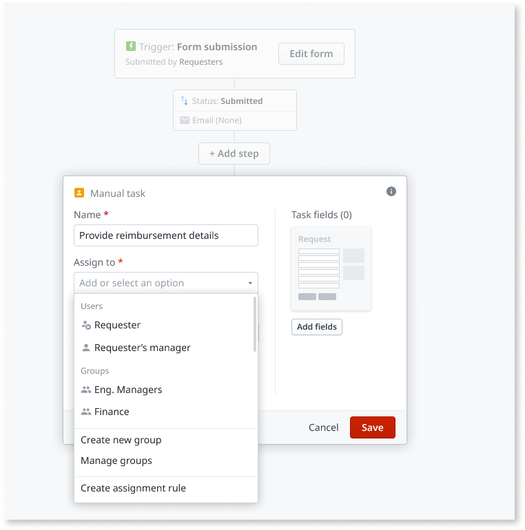

    * **Requester** - automatically assigns the request to the requester

    * **Requester's manager** — automatically assigns the request to the requester's manager.

    * **&lt;group-name&gt;** — assigns the request to one of the groups already created, where &lt;group-name&gt; is the name of a group.

    * **Create a new group** — defines the group to whom you want to assign the approval of the request, for example, **Managers**.

    * **Manage groups** — creates or deletes groups of users.

    * **Create assignment rule** — sets the assigned user or group dependent on a condition. Check how to [create assignment rules](#create-assignment-rule).

    

    **User groups** are groups of end users with different roles in the hierarchy and may not correspond to groups or teams within your organization. To learn more about user groups refer to [How to set up a Governance Model](how-setup-governance.md) and [How to set up the end users hierarchy](how-setup-end-users-hierarchy.md).

    

1. On the **Send email to assigned group?** menu activate the checkbox if you want to notify all the users of your group about the new request waiting for their action. To preview how the email looks like, click on the preview icon.

1. To notify the users of your group about the new request, select the **Send email assigned group?** checkbox. You can preview the email by clicking the preview icon.

    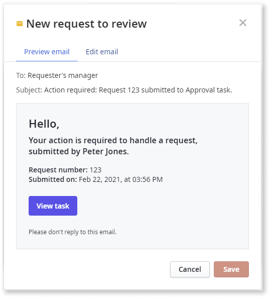

1. To edit the email, click **Edit email**.

    You can edit the email by directly typing in the **Subject** and **Message** fields. You can also edit the dynamic fields by choosing a value from the **Dynamic field** drop-down.  

    

### Create assignment rule

While assigning manual tasks to user groups you can set an assignment rule to assign groups at runtime based on form and case fields.

An assignment rule exists only in the context of the manual task for which you created the rule.

1. On the assign group, on the drop down select **Create assignment rule**.

1. Choose the attribute of the **If** rule in the first drop-down list. This is the first logical operand.

1. Choose the logical operator from the second drop-down list. These conditions vary according to the data type of the field you chose in the previous step.

1. Write or choose the value in the third drop-down list. The available options change according to the previous field. This is the second logical operand.

1. If needed you can add another logical expression to the **If** rule by selecting **And** and repeating steps 2 to 4.

1. In the drop-down following **assign to**, choose the user or group of users to assign to the task if the rule is true.

    **Note**: You cannot assign the task to the Requester.

    

1. If needed add another **If** rule, by selecting **+If**, and then following steps 2 to 6 to define the rule and assignment.

1. In the drop-down following **Else assign to**, choose the user or group of users to assign to the task if the rules are all false.

From this point on, the manual task is automatically assigned to the group that fulfills the condition you defined.
You can edit existing rules at any time.

### Adding fields to tasks

While configuring a **Manual task**, you can add fields to the task. These fields apply to that specific manual task only. Once you generate your app, these fields are shown in the task's detail screen.

Manual tasks are only executable by specific groups of users, meaning that only the users belonging to these groups can deal with the request, and consequently have access to these fields.

To add fields to a manual task, perform the following steps.

1. In the **Manual task**, click **+Add field**.

1. In the **Manual task form** screen, click **+Add a field**.

1. In the **New field** window, set the **Label** of the field.

1. The **Type** of the field is automatically pre-filled based on the **Label** set in the previous step. You can change the field type to one of the following types:

    * Number
    * Text
    * Currency
    * Date
    * Checkbox
    * Dropdown
    * Database entity - Read more about using OutSystems database Entities  in the [Using the existing OutSystems database Entities](#use-outsystems-entities) section.
    * File upload

    Each type you select shows different input parameters. For example, choosing the **Dropdown** type allows you to add several options for your users to select from.

1. If the field is mandatory, turn on the **Required** field switch.

1. Click **Save**.

1. To add other fields to your form, repeat steps 3 to 6 .

1. To preview the fields you added to the manual task, select **Preview**. The task's details screen preview opens in a new tab and you can test it by interacting with it.

Using the example of the employee expense approval, this field could be a **Required** field for managers to validate the expense submitted by the employees.

## Conditions { #conditions }

Conditions allow you to automate decisions based on attributes. You can set a condition based on an input field and create a decision (rule) based on that. Conditions lead to two different branches:

* One branch that defines what happens if you meet the condition.
* The **Else** branch that defines what happens if you don't meet the condition.

Using the example of the employee expense, you can use a **Condition** to automatically approve expenses lower than a defined value, or require approval from a manager, if exceeding that value.

To define the **Condition**, perform the steps below. You can add more than one rule.

1. Enter the name of the condition.

1. Choose the attribute of the rule in the first drop-down list. This contains the **Status** field by default, and also the [form fields you defined](#setup-form) for each task.

1. Choose the rule from the second drop-down list. These conditions vary according to what you chose in the previous field.

    

1. Write or choose the value in the third drop-down list. The available options change according to the previous field. Some examples:

    * If **Expense** is **greater** than **100...**
    * If **Status** is **equal** to **submitted...**
    * If **Description** contains **hotel...**

1. You can add another rule, selecting the **+If** button below, and defining the new rule as described in the previous steps. The **Else** button isn't clickable. It refers to the workflow branch to run if you don't meet the condition.

1. Click on the **Save** button to save the condition.

After creating a condition the workflow automatically splits into two branches: the true and the false branches.

For each branch, you need to define the following steps in the workflow. You can add the following tasks:

* **Manual task** — to insert a new manual task
* **Condition** — to add a new condition to the branch
* **Status** — to set a new status
* **Go to...** — to proceed to another destination in your workflow, for example, to one of the existing manual tasks, conditions, or to the form submission.

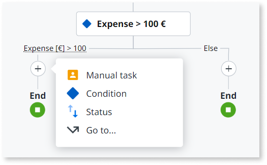

All branches of a workflow finish with an **End** green icon.

Once you finish your app workflow, you can **Publish** and test it.

To learn how to publish and test your Workflow Builder app, go to [Publishing and testing your app](publish-test.md).

## Parallel flows { #parallel-flow }

A parallel flow is a process modeling capability that allows multiple paths with activities to be executed in parallel, but always within the same case instance.

A sequential flow ends when all tasks in the process are complete.

When a parallel flow is executed, the sequence of activities in each parallel path is executed independently.

  

You can define when a parallel flow ends, for example, when all branches are complete or when a specific branch finishes before the rest. This option means when that specific branch completes, the main flow continues.

Workflow Builder allows you to create parallel flows. The following diagram shows parallel branches being used for an employee onboarding request where the IT manager and the facilities manager have parallel tasks to complete at the same time.

## Creating a parallel flow

1. From the main canvas, click **+Add Step**, and select **Parallel branches**.

    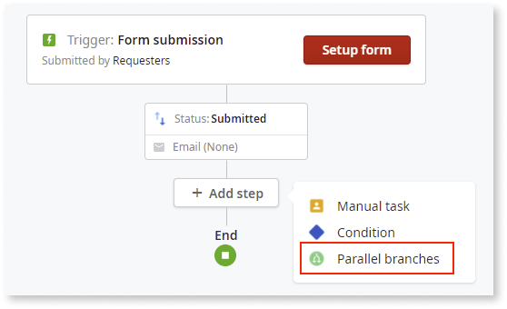

1. In the **Parallel branches** popup, click **Add branch**.

    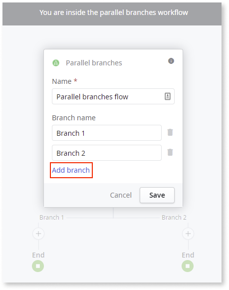

    **Note**: You can add a maximum of 4 branches to a branch flow. Adding  a new branch allows you to delete an existing branch. For each branch, you can add a manual task, a condition, a status, or a go to action. Adding a go to action allows you to proceed to another destination within the parallel flow. If you add a go to action after a condition or a parallel flow, you can only proceed to a manual task.  If you add a go to action after a manual task, you can proceed to another manual task, form submission, a condition, or another parallel flow.

    

1. Enter a name for the branch flow and a name for each branch, then click **Save**.

1. Click the **Go back to main workflow** button.

    The new parallel flow is displayed on the main canvas.

    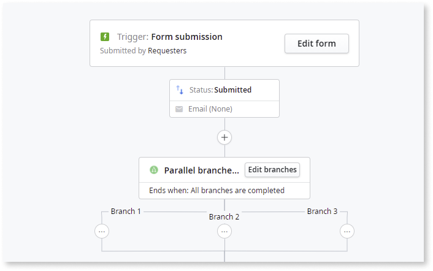

### Deleting a parallel flow

1. From the main canvas, select the parallel flow you want to delete.

    

1. Click the Delete icon.

    

1. Click the **Yes, delete** button.

    
