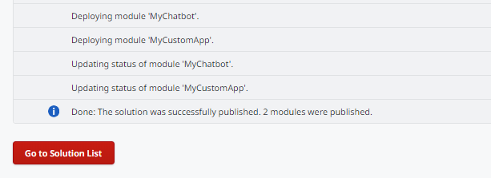

# How to publish a Solution in an Environment

To publish a Solution in an Environment follow these steps:

1. In the Service Center console of the target environment (`https://<environment>/ServiceCenter`), go to **Factory**.
1. Go to **Solutions**.
1. Select **Upload & Publish a Solution**.
1. Select **Choose File** and select the **Case Management Framework.osp** file.
1. Select **1-Click Publish**.

Validate if the Solution is successfully published by checking for a **Done: The solution was successfully published.** message.

