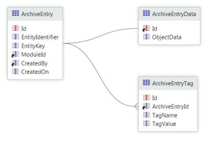

# Data Archiving

## What's data archiving

Data archiving is the process of identifying and moving data from the primary storage into a secondary storage, for long term storage. Archived data consists of data that's no longer relevant for daily operations but that's still important to the organization and may be needed for future reference, or data that must be retained for regulatory compliance.

Data archiving is an important practice when dealing with a large volume of data, to help mitigate eventual performance impacts.

This article uses the terms **main catalog** for the primary storage and **archive catalog** for the secondary storage.

### Archive location

This article focuses on how you can achieve an archiving strategy using the OutSystems database. For [on-premises installations](https://success.outsystems.com/Documentation/11/Setting_Up_OutSystems/Possible_setups_for_an_OutSystems_infrastructure#On-premises_infrastructure), you should use the [Multiple Database Catalogs and Schemas](https://success.outsystems.com/Support/Enterprise_Customers/Maintenance_and_Operations/Multiple_Database_Catalogs_and_Schemas) feature to configure the archiving mechanism in a dedicated database catalog.

For [OutSystems Cloud](https://success.outsystems.com/Documentation/11/Setting_Up_OutSystems/Possible_setups_for_an_OutSystems_infrastructure#Cloud_infrastructure), you can use new entities in the OutSystems Database Catalog and schema, or use an external database, using APIs to archive the data.

In case you wish to archive data externally to OutSystems, there are multiple solutions in the market, from data lakes to cloud storage services. OutSystems allows you to easily integrate with your existing systems, depending on your enterprise architecture.

## Benefits

From the end user perspective, the major benefit of having a data archiving strategy is **runtime performance**. Since the volume of data in the main catalog is reduced, queries take less time to execute and application reacts faster.

From an IT perspective, the major benefits are the **performance of the needed resources** and **cost savings**. Since the data volume in the main catalog is reduced, the backup and recovery operations run faster, disaster recovery is less costly and takes less time, reducing the potential system downtime. If you use a specialized archival system to store the archived information (instead of OutSystems Database) you may reduce the overall storage costs.

## Data archiving best practice

In this section, you can find two examples of data archiving implementation that works as a best practice for the archiving mechanism.

### Preparing your data

To ensure the data model contains the information needed to implement the archive algorithm, it's recommended to add **control columns** to your entities, to allow enforcing the archive condition(s).

For example, the condition may be to archive all records whose update timestamps exceed the ones defined in a threshold, in days (specified using a site property) or to archive all records based on a boolean control column.

Here are some examples of possible control columns. Select those that make sense according to your use case and add any other that may also apply:

* **LastUpdatedOn** (DateTime): Tracks the last time the record was updated. Used to archive records based on a timestamp (defined using a Site Property, for example).

* **IsActive** (Boolean): Marks the record as active or inactive. The decision if inactive records should be archived or not must be discussed with your business.

* **IsArchived** (Boolean): Marks the records that were already archived. These records can be purged from the main catalog later.

* **IsDraft** (Boolean): Useful for draft scenarios, such as having data not yet finalized. This flag avoids the archiving of incomplete data.

### Implementing the archive mechanism

Based on the need to have the archived records readily available or not, there are two archiving variants to consider:

* **Light archiving:** Archived data can be searched and displayed along with non-archived data.

* **Historical archiving:** Archived data isn't accessible and serves for auditing or historical purposes only.

#### Light archiving

You should consider this approach when the archived data must be **searchable** in the archive catalog, and eventually **recovered into the main catalog**.

This section details a light archiving architecture and mechanism that minimizes the impact on the main applications and processes, and is easy to implement and maintain in OutSystems.

**Step 1. Create an archive catalog that mirrors the main modules and main catalog entities**

Identify the data source modules in the **main catalog**:

* Identify the main entities to be archived.

* Add an **IsArchived** attribute on the main entities.

* Choose the appropriate delete rules on detail Entities

* Add an index on the **IsArchived** attribute

Mirror the data source modules in the **archive catalog** side, in a way simple to map and update:

* Copy entities only.

* Set the **Is AutoNumber** property to `No` for IDs.

* Remove IsArchived attribute.

* Remove any copied indexes, and create new indexes based on your specific archiving and search criteria.

* Set the **Delete Rule** property of foreign keys to `Ignore`.

To minimize impacts, set the schemas on different tablespaces and discs ([Multiple Database Catalogs and Schemas](https://success.outsystems.com/Support/Enterprise_Customers/Maintenance_and_Operations/Multiple_Database_Catalogs_and_Schemas) feature is available for [on-premises installations](https://success.outsystems.com/Documentation/11/Setting_Up_OutSystems/Possible_setups_for_an_OutSystems_infrastructure#On-premises_infrastructure)).

**Step 2. Create a new module that implements the archiving process to store the main data into the archive catalog**

This module (for example, “Archiving Engine”) implements all the archiving and purging logic, such as:

* The archiving criteria business rules.

* The regular archiving process to mirror the data in the source Entities into the archive catalog.

* The regular purging of archived data.

* The restore of archived data by reference.

You can use Site Properties for simple configuration, such as the archiving frequency and thresholds, and use the Service Center console to update them in runtime. In case your archiving mechanism requires more complex configurations, you should implement a dedicated back-office.

**3. Create a new module that exposes search and restore functionality to end users**

This module (for example, “Archive Search”) implements the UI where the end user can interact with the archived data:

* Restore archived data back to the main catalog.
* Search data directly in the archive Entities.

Due to the volume of data, the archive catalog is less performant than the main catalog. To manage the end user expectations in terms of response time, implement a toggle that the end user must explicitly set before interacting with the archived data.

**Step 4. Create a Timer to asynchronously run the archiving process**

Create a Timer that runs your archiving process implemented in the “Archiving Engine” module.

The following is an example of the archiving process logic:

1. **Set Archive Threshold** - Sets the number of records to archive by iteration. This threshold can be defined using a Site Property, so it can be adjusted without redeploying the module.

2. **CheckRecordsToArchive** - Validates if there are records left to archive.

3. **Has Records to Archive?** - Validates the output of the previous query and executes the archive branch if there are records to archive.

4. **MoveIntoArchiveCatalog_InBulk** - Executes a bulk INSERT INTO SELECT statement from the main catalog to the archive catalog, combined with a clause to limit the amount of archived records (using the Archive Threshold set in step 1). It implements the archive condition.

5. **MainCatalog_SetArchivedFlag_InBulk** - Executes a bulk UPDATE to set the IsArchived flag of the records archived in the previous step.

6. **WakeArchiveData** - Re-wakes the Timer to check if there are still records to archive.

Make sure the Timer:

* Is scheduled to run in off-peak hours.
* Is resilient to failure.
* Avoids repeated work.

Optimization tip: On start, switch off the indexation on the archive and rebuild the indexes after. This optimization isn't out-of-the-box in OutSystems and may require your DBA support.

**Step 5. Purge the archived data from the main catalog**

Delete the data that's already archived from the main catalog. Use an independent log execution Timer, with its own schedule and running in off-peak hours.

For further information, check the [best practices for Data Purging](purge.md).

#### Historical archiving

You should consider this approach when the data is archived due to historical or legal requirements and data is only needed on rare occasions.

**Step 1. Create a centralized factory component to serve as an archive for the multiple OutSystems applications**

This component (for example, “Archive_Lib”) is used as a centralized, general-purpose archiving catalog repository across the multiples OutSystems applications in your factory.

The archived records are stored in JSON format, along with metadata attributes (tags), to allow for searching and retrieval in a set of self-contained screens. Below is a proposed specification for this component:

This solution avoids having to design and maintain an archive repository per Entity. On the other hand, you do have to consider that by using this approach, all data is archived under the same group of archived Entities. These will grow and may become a performance bottleneck, even for auditing purposes. You can comprise the maintenance costs and create one clone of the Archive component per set of business applications.

**Step 2. In each OutSystems application, implement the archiving process using the central archive**

Each business application is responsible for moving its records into the central archive. The archiving criteria can vary from application to application (inactive records, last update timestamp, creation date, etc).

Note that whenever a record is added to the archive, it must be purged from the original location in the same transaction scope, to prevent data loss.

## Common pitfall scenarios

### No archive strategy

A common scenario is lacking a data archiving strategy because the high growth of application data wasn't correctly estimated. This situation may lead to application performance deterioration over time.

Forecast the growth of your data during the design phase, based on business knowledge and existing metrics. If you don’t have enough information, take a conservative approach and consider the high growth of the data.

To prevent a scenario of application performance deterioration, you should monitor the application performance (for example, using LifeTime Analytics) and database growth periodically, considering the implementation of a data archiving mechanism, if needed.

### Incorrect archive policy

Archiving data with the incorrect periodicity leads to unnecessary data in the main catalog, affecting the main catalog overall performance.

Also, it’s common to have the same archive policy applied to all Entities, when they have different data growth patterns.

Make sure to discuss the business requirements and determine the more effective archive policies, considering different archive policies according to each Entity’s life cycle.

### Lack of indexes on the archive catalog

The archive catalog contains a higher volume of information and is consulted less often than the main catalog. It’s commonly accepted by end users that queries over the archive take longer to retrieve information, so the development team tends to not optimize the archive Entities.

However, lack of optimization, such as proper indexes, may cause the end user experience to deteriorate over time and eventually renders the end user unable to retrieve any information due to timeouts.

Always keep the archive catalog optimized and returning information as fast as possible.

### Archiving without purging

If you have no purging strategy on the archive catalog, the data will grow and the archive catalog will become slower.

When the archived data is no longer required, you should purge it. [See more details about Data Purging.](purge.md)

### Lack of database maintenance plans

Maintenance plans are crucial for the overall health of your database, as they ensure the regular rebuild of DB statistics and indexes, free up disk space, among many other important routines.

Considering the high volume of data stored in your archive catalog, it’s important that the database maintenance plans are coordinated with your archiving mechanism. Make sure to consult your DBA to have a suitable maintenance plan according to your archiving needs.
