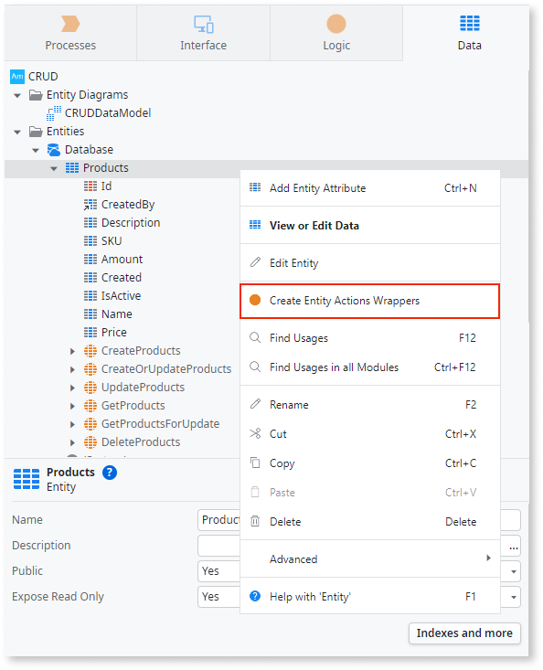
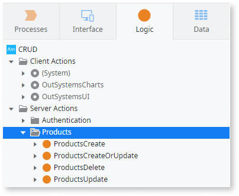

# Understanding CRUD operations in O11

CRUD operations—Create, Read, Update, and Delete—are basic actions that let you work with data in applications. They’re a foundation of application development, making them critical for organizing, storing, and updating information. In OutSystems, CRUD operations are central because they help developers create and manage apps quickly and efficiently.

OutSystems provides tools that simplify CRUD operations, saving time while ensuring consistency and scalability. These tools allow developers to design systems that grow as needed and maintain high standards for functionality. A key feature of these tools is CRUD wrappers. CRUD wrappers let developers add rules, validations, and custom logic to CRUD actions to ensure the application behaves as expected. While manually creating CRUD wrappers can take time, OutSystems Studio’s accelerator feature lets developers create them faster and more easily.

## Core concepts of CRUD wrappers in OutSystems

CRUD wrappers are actions that group together the default CRUD entity actions, such as creating or updating a record. They provide a way to add extra checks and rules to these actions, making development more efficient and promoting code reusability. With CRUD wrappers, developers can:

* Verify the validity of data before saving it, ensuring high data quality.
* Apply business rules, such as marking records as inactive rather than deleting them, to preserve data history.
* Centralize error handling and change tracking, making applications easier to maintain and debug.

While CRUD wrappers are extremely useful, they can be tedious to create manually, especially in applications with many entities or complex requirements.

### Service Studio accelerator 

OutSystems Service Studio offers an accelerator feature designed to simplify CRUD wrapper creation for entities created in Service Studio. The accelerator automates repetitive tasks like adding validations and parameters, streamlining the initial setup process. 

The accelerator creates four server action wrappers, which are visible in the Logic tab under a folder with the same name as the entity:

* `<Entity>Create`
* `<Entity>CreateOrUpdate`
* `<Entity>Delete`
* `<Entity>Update`

These server actions encapsulate the entity actions and include validations to ensure mandatory attributes are filled in. The accelerator only supports entities created in Service Studio and doesn't handle external entities. They also create the necessary input and output parameters. If the entity is public, the server actions are also created as public. Conversely, if the entity is not public, the created entity action wrappers are not public. However, it’s important to note that the accelerator simplifies the initial creation of CRUD wrappers but doesn’t automatically adjust to changes in the data model, like adding or removing attributes or modifying their properties.

To use the accelerator, right-click an entity in Service Studio and choose the option **Create Entity Action Wrappers**.

## Best practices

Even with the accelerator, it’s important to follow best practices to ensure robust and efficient applications:

* **Plan your data model**: Organize your data model carefully to keep your app efficient and easy to scale. Define relationships between entities clearly to reduce errors and optimize performance. Use isolated entities for large or complex data.
* **Consider the use of soft deletes**: Instead of permanently deleting records, mark them as inactive. This approach helps preserve a record’s history for audits or restoration purposes.
* **Monitor performance**: Regularly evaluate the performance of CRUD operations. Optimize aggregates and queries, and use indexes where needed to keep your application responsive as data grows.&#x20;
* **Add custom checks**: Include validations specific to your app’s requirements. These checks enforce business rules and enhance data accuracy. For example:
    * check that a date field contains a valid future date before saving a record
    * add role validations
    * add logic to update related tables, for example, updating the stock when an order is fulfilled
    * write into auditing tables

