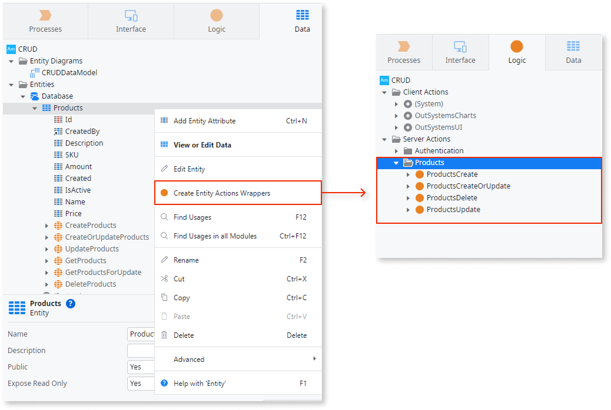

# Understanding CRUD operations in O11

CRUD operations—Create, Read, Update, and Delete—are basic actions that let you work with data in applications. They’re a foundation of application development, making them critical for organizing, storing, and updating information. In OutSystems, CRUD operations are central because they help developers create and manage apps quickly and efficiently.

OutSystems provides tools that simplify CRUD operations, saving time while ensuring consistency and scalability. These tools allow developers to design systems that grow as needed and maintain high standards for functionality. A key feature of these tools is CRUD wrappers. CRUD wrappers let developers add rules, validations, and custom logic to CRUD actions to ensure the application behaves as expected. While manually creating CRUD wrappers can take time, OutSystems Service Studio’s accelerator feature lets developers create them faster and more easily.

## Core concepts of CRUD wrappers in OutSystems

CRUD wrappers are actions that group together the default CRUD entity actions, such as creating or updating a record. They provide a way to add extra checks and rules to these actions, making development more efficient and promoting code reusability. With CRUD wrappers, developers can:

* Verify the validity of data before saving it, ensuring high data quality.
* Apply business rules, such as marking records as inactive rather than deleting them, to preserve data history.
* Centralize error handling and change tracking, making applications easier to maintain and debug.

While CRUD wrappers are extremely useful, they can be tedious to create manually, especially in applications with many entities or complex requirements.

### Service Studio accelerator

OutSystems Service Studio offers an accelerator feature designed to simplify CRUD wrapper creation for entities created in Service Studio. The accelerator automates repetitive tasks like adding validations and parameters, streamlining the initial setup process.

The accelerator creates four server action wrappers, which are visible in the Logic tab under a folder with the same name as the entity:

* `<Entity>Create`
* `<Entity>CreateOrUpdate`
* `<Entity>Delete`
* `<Entity>Update`

These server actions encapsulate the entity actions and include validations to ensure mandatory attributes are filled in. The accelerator only supports entities created in Service Studio and doesn't handle external entities. They also create the necessary input and output parameters. If the entity is public, the server actions are also created as public. Conversely, if the entity is not public, the created entity action wrappers aren't public. However, it's important to note that the accelerator simplifies the initial creation of CRUD wrappers but doesn't automatically adjust to changes in the data model, like adding or removing attributes or modifying their properties.

To use the accelerator, right-click an entity in Service Studio and choose the option **Create Entity Action Wrappers**.

### Mandatory attributes

The accelerator adds an If node to validate mandatory attributes of the following types: `Text`, `Email`, `Phone Number`, `Date`, `DateTime`, `Time`, `Binary`, other `Entity Identifiers`. It doesn't validate Numeric values (`Integer`, `Long Integer`, `Decimal`, `Currency`), `Booleans`, and basic audit attributes.

Basic audit attributes, even if they're mandatory, aren't validated in this node. Instead, they're assigned values in dedicated assignment nodes.

### Handling identifiers that aren't AutoNumber

OutSystems entities typically have an ID attribute as their primary key, configured as AutoNumber by default. This means the platform automatically generates a unique, sequential integer for each new record, simplifying data management.

However, you may want to disable AutoNumber in scenarios where you need manual control over record IDs. This includes cases like integrating with external systems that rely on predefined IDs or implementing a custom ID generation strategy. If you choose to disable AutoNumber, your application must have a mechanism to generate and assign unique IDs to maintain data integrity.

For entities where the ID attribute is not AutoNumber, the CRUD wrappers include specific logic. In the `Create` and `CreateOrUpdate` wrappers, a validation checks if the Identifier is set, since the platform won't automatically generate one. Therefore, you must ensure your logic provides a unique identifier, such as using the `GenerateGuid()` system action or another suitable method.

### Enable auditing for data changes

Entities can include attributes that automatically track when and by whom a record was created or modified. These auditing attributes provide valuable transparency and accountability for your data, enhancing data management and overall application reliability.

Benefits of auditing include:

* Traceability and accountability: Tracks data changes for auditing and troubleshooting.
* Data integrity: Provides a record of data modifications to identify and correct errors.
* Compliance and reporting: Helps meet regulatory requirements.
* Business insights: Analyze usage patterns for data-driven decisions.
* Debugging and issue resolution: Review change history to identify and resolve issues faster.

The generated CRUD wrappers provide basic auditing using these attributes:

* `CreatedOn`: The date and time when the record was initially created.
* `CreatedBy`: The user who created the record.
* `UpdatedOn` or `ModifiedOn`: The date and time when the record was last updated.
* `UpdatedBy` or `ModifiedBy`: The user who last updated the record.

When generating wrapper logic, ODC Studio identifies these basic auditing attributes by name and data type, and adds assignments to fill them in.

For a full audit trail, it's best practice to use a separate entity to store dates and users for each record change.

For `CreateOrUpdate` wrappers on entities with non-AutoNumber Identifiers, the logic assumes a record is new if its Created audit attributes (`CreatedOn`, `CreatedBy`) are empty. Review and adjust this logic to fit your specific requirements.

## Best practices

Even with the accelerator, it's important to follow best practices to ensure robust and efficient apps:

* **Plan your data model**: Organize your data model carefully to keep your app efficient and easy to scale. Define relationships between entities clearly to reduce errors and optimize performance. Use isolated entities for large or complex data.
* **Consider the use of soft deletes**: Instead of permanently deleting records, mark them as inactive. This approach helps preserve a record’s history for audits or restoration purposes.
* **Monitor performance**: Regularly evaluate the performance of CRUD operations. Optimize aggregates and queries, and use indexes where needed to keep your application responsive as data grows.
* **Add custom checks**: Include validations specific to your app's requirements. These checks enforce business rules and enhance data accuracy. For example:
    * Check that a date field contains a valid future date before saving a record.
    * Add role validations.
    * Add logic to update related tables, for example, updating the stock when an order is fulfilled.
    * Write into auditing tables.
