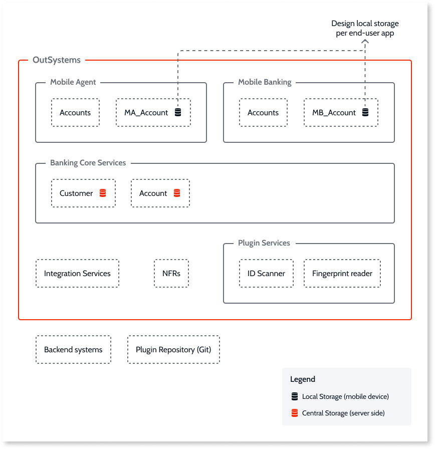
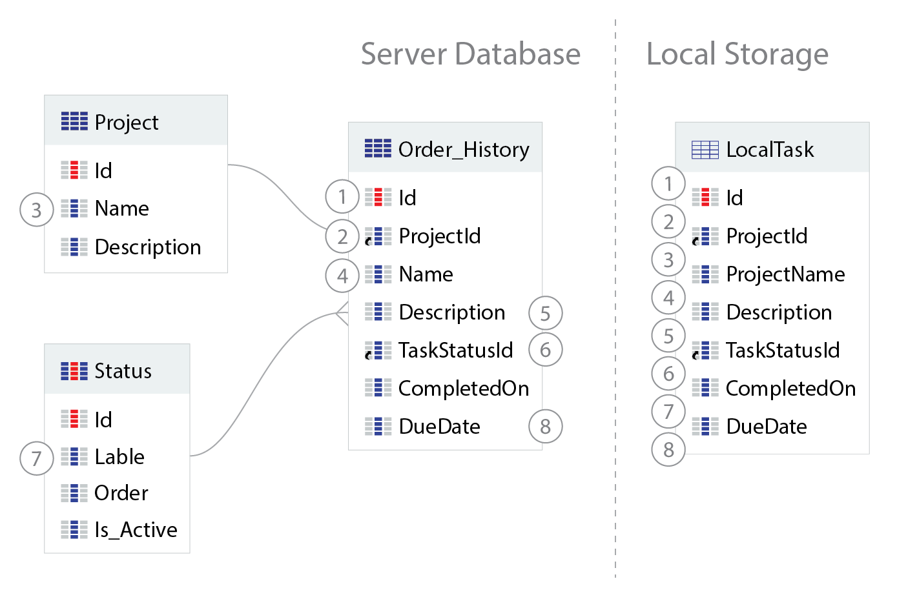

# Mobile Data Layer

## Pre-requisites

You need to be a [Mobile Web Developer](https://learn.outsystems.com/training/journeys/mobile-developer-679).

## Storing Data

This article introduces the Best Practices for storing data in the device’s local storage.

### Mobile Data Layer

Improve the User Experience by following a Local Storage First strategy. This approach allows the user to have smaller loading times while navigating through screens and minimizing server-side calls by requesting the updated data only.

### Use Local Storage

When designing the local storage it is important to focus on the mobile application use cases. Avoid sharing the local storage model between different mobile applications as each application has different use cases to take into account when designing the model.

Use local storage whenever possible.

* It is best for performance
* Reduces the number of server calls
* It is offline-ready

#### Design a Lightweight Local Storage

To denormalize the local storage correctly, analyze the main use cases and identify the most common data interactions.

Local storage entity actions use **individual transactions**, so avoid writing multiple times in the local storage in the same request. If not possible, then design the model to endure the loss of transaction.

* Don't copy the server data model
    * Denormalize the local storage
    * Group relevant information
    * Define only used attributes

* Don't store many data
    * Only relevant records
    * Hot cache principle

#### Optimize the Local Storage Access

When accessing the Local Storage, ensure you follow the best practices below:

* Avoid joins
* Move complex SQL to the server synchronization process
* Control the number of rows fetched
    * Maximum Records
    * Use the **On Scroll** event to load more records
* Remove unnecessary sorting
* Keep the SQL simple and clean
* Don’t fetch data inside lists
* Populate lists using a single aggregate
* Parallel and asynchronous Fetch Data

## Benefits

Following the good practices of storing data in the device’s local storage, provide you with the following benefits:

* Smooth navigation between screens
* Increased performance
* Server-side call avoidance
* Offline-ready

## Common Pitfall Scenarios

A common scenario to avoid consists of replicating the server data model on the local storage without considering the mobile use cases. This approach requires a considerable amount of joins and complex SQL statements to handle the data, invalidate a parallel access approach, and contributes to the storing of unnecessary high volumes of data. The overall performance is strongly affected.

## Additional Information

To learn more about storing data in the device’s local storage read the [Offline data usage](https://success.outsystems.com/Documentation/11/Developing_an_Application/Use_Data/Offline) documentation.
