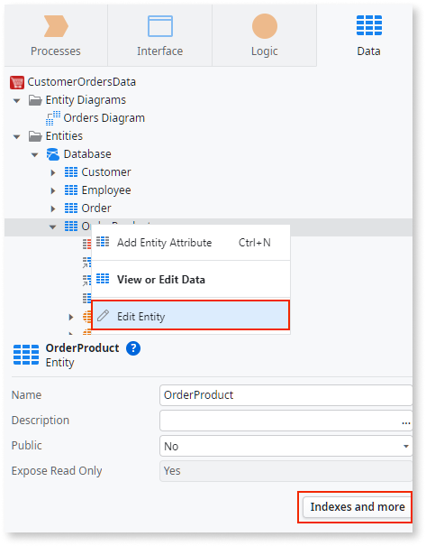
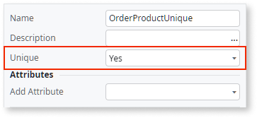
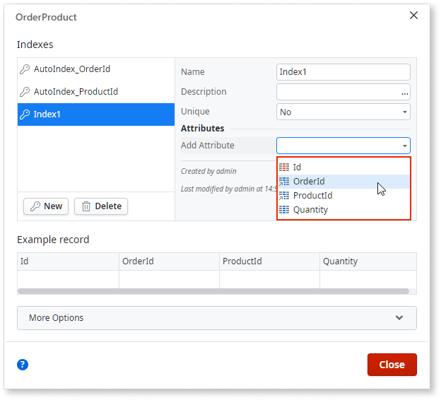

# Create an Entity Index
  
You can define a database index in your data model to enforce uniqueness of table attributes across multiple rows or to make searches quicker using those attributes as filters. In OutSystems, you can model a database index in the entity element.
Note that adding several indexes to Entities can impact negatively the performance of the database operations, namely write operations.

See [Database Indexes](<../../../ref/data/database/database-indexes.md>) for more information about creating database indexes.

To create an index for an entity:

1. Right-click the Entity and select **Edit Entity**, or click the **Indexes and more** button in the Entity properties.

    

1. Click the **New index** button to create an index.

1. Enter a name for the index.
    In this example, **OrderProductUnique** is added.

1. If you want this index to be restricted to restrict records only, change the **Unique** property to **Yes**.

    

1. Add the attributes you want to include in the index.

    

1. Click **Close**.

1. To apply the index created in the database, publish the module.

    During the publishing process, OutSystems creates the corresponding database index as defined in the Entity properties.
