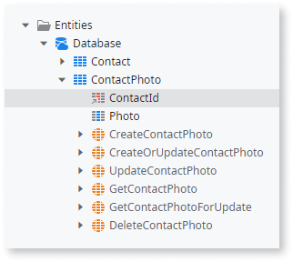
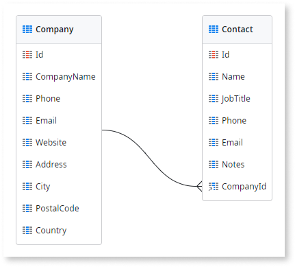
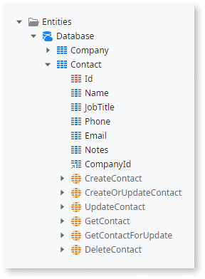
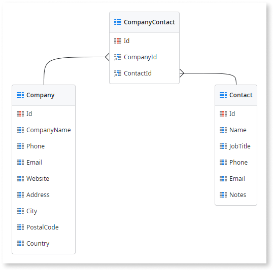
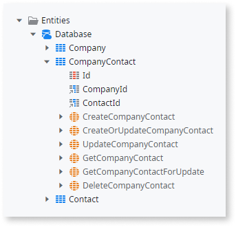

# Entity relationships

In Service Studio, an entity encloses not only the logical definition of a business entity, but also its **relationships** with other entities.

Relationships are created by defining a single **reference attribute** (also known as "foreign key" in database terminology). Its data type is `<Entity> Identifier` which corresponds to the type of the Identifier of the other entity. The reference attribute is shown with a different icon ( or , depending on the type of relationship) which is also visible in Entity Diagrams. 

The entity where the reference attribute should be created depends on the cardinality (One-to-One, One-to-Many, Many-to-Many) and optionality (mandatory or optional) of the relationship.

When modeling data, remember that static entities can only have foreign keys to other static entities. They can't reference dynamic entities.

A relationship can be:

* One-to-One
* One-to-Many
* Many-to-Many

Check below for more information on each of these types of relationships.

## One-to-one relationships

A One-to-One relationship between two entities indicates that one record in Entity `A` corresponds to one record in Entity `B` and one record in Entity `B` has only one associated record in Entity `A`. 

In this case the  reference attribute can be either in Entity `A` or Entity `B`. To decide which entity contains the reference attribute you have to consider the optionality of the relationship. When both sides of the relationship are either mandatory or optional, you have to decide to which Entity you should add the relationship, considering factors like which entity is shared the most.

Learn how to [create a One-to-One relationship](relationship-one-to-one.md).

### Example

Suppose, that in your business logic, you have these entities:

* `Contact`
* `ContactPhoto`

A `ContactPhoto` always belongs to a `Contact`. A `Contact` can have one `ContactPhoto` associated. This can be helpful if you want to optionally customize the `Contact` entity.

To implement this relationship, the primary key of the `ContactPhoto` must be a reference attribute to the Primary key of the `Contact`:

Entity Diagram | Module Tree
---------------|------------
 | 

## One-to-many relationships

A One-to-Many relationship between two entities indicates that one record in Entity `A` corresponds to multiple records in Entity `B` but one record in Entity `B` has only one associated record in Entity `A`.

In this situation, the  reference attribute must be in the "Many side" of the relationship, i.e. in Entity `B`.

Learn how to [create a One-to-Many relationship](relationship-one-to-many.md).

### Example

Suppose that, in a business logic, you have these entities:

* `Company`
* `Contact`

A `Company` has one or more `Contact`. A `Contact` belongs to a `Company`.

To implement this relationship, the reference attribute must be in the entity `Contact`:

Entity Diagram | Module Tree
---------------|------------
 | 

## Many-to-many relationships

A Many-to-Many relationship between two entities indicates that one record in Entity `A` corresponds to multiple records in Entity `B` and a record in Entity `B` can have more than one associated record in Entity `A`. In this situation, you must create a **third** entity with, at least, two  reference attributes for Entity `A` and Entity `B`. A Many-to-Many relationship is, in fact, two One-to-Many relationships with this third entity.

Learn how to [create a Many-to-Many relationship](relationship-many-to-many.md).

### Example

Suppose, that in a business logic, you have these entities:

* `Company`
* `Contact`

A `Contact` can move from `Company`. In turn, a `Company` can have more than one `Contact`.

To implement this relationship, a third Entity must be created, `CompanyContact`, with at least the following attributes:

* `Id`
* `CompanyId`
* `ContactId`

Entity Diagram | Module Tree
---------------|------------
 | 

## Referential integrity

When you create relationships between an entity `A` and an entity `B`, you must specify the referential integrity mechanism that you want to apply in your module, i.e. what must happen in entity `B` if the corresponding record in entity `A` is deleted. In OutSystems this behavior is defined by the value of the "Delete Rule" property of reference attributes.

Learn more about the different [Delete Rules](delete-rules.md) in OutSystems.

## Relationship indexes

When the reference attribute is defined, an index is automatically created to improve the performance of your module. This index is called:

`AutoIndex_<reference attribute name>`

and covers the reference attribute that implements the relationship.

**You shouldn't delete this index.** If you do, Service Studio displays a warning notifying you of the performance impact this operation might have.

