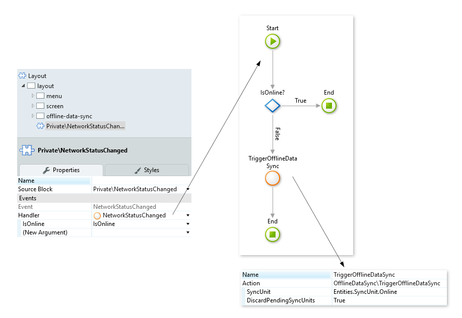

# Handling Optimized Complex Synchronization on Mobile Devices

This article describes Best Practices to deal with more demanding synchronization scenarios and explains how to optimize resources.

When syncing information from the server to the device it's important to only synchronize relevant data. On each use case, consider which records (rows) and attributes (columns) should be synchronized, and when to sync.

**Sync only when required**

* At session start, sync summary data to local storage
* At process start, sync process detail to local storage
* At process/transaction end, sync to server

**Sync only what is required**

* Both in terms of records (rows) and attributes (columns)
* On login sync accounts' summary
* On account selection, sync its details

**Ensure sync granularity**

* Incremental by entity
* Only sync deltas
* Use control timestamps
* Use Entity Bulk Operations (built-in)

## Top principles

To illustrate the **top principles** let's consider a mobile app designed to support **appointment scheduling** on a hospital backoffice.

### Design a lightweight local database
    

* Since the main uses cases are **presenting appointments information** and provide **available doctor's data** we should denormalize the server side relational data model.

* On the **LocalAppointment** table we should include all necessary columns to support the use case without the need for extra table joins

* For the **LocalDoctor** table we add all necessary information for the use case even if it includes duplicating information that already exists in the local storage

### Control amount of synchronized data

**SyncUnit**

The text input of OfflineDataSync action is used to define the several flows of synchronization. By using this input we can fine tune the amount of data to sync on each flow or moment of our application.

**Local SyncProperties per SyncUnit**

Create a local entity to keep track of the last synchronization moment per SyncUnit. This will allows us to communicate with the server and retrieve only updated information through the use of time deltas. Compare the **LastSyncOn** from that sync unit with the **CreatedOn**, **UpdatedOn**, and **DeletedOn** attributes from the server DB to know which records to fetch.

### Synchronization moments

* Define the sync moments of the application and use SyncUnits. SyncUnit defines the type of data to synchronize; **it can be all, a single entity, or a set of entities**. It helps if you define a SyncUnit as an instant or moment of the app.

    1. **SyncUnit = "Splash"** — Get information to display on the homepage, not that detailed.

    1. **SyncUnit = "Login"** — Get detailed information, related to the user or the homepage items.
    
    1. **SyncUnit = "SendAppointments"** — Send Appointments stored locally to the server.
    
    1. **SyncUnit = "Online"** — Trigger complete sync for new and updated data.

* Use the SyncUnit parameter of the OfflineDataSync action — Manages the different moments of the synchronization by passing the SyncUnit as a parameter.

* Static entity to create SyncUnits — Creates a static entity to keep all SyncUnits well defined and to be easier to maintain.

SyncUnit = "Login"
:   To support all the offline use cases we need to **synchronously** sync all the doctors and appointments right after login. This sync only retrieves information from the server, no data is sent.

    

SyncUnit = "SendAppointments"
:   TriggerOfflineDataSync at the Create Appointment action to send the new appointment to the server **asynchronously**. 

    

SyncUnit = "Online"
:   When the app regains connectivity we trigger a complete sync, where we send new data to the server and retrieve updated data. Since this sync is complete and bidirectional we discard all other pending sync requests by setting the DiscardPendingSync input to true.

    

### Minimize the number of server requests

* **Avoid multiple server requests on client actions**

    * Encapsulate all server actions together into one action, so that there's only one server request. This improves the application performance.

* **Synchronization process with only one server request**

    * For each branch of synchronization call, there's just one server action to reduce the server requests and improve performance.

* **Huge amount of data to synchronize**

    * **Device performance issues** — Different devices have different processing capabilities. Find an optimal value for a set of records to bulk create on the local DB.

    * **Time of synchronization** — Minimize the server requests. Transfer the least amount of data needed, to complete the synchronization successfully. Know the conditions at which the app works.

    * **Thousands of records to pull** — Get the data from the server and break it into chunks to bulk create them on the local DB. Use the TriggerOfflineDataSync to avoid blocking the UI.

## Benefits of this approach

* Non-blocking screens
* Alignment between synchronization and use cases
* Error tolerant synchronization (network, memory, device crash)
* Better usage of local storage space

## Scenarios to avoid

* Long synchronous synchronizations
* Delete all / Create all scenarios where deltas are not used
* Synchronization processes that cannot be controlled by sync unit parameter
