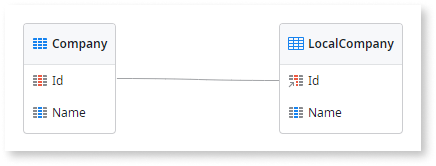
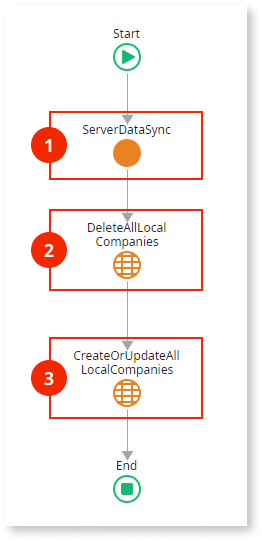
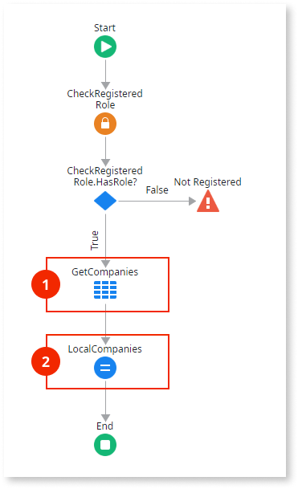

# Read-Only Data

Applies only to Mobile Apps.

This data synchronization pattern is recommended for mobile apps where the end users only need to read data while the apps are offline and the amount of data is small, as follows:

* The server database holds the master data which can change over time. 
* Synchronization downloads all data from the server database and stores it on the local storage of the device. 
* Data modifications performed on the device are not propagated to the server. 

The following is an overview of the Read-Only Data pattern logic:

1.  Invokes server to get data.

1.  Returns database data.

1.  Deletes and recreates data in the local storage with the data received from the server.

Download and store locally only the minimum subset of data relevant to the user to reduce the amount of data synchronized.

Download the [sample module for the Read-Only Data pattern](http://www.outsystems.com/forge/component/1638/Offline+Data+Sync+Patterns/), that uses companies as an example of data to synchronize. The following sections explain how to automatically generate this synchronization pattern and provide detailed descriptions of the data model and logic used in the sample module.

## Automatically Generate the Pattern for an Entity

To automatically generate the logic needed to implement this pattern for an entity:

1. In Service Studio, open the Data tab.

1. Under Local Storage, select the local entity of the entity you want to synchronize in the database.

1. Right-click on the local company and choose **Create Action to Sync Data (Read-Only)**.

    This option is only available if the local entity is linked to the database entity (with the Id as a foreign key to the database entity). That happens if you create local entities with a right click on **Local Storage** and choose **Add Entity from Database...**

    ")

This creates the actions needed to implement the Read-Only synchronization pattern:

SyncLocal&lt;Entity&gt;
:   Client action that starts the synchronization between the local entity and the entity in the server database.

Sync&lt;Entity&gt;
:   Server action called by the SyncLocal&lt;Entity&gt; action, that retrieves the current records of the entity in the database to be stored in the client local storage.

If you want this pattern to run in the [synchronization template mechanism](<../sync-implement.md>), add a call to the SyncLocal&lt;Entity&gt; in the OfflineDataSync client action.

## Data Model

This sample defines a Database entity `Company` and its Local Storage counterpart `LocalCompany`.

## OfflineDataSync Logic

The following is a description of the logic of the `OfflineDataSync` client action:

1. Calls the `ServerDataSync` server action to retrieve data from the database. The server returns a list of Company records.
1. Deletes all Company records in the local storage.
1. Recreates the Company records in the local storage using the list of records returned by the server.

`DeleteAllLocalCompanies` and `CreateOrUpdateAllLocalCompanies` are entity actions created automatically for the `LocalCompany` local storage entity. This is a local storage feature to help you handle records.

## ServerDataSync Logic

The following is a description of the logic of the `ServerDataSync` server action:

1. The aggregate `GetCompanies` fetches all the Company records from the database.
1. Assigns the records returned by the aggregate to the output parameter of the action.
