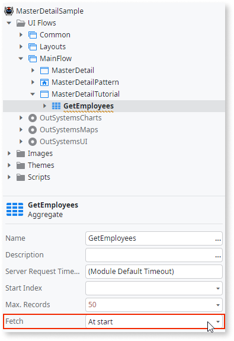
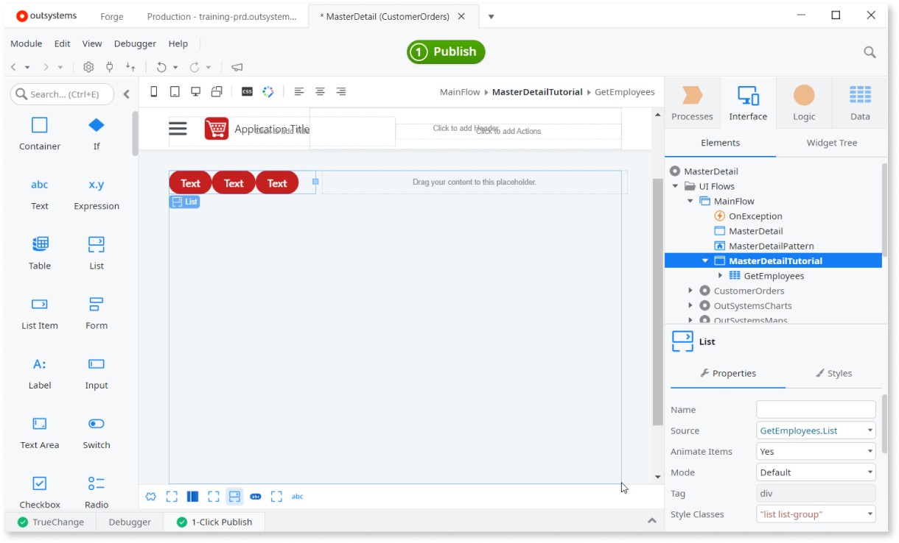
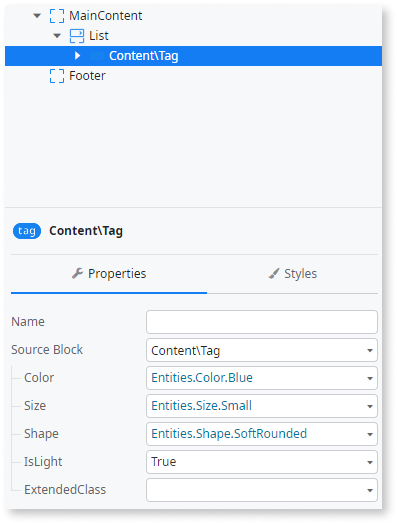
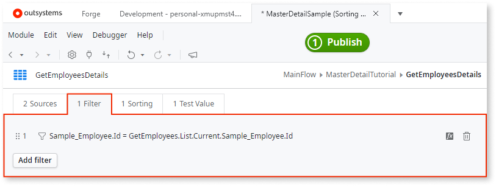
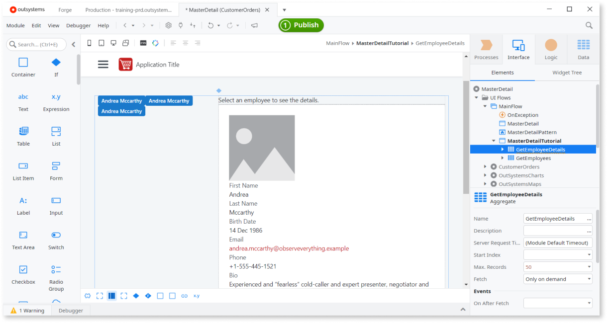
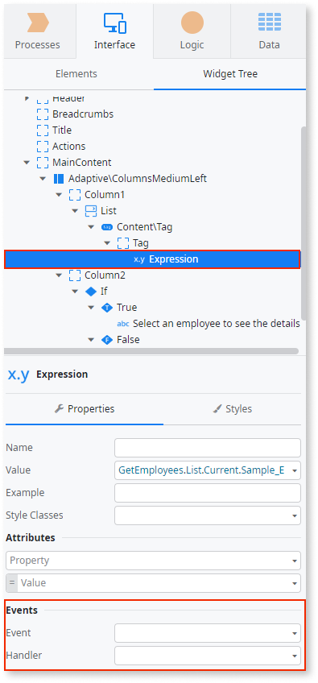
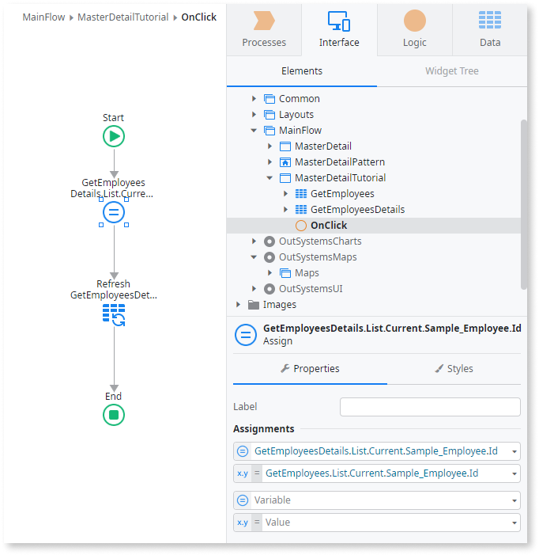
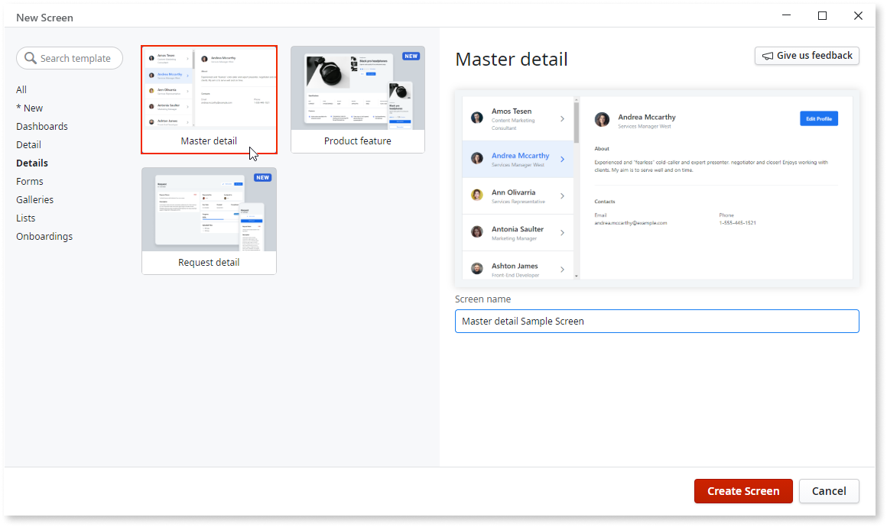
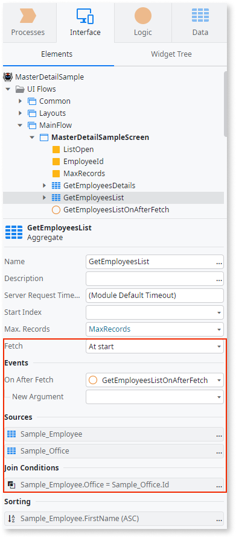

# Implement asynchronous data fetching using Aggregates

Applies to Mobile Apps and Reactive Web Apps only

Sometimes you want to update only a part of the Screen, and you can do it by loading data in chunks. For example, you may have a list with employees where clicking an employee name loads the details.

This is often called a master-detail pattern, and you can implement it by using two Aggregates with different **Fetch** properties, where the first "master" Aggregate fetches data immediately, and the second "detail" Aggregate only when needed. The "details" are loaded asynchronously, as the request takes place in the background and updates the UI when the data is received.

## Preparation

Before we move on to the steps of implementing the master-detail pattern and showing how the asynchronous data fetching works, let's prepare our app:

* Create a new Reactive Web App. You can check the instructions in the article [Create a Reactive Web App](../../../getting-started/create-reactive-web.md).
* In the newly created Reactive App, check if you have **OutSystemsSampleDataDB** under **Data** > **Entities** > **Database**. If not, follow the steps in [Referencing sample data in apps](../../ui/screen-templates/sample-data.md#referencing-sample-data-in-apps), as we need it to for the example in this article.

## Overview

We're going to create a Screen with the employee list. Clicking the name shows the employee details. The employee list loads when the Screen loads, but the details are fetched only after the click, asynchronously.

Here's the overview of our implementation:

1. [Get the list of all employees](#get-the-list-of-all-employees)
1. [Get the details of one employee](#get-the-details-of-one-employee)
1. [Create logic to update the UI](#create-logic-to-update-the-ui)

## Get the list of all employees

Let's create a "master" UI populated by the records from the Aggregate that fetches the list of all Employees once the Screen loads. We set the **Fetch** property of this Aggregate to **At start**.

1. Start by creating a blank Screen and naming it `MasterDetailTutorial`.

1. Right-click on the Screen in **Interface** > **UI Flows** > **MainFlow**, and select **Fetch data from database** from the help menu. The Aggregate details open.

1. With the Aggregate details open, click the **Data** tab, navigate to **Entities** > **Database** > **OutSystemsSampleDataDB**, and drag the Entity **Sample_Employee** to the Aggregate details screen. Sample data populates the view while the name of Aggregate changes to "GetEmployees".

1. Go back to the **Interface** tab, and Set the **Fetch** property of the **GetEmployees** Aggregate to `At start`. This ensures that the app requests the data from the database when the Screen loads.

    

1. Open your MasterDetailTutorial Screen and drag a Columns Medium Left Widget to the editor.

1. Drag a List Widget to the left column of the Columns Medium Left Widget. Service Studio now shows that a source of data is needed for the List. In the Properties of the List Widget, locate the **Source** property and select `GetEmployees.List`.

1. Drag a Tag Widget to the List Widget. At this point, your Screen should look similar to this:

    

    You can adjust the tag style in the properties:

    

1. Drag an Expression Widget to the Tag Widget. **Expression Value** editor opens. Enter `GetEmployees.List.Current.Sample_Employee.FirstName + " " + GetEmployees.List.Current.Sample_Employee.LastName` and click **Close**. The tags now show the employees' first and last names. Run the app, and you should see a Screen with the list of employees.

## Get the details of one employee

Let's now create the "detail" UI that loads and shows data only after a click. The **Fetch** property of this Aggregate is set to **Only on demand**. Additionally, we set a Filter in this Aggregate with the ID of the record, so that the app fetches one record only. This results is a very responsive user interface.

1. Add a new the Aggregate for the Screen, for the same **Sample_Employee** Entity. Name the Aggregate "GetEmployeeDetails".

1. Still in the Aggregate details pane, add a Filter to GetEmployeeDetails Aggregate with the following condition: `Sample_Employee.Id = GetEmployees.List.Current.Sample_Employee.Id`. This forces the Aggregate to return only a single record, a record that matches selection in the list of employees.

    

1. Set the **Fetch** property of the **GetEmployeeDetails** Aggregate to **Only on demand**. With this setting, the Aggregate queries the database only upon a request.

1. Open your MasterDetailTutorial Screen and drag an If Widget to the Column2 of the Columns Medium Left Widget. In the **Condition** property of the If Widget, enter `GetEmployeeDetails.List.Empty`. This evaluates if an employee's name is clicked.

1. Select the True branch of the If Widget and type "Select an employee to see the details." This is a blank state for this part of the Screen, when no employee name is selected.

1. Drag **GetEmployeeDetails** Aggregate to the False branch of the If Widget. This "scaffolds" an interface with the employee details and picture. At this point you should have a Screen with two Aggregates that update different parts of UI. The screenshot contains additional overlay to show how Aggregates fetch data for different parts of the Screen.

    

1. Publish the app. If you open it in the browser, you should see the message "Select an employee to see the details.". In the next section we implement the logic to refresh the UI asynchronously.

Note that the scaffolding from Entity in this section works only after you add a Filter to the Aggregate, as instructed.

## Create logic to update the UI

The "detail" UI that loads data only when requested must be triggered. In this example, the app loads the data after you click a name in the list. Thanks to the architecture of the app, the UI refreshes automatically after the data bound to it changes.

1. Select the **Expression** within the Tag. In the "Events" section of the properties in the **Events** list, select **onclick**. In the **Handler** list select **New Client Action**. The **OnClick Client Action** opens for editing.

    

1. Drag an **Assign** node to the flow. In the **Variable** property, enter `GetEmployeeDetails.List.Current.Sample_Employee.Id`, and in **Value** enter `GetEmployees.List.Current.Sample_Employee.Id`. This tells the app which employee is selected in the list.

1. Drag a **Refresh Data** to the flow below the Assign. When the **Select Data Source** dialog shows, select **GetEmployeeDetails**. This refreshes the UI where the data is used.

    

1. Publish the app and try clicking on the employee names. You should see the details load on the right side of the screen.

## Example from Screen Templates

To see a working example, you can also create a Screen from one of the Screen Templates that are built around the master-detail pattern. 

In the created Screen, check the **Fetch** properties of the Aggregates and related logic.

