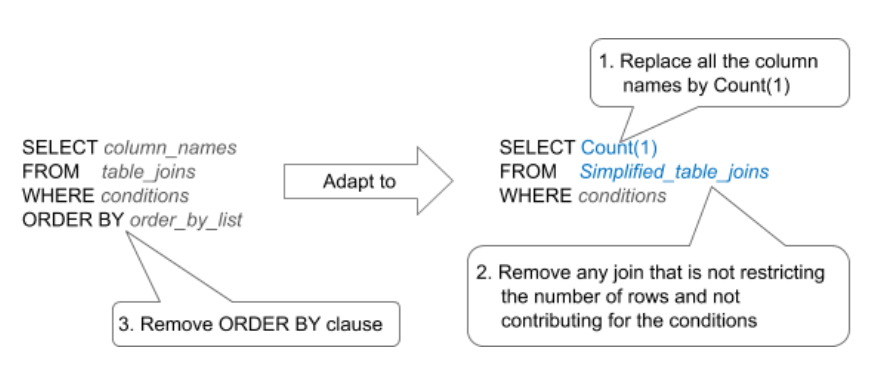

# Appropriate record counting

Use `.Count` property to get the number of rows returned by an Aggregate or a SQL query. 

When the `.Count` property is evoked, the compiler generates a second query to perform the counting without Maxrecords limitation. The original query is usually designed for retrieving data, not for counting.

## Impact

While in an aggregate OutSystems platform knows how to generate an optimized query for counting records, this isn't the case with the custom SQL queries. The SQL functionality is for writing complex SQL calls by developers. These query calls can be too complex for counting records.

The platform in SQL queries runs the same query without the Maxrecords limitation. Since the query was originally designed to retrieve data, it fetchs unnecessary fields and performs needless joins and, eventually, sort the result - simply to obtain the row count. This is an expensive way to count the rows.

## Best practices

1. To count the number of rows of a SQL Query, copy the query designed to retrieve data and adapt it with the sole goal of counting number of rows:
  
    

1. Don’t use the `.Count` property, in Aggregates or SQL queries, just to test if the query returned something or not. Testing `<Query>.List.Empty` instead of testing `<Query>.Count = 0` saves a costly run of an extra query just to count elements when all you want is to check if the result is empty or not.  
  