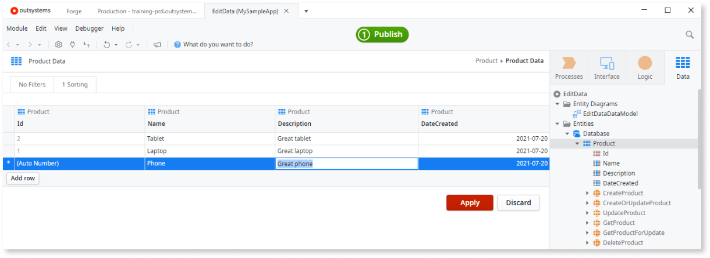
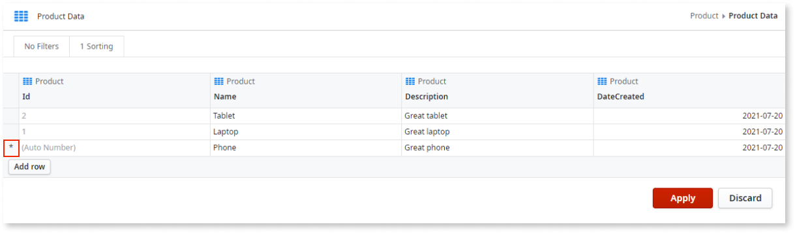

# Edit data while developing

After you [create entities to persist data](../modeling/entity-create.md), you can edit your app's data without leaving Service Studio.

Add, remove, and change records of **entities** during app development, enables you to do the following:

* Test your app with real and meaningful data to ensure your apps works correctly once it reaches your production environment.

* Prepare your demos with the right data to show your stakeholders real use cases and enable them to give you meaningful feedback.

This topic relates to editing data of **Entities**, to learn how to edit data in **Static Entities**, check [Static Entities](../modeling/entity-static.md).

## Prerequisites

To edit entity's data in Service Studio, ensure the following:

* You're connected to an environment that uses **Platform Server release 11.11.1** or later.

* You're connected to an environment with [Purpose](../../../setup-infra-platform/setup/environment-config.md#purpose) set as **Development** or **Non-Production**.

* Your IT user has [**Change and Deploy Applications**](../../../manage-platform-app-lifecycle/manage-it-teams/about-permission-levels.md) or higher for the module that contains the entity you are editing. 

*  If your environment uses [Multiple Database Catalogs and Schemas](https://success.outsystems.com/Support/Enterprise_Customers/Maintenance_and_Operations/Multiple_Database_Catalogs_and_Schemas), the entity must belong to a module published to the **(Main)** database catalog. This doesn't apply to **Platform Server release 11.14.1** or later.

### Entities whose data can be edited

In Service Studio, you can edit the data of **entities** that meet the following criteria:

* The entity has an **Identifier** attribute.
* The entity is a server entity. You can't edit the data of a client entity.
* If the entity is **Multi-Tenant**, the  **Show Tenant Identifier** property must be set as **False**, which is the default value.
* The entity isn't an exposed process entity.

## Adding changes

To start editing an entity's data, open the module where the entity exists. Then in the **Data** tab, double-click the entity, or right-click the entity and select **View or Edit Data**.

Even though it seems like you're editing data in a spreadsheet, you're actually preparing changes to data in a relational database. 
Rows represent entity records, and cells represent attributes.

In the entity Data screen, you can then [add rows](how-edit-data.md#add), [remove rows](how-edit-data.md#remove), and [modify cells of existing rows](how-edit-data.md#modify) to the entity. Changes aren't committed immediately, you can prepare several changes before applying them.

Service Studio adds an asterisk, **\***, to the first cell of rows that contain pending changes.

If the change applies to specific cells of a row, Service Studio highlights that cell's background.

Service Studio continually validates your pending changes, and highlights cells with a red outline if it detects an issue. 
Check the issue by hovering over the highlighted cell. Fix these issues before applying your changes.

If needed, you can [discard your changes](how-edit-data.md#discard) all at once, or one row at a time.

Once you [apply your changes](how-edit-data.md#apply), Service Studio creates and sends SQL statements to your platform database, changing one record at a time.

After trying to apply all your changes in the database, Service Studio lets you know if all changes were successful, or if any of the changes failed.

If you don't apply or discard your pending changes, Service Studio keeps them saved in your machine.
