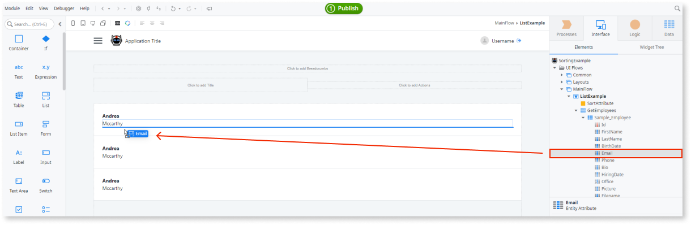
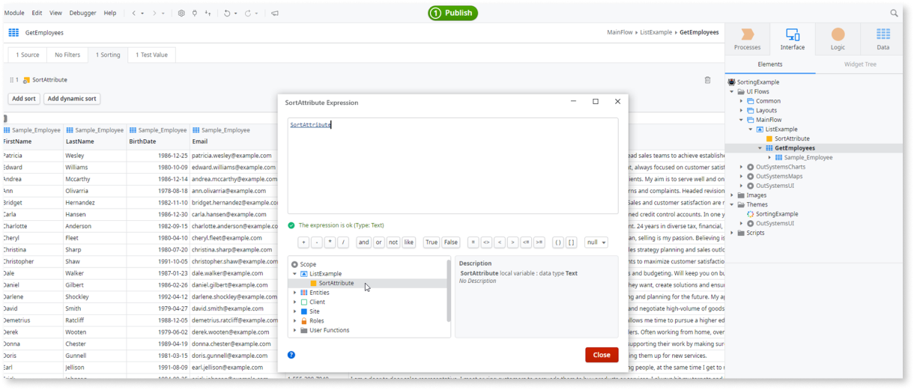
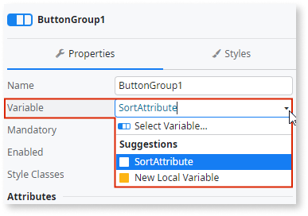
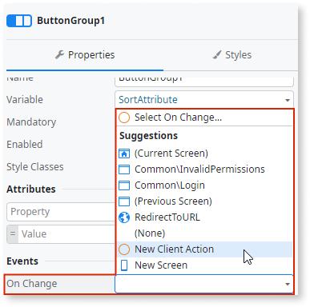
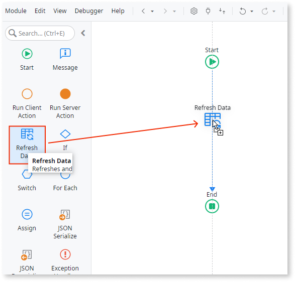

# Sort Results in an Aggregate

Most times, records display on screens following an order that facilitates reading or finding information.

In OutSystems, aggregates let you choose how the records sort when they return data. The sorting can be fixed or dynamic, meaning that it can change during runtime.

To display results in an aggregate with **fixed sorting**, follow these steps:

1. In the aggregate, select the column on which you want to sort and right-click the mouse.
1. To sort the results in ascending order, select **A-Z**,  or to sort the results in descending order, select **Z-A**.

To sort results in an aggregate with **dynamic sorting**, follow these steps:

1. In the aggregate,from the Sorting panel,  click **Add Dynamic Sort**. The expected input is an expression of type Text. This value can be the result of a condition or other logic implemented in the expression itself.
1. To refer to columns, select a **variable of type Text** previously defined from the Scope tree.

While defining expressions as values for your variable, you can specify:

* **Calculated or grouped attributes**, using the pattern `AttributeName` for ascending order or `AttributeName DESC` for descending order.
* **Entity attributes**, using the pattern `Entity.Attribute` or `Entity.Attribute DESC` for ascending or descending order.

## Example

In the following Sorting Example, a reactive application displays a list of employees, with details about each employee. Users should be able to sort by the name of the employee in either ascending or descending order.

1. Open Service Studio, create a new Reactive Web App named SortingExample.

1. Create a module with the default name.

1. Create an empty screen and name it.

1. Go to **Manage Dependencies...** and search for the Sample_Employees entity of the **OutSystemsSampleDataDB** module.

1. Fetch this entity to be used on the previous screen you created.

1. Drag and drop a list widget into the screen and define Sample_Employees as the source list for it.

1. Drag and drop the FirstName, LastName, and Email attributes into the list.

1. Create a local variable and name it **SortAttribute**, then set the Data Type property to **text**.

    

1. Double-click on the aggregate **GetEmployees**.

1. From the Sort tab, click **Add dynamic sort**, and then define the Local Variable as the value for the dynamic sort.

    

1. From the toolbox, drag a **Button Group** widget to the top of the employees list and bind the variable **SortAttribute** with the Button Group.

    

1. Remove one of the Button Group Items and rename the remaining Button Group Items to **Sort ASC** and **Sort DESC**.

1. Select the **Sort ASC Button Group Item** and set the Value property to the expression "Sample_Employee.FirstName". This sorts the results of the aggregate by ascending order using the attribute FirstName.

1. Repeat the operation on the **Sort DESC Button Group Item**, changing the expression to "Sample_Employee.FirstName DESC".

1. On the ButtonGroup, define an event **On Change** as a new client action.

    

1. In the new client action, drag Refresh Data and select the data source as **GetEmployees**.

    

1. Publish and test. Verify the list sorting changes after clicking the **Sort ASC** or **Sort DESC** buttons.  

    <iframe src="https://player.vimeo.com/video/973090257" width="750" height="454" frameborder="0" allow="autoplay; fullscreen" allowfullscreen="">Video demonstrating the sorting functionality.</iframe>
