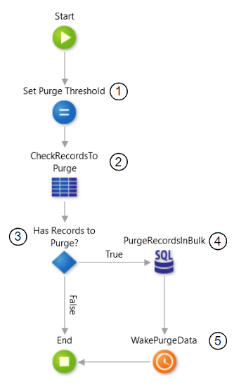

# Data Purging

## What is Data Purging

Data purging is a mechanism that permanently deletes inactive or obsolete records from the database. It should be considered for entities with evident high-growth rate, which can quickly achieve considerable volumes of data. All purging strategies must always align with business and (or) legal requirements.

Although this article focuses on purging data from the database’s entities, we can consider a similar approach for other types of storage, such as file systems, e-mails, and so on.

## Benefits

The two major benefits of having a purging strategy are **runtime performance** and **costs saving**.

Keeping inactive or old data in the system consumes more file storage space, requires more physical resources to keep up the system performance - memory and computing capacity from the database - and complicates the database backup and maintenance. All of these might result in unnecessary and expensive hardware upgrades.

## Data Purging Best Practice

In this section, you can find an example of data purging implementation that works as a best practice for the purging mechanism.

### Preparing your data

To ensure the data model contains the information needed to implement the purge algorithm, it is recommended to add control columns to your entities, to allow enforcing the purge condition(s).

For example, the condition may be to delete all records whose update timestamps exceed the ones defined in a threshold, in days (specified using a site property) or to delete all records based on a boolean control column.

Here are some examples of possible control columns. Select those that make sense according to your use case and add any other that may also apply:

* **LastUpdatedOn** (DateTime): Tracks the last time the record was updated. Used to purge records based on a timestamp (defined using a Site Property, for example).

* **IsActive** (Boolean): Marks the record as active or inactive. Inactive records can be purged later on.

* **IsDeleted** (Boolean): Marks the record for later deletion (soft-delete). The record can be effectively deleted (purged) or restored later.

* **IsDraft** (Boolean): Useful for draft scenarios, such as having data not yet finalized. This flag helps to identify data to purge, such as drafts created a long time ago with no recent updates.

### Implementing the purge mechanism

You can set up a purging process by using a Timer that asynchronously deletes records from a given entity, based on the purge condition. For performance reasons, and to prevent timeouts, the purge should be executed in chunks and though the usage of bulk operations.

The following is an example of the purge process logic:

1. **Set Purge Threshold** - Sets the number of records to purge by iteration. This threshold can be defined using a Site Property, so it can be adjusted without redeploying the module.

1. **CheckRecordsToPurge** - Validates if there are records left to purge.

1. **Has Records to Purge?** - Validates the output of the previous query and executes the purge branch if there are records to purge.

1. **PurgeRecordsInBulk** - Executes a bulk DELETE statement, combined with a clause to limit the amount of purged records (using the Purge Threshold set in step 1). It implements the purge condition.

1. **WakePurgeData** - Re-wakes the Timer to check if there are still records to purge.

The whole system may require multiple Timers to purge data from different entities. Each Timer will have its purge condition, aligned with the use case associated with that Entity.

## Common pitfall scenarios

### No purge strategy

A common scenario is lacking a data purging strategy because the high growth of application data was not correctly estimated. This situation may lead to application performance deterioration over time.

Forecast the growth of your data during the design phase, based on business knowledge and existing metrics. If you don’t have enough information, take a conservative approach and consider the high growth of the data.

To prevent a scenario of application performance deterioration, you should monitor the application performance (for example, using LifeTime Analytics) and database growth periodically, considering the implementation of a data purging mechanism, if needed.

### No referential integrity strategy

When implementing your data purging mechanism, you have to consider the [referential integrity (Delete Rule)](https://success.outsystems.com/Documentation/11/Developing_an_Application/Use_Data/Data_Modeling/Entity_Relationships/Delete_Rules) defined for the relationships between the Entities in your model, as it directly impacts the sequence of your deletion flow.

If during the design phase of your Entities model, you haven’t set the Delete Rule for the several relationships taking the data purging requirement into consideration, you might end up with a complex and hard to maintain purging implementation.

The `Protect` approach
:   If you kept the `Protect` default value for the **Delete Rule** of all the Entities relationships in your model, the result is having a more complex data purging flow or getting a database exception when trying to delete records following the wrong deletion order.

The cascade delete approach
:   Having the **Delete Rule** set to `Delete` - cascade delete behavior - is the scenario that most benefits the purging implementation, as it ensures that when you delete the main record, all the related records are automatically deleted. Therefore, for a simpler data purging implementation, you should design your Entities model to use the cascade delete rule as much as possible. On the other side, make sure to respect the expected system behavior in each use case.

The `Ignore` approach
:   Having the **Delete Rule** set to `Ignore` will allow you to delete a record from the main Entity and keep all the related records. While this approach facilitates your data purging flow, use it carefully, as it might lead to an inconsistent data model. If you need to keep only the related records for compliance purposes, bear in mind that you will never be able to retrieve and show the detailed information of the main record.

### Lack of transient data purging

All transient data must be purged periodically. You should discuss these purging mechanisms for each project, as soon as the business concepts and master data are identified.

Examples of transient data that might require purging:

* **Users that are no longer active** - If you delete Users, be careful how to handle the related data. If you consider setting the **Delete Rule** to `Ignore`, instead of `Delete`, you will never be able to retrieve and show the User detailed information.

* **Users that started the online registration process but never concluded it** - In this case, you may want to keep the Users as prospects during a certain amount of time before being purged. The purge may take place after synchronizing relevant metrics with external sources.

### Incorrect purging schedule

The purging process(es) should run during off-peak hours to minimize the impact over web requests provided to end users.

### Lack of database maintenance plans

Maintenance plans are crucial for the overall health of your database, as they ensure the regular rebuild of DB statistics and indexes, free up disk space, among many other important routines.

Considering the high volume of data being deleted during a data purging process, it’s important that the database maintenance plans are coordinated with your purging mechanism. Make sure to consult your DBA to have a suitable maintenance plan according to your purging needs.
