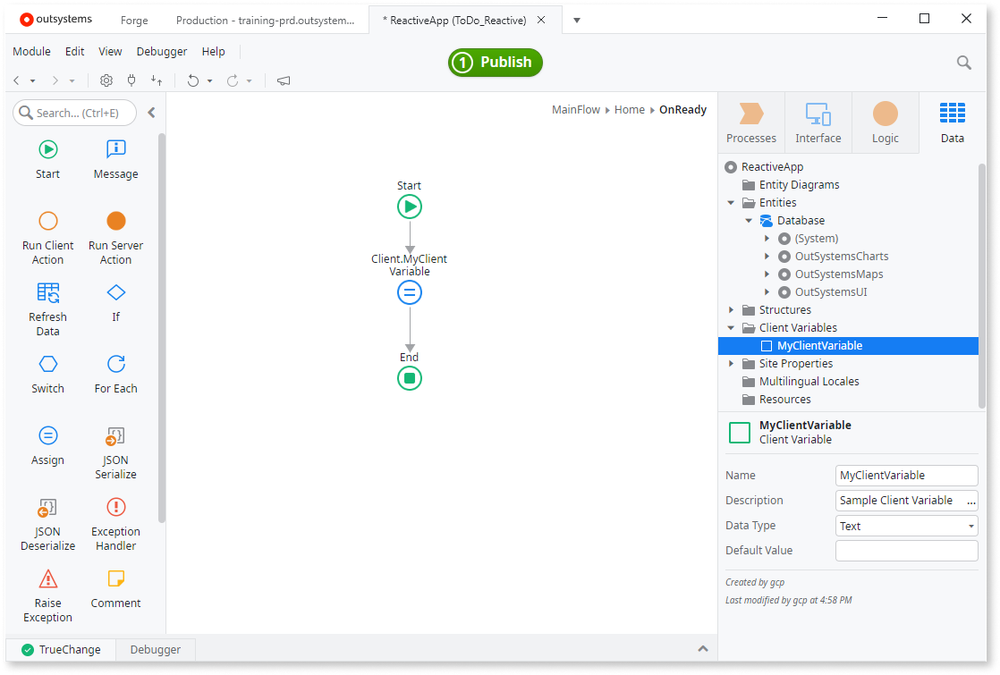

# Share a Client Variable between apps

This document shows how you can share some value between two apps using Client Variables. We're using a Block to share the value, but you can do the same with a public Client Action. The instructions apply to **Reactive Web** and **Mobile App**.

## Create the first app and a Client Variable

Follow these steps to create a Client Variable and initialize its value when the module loads.

1. Create a sample **Reactive Web App**, name it **ReactiveAppA**, and add a **Web Module** to it. When the editor opens, add a Screen to the app.
1. Go to the **Data** tab > right-click **Client Variables** > select **Add Client Variable**. Name the variable **MyClientVariable**.
1. Go to the **Logic** tab > right-click **Client Actions** > select **Add System Event** > select **On Application Ready**.
1. Drag an **Assign Tool** to the Flow and assign `Client.MyClientVariable = "Value from ReactiveAppA!"`. This sets a value to the variable once the app starts running.
1. Add a Block to MainFlow and name it **BlockWithClientVariable**. Drag an **Expression Widget** to the Block and enter `Client.MyClientVariable` in the **Expression Value** of the Widget.
1. Drag **BlockWithClientVariable** to the Screen.
1. Set **Public** property of BlockWithClientVariable to **Yes**.
1. Publish the app and open it in a browser.

## Create the second app and pass it the value of Client Variable

The following steps show how to share the Client Variable between apps by reusing the block created in the previous section.

1. Create another sample **Reactive Web App**, name it **ReactiveAppB**, and add a **Web Module** to it. Again, add a Screen to the app.
2. Open **Manage Dependencies**, search for **ReactiveAppA** in Producers and select **BlockWithClientVariable**. Click **Apply** to add references and close the dialog.
3. Drag the **BlockWithClientVariable** to the Screen.
4. Publish the app and open it in a browser.

## Sharing values in Traditional Web Apps 

In Traditional Web Apps, you can use Session Variables to keep configurations and app context data.
