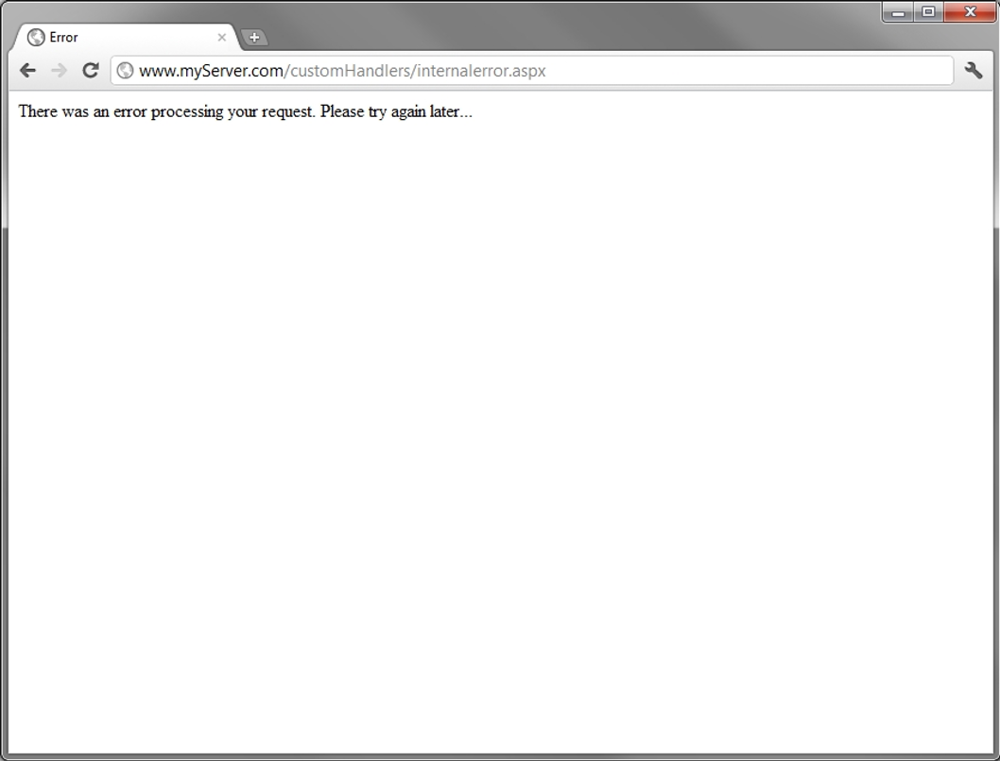
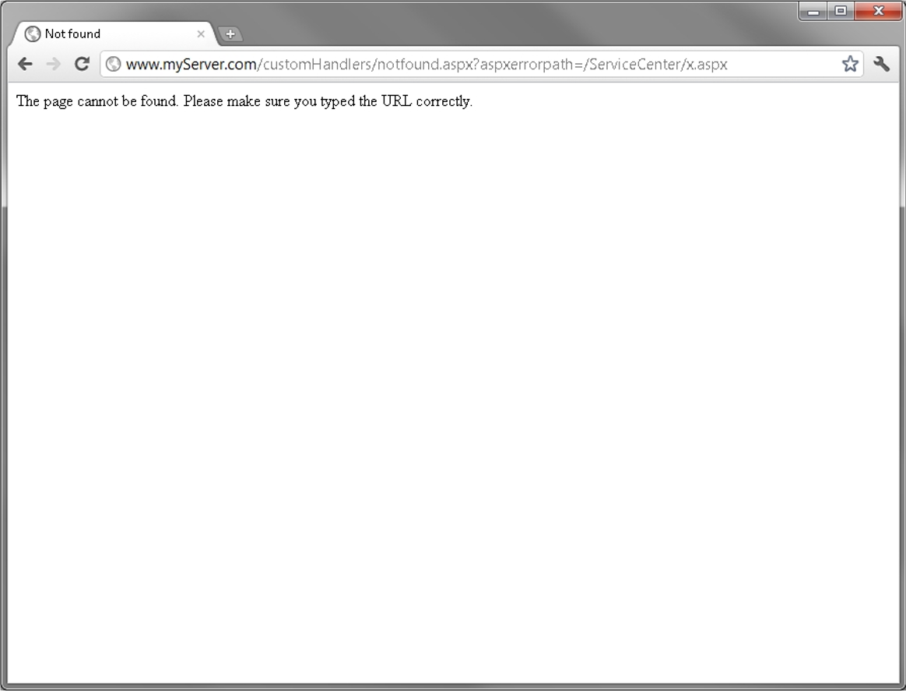
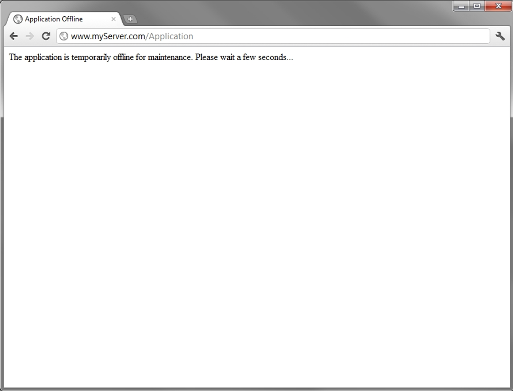
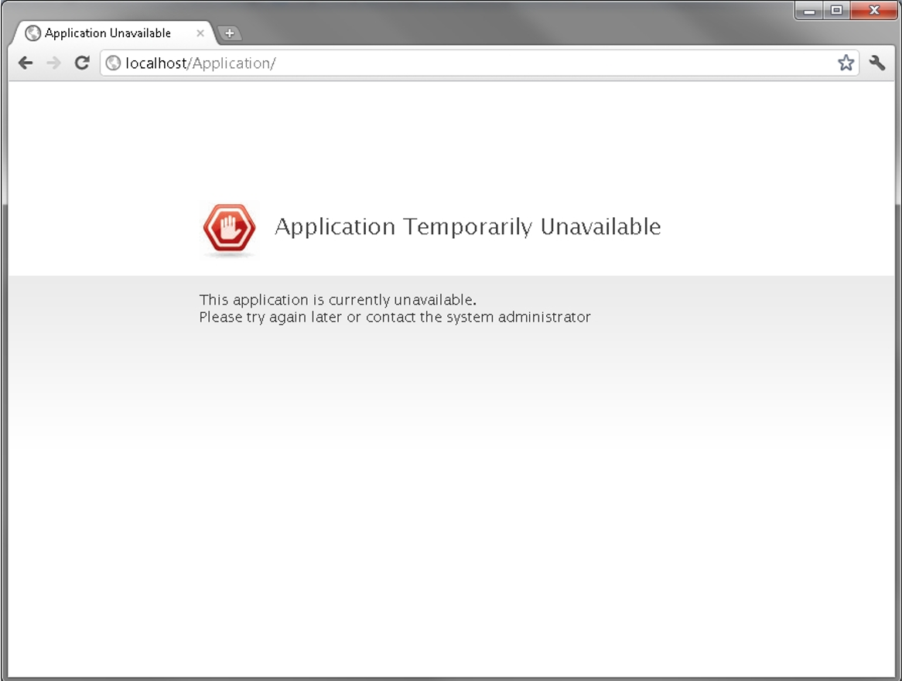
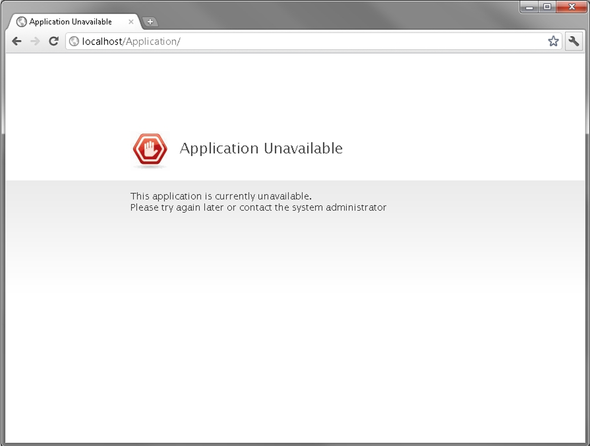

# Customizing OutSystems Platform Pages for Unhandled Errors

OutSystems handles unforeseen or unhandled errors that might occur in applications and displays proper feedback pages to end users. In this article it is described how you can customize these pages and make them fit your application design.

Keep in mind that this is **only applicable** to OutSystems On-Premises installations.

## Introduction

When designing an application the error handling is fundamental to avoid misbehaviors or crashes and to give feedback to end users. However, unforeseen (and unhandled) errors might occur in applications and for that reason the OutSystems Platform ensures their handling by displaying proper feedback pages to end users. In this document are described all types of error handling provided by the OutSystems Platform and how you can customize them to fit your application design.

## Error Handling Pages

OutSystems Platform displays specific pages for the type of errors that it handles: internal errors, resource not found errors, temporary offline application errors, or application unavailable errors.

### Internal Errors

These errors occur when not handled by the application, i.e., unhandled errors. OutSystems displays the following page:

### Resource Not Found Errors

These errors occur when navigating to a page (URL) that does not exist within the scope of the application. OutSystems displays the following page:

### Application Temporarily Offline Error Page

These errors occur when an application is being deployed (at that moment) and the license does not include the Hot Deployment feature. OutSystems displays the following page:

### Application Unavailable Error Pages

These errors occur when an application is unavailable for one the following reasons:

* The application was taken offline in Service Center.
OutSystems displays the following page:

* The application was automatically shut down by the OutSystems Platform due to licensing issues as, for example, the license has expired.
OutSystems displays the following page:

## Customizing Error Handling Pages

### File Customization

To customize an error handler page you have to edit the content of the corresponding file:

* **Internal Errors:** internalerror.aspx

* **Resource Not Found Errors:** notfound.aspx

* **Application Temporarily Offline Errors:** app_offline_template.htm

* **Application Unavailable Errors:** app_offline.aspx and forbidden.aspx

From Platform Server version 11.28.0 and higher, the **forbidden.aspx** and **app_offline.aspx** files are replaced by newer versions, and any previous configuration is overwritten.

These files are all available under the customHandlers folder which can be found in your Platform Server installation directory (normally it is C:\Program Files\OutSystems\Platform Server).

Take note that OutSystems Platform upgrades do not change these files and, therefore, your customizations are kept.

### Allowed Editors

To edit the file content to design your page you are allowed to use any editor of your choice that is suited for the file type.

### Using Additional Information

In case of the **Application Unavailable Errors** page some request parameters are sent to the page, allowing you to add further information/functionality to the page:

* **contact:** the email address of the Platform Server administrator (as configured in Service Center)

* **errorCode:** used to identify the error type with one of the following values:

    * "APPLICATION_OFFLINE": indicates that the application was deliberately taken offline in Service Center

    * "APPLICATION_LICENSING_ERROR": indicates that the application was taken offline due to a licensing error

* **errorDetail:** detailed information about licensing errors.

### Bringing a New Error Handling Page Online

Changes made to the file of an error handling page take immediate effect on what is displayed by the OutSystems Platform to end users. This means that you should be very careful when working directly on the file and saving unfinished versions; we advise you to (1) copy the file to another directory, (2) work on it, (3) and then copy it back again when finished.

On a farm environment, files of your customized pages must be **manually copied to all of the Front-end nodes**.
