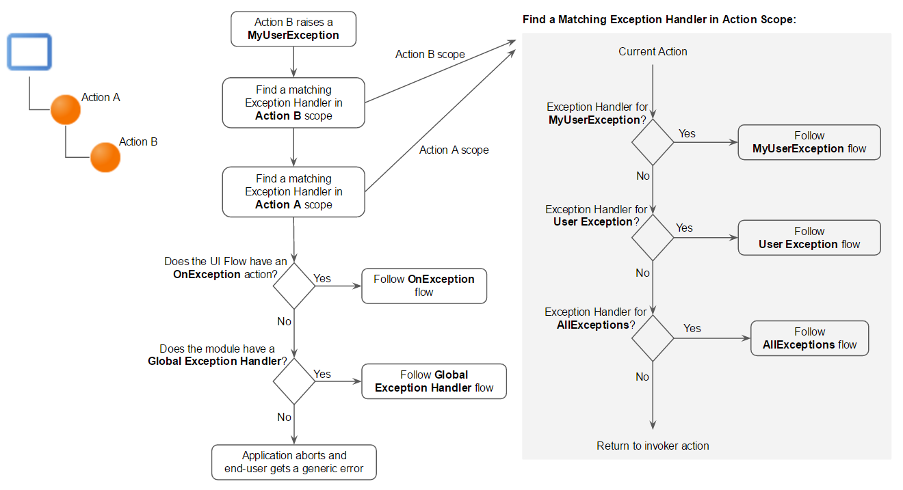

# Exception Handling Mechanism

The exceptions raised in your module are handled in a flow starting with an Exception Handler element. In an action, you can have more than one Exception Handler flow to handle different types of exceptions.

An exception can be raised by OutSystems or in your logic at any point of your module. For typical UI requests, you can handle the raised exceptions by:

* Adding an [Exception Handler](<../../ref/lang/auto/class-exception-handler.md>) element and its logic in your action's flow.
* Adding an On Exception action in your UI Flows.
* Let the Global Exception Handler of your module do the work. By default, Global Exception Handler property of your module is set to the On Exception action of the "Common" UI Flow.

In action flows starting in Timers you can only handle the raised exceptions by adding Exception Handler elements in your logic, otherwise, the execution flow is interrupted and the error is logged.

When an exception is raised, the current execution flow is interrupted and the flow restarts in the first Exception Handler element which handles that type of exception.

As an example, consider an Action B raising a User Exception named MyUserException. Action B is invoked by Action A, which is a screen action. When MyUserException is raised in Action B, the exception handling mechanism works as follows:

You should have, at least, one Exception Handler in your application flow to inform and allow the end user to continue to navigate.

**OnApplicationReady** is a special event handler that is not covered by the Global Exception Handler. For that reason, error handling should be implemented in the action itself.

## Handling exceptions raised by integrations

When you are handling exceptions raised by an integration you are consuming (such as an action of an Extension or a method of a REST API) you won't be able to determine the type of exception. In these situations, you should handle the exception with an All Exceptions Handler. Then, you can use the **ExceptionMessage** property of the Exception Handler element to identify the exception.

For more information on handling errors in consumed REST APIs, check [Handling REST Errors](../../integration-with-systems/rest/consume-rest-apis/handling-rest-errors.md).

## Handling exceptions in WebBlocks

Imagine you have two flows, UIFlow1 and UIFlow2. In UIFlow1, there’s a Screen that includes a WebBlock from UIFlow2. If an exception occurs within this WebBlock, the `OnException` handler in UIFlow1 will handle it, not the one in UIFlow2. This is because, when you use components from another flow (like UIFlow2) within a Screen in UIFlow1, UIFlow1 takes on the responsibility for handling any exceptions those components might raise. This behavior is expected, as UIFlow1 acts as the primary flow and has precedence in exception handling for any elements it contains, regardless of their origin.
