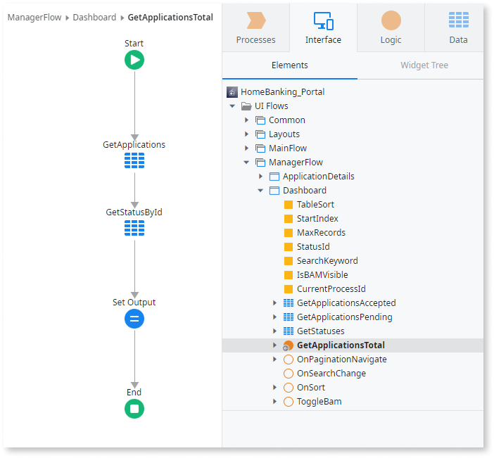
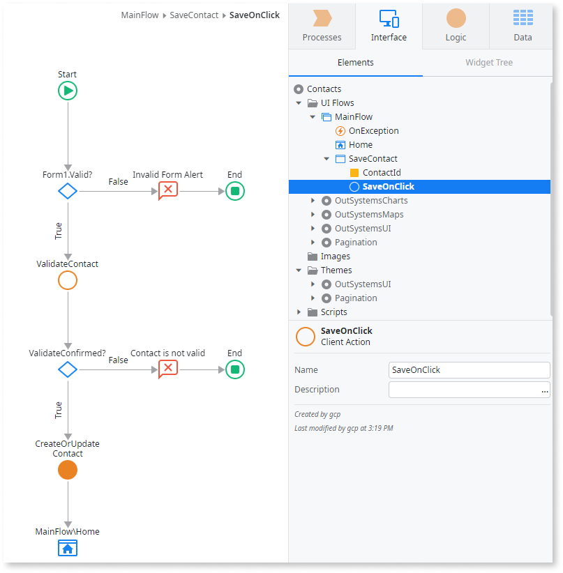
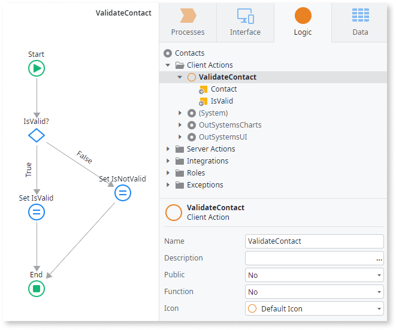
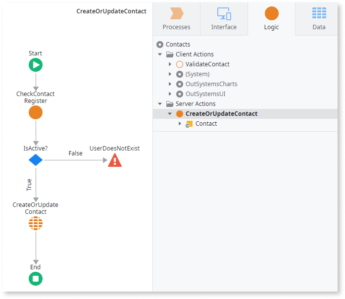

# Actions in Reactive Web and Mobile Apps

Applies to Mobile Apps and Reactive Web Apps only.

When developing Apps you create logic that runs on the **server** and logic that runs on the **client** device, like a smartphone or a tablet.

You can create the following Actions:

* Data Actions
* Client Actions
* Server Actions

## Data Actions { #data-actions }

Some Screens may require fetching complex information from the database or other external systems, for example a home banking dashboard. In Mobile and Reactive Web apps you do this in a **Data Action**:

**Data Actions** run on the server. You can create **Data Actions** to fetch complex data from the database, which you are not able to achieve using a single server Aggregate, or to fetch data from an external system, for example through a consumed REST API.

**Data Actions** run simultaneously with the client and server Aggregates to fetch data after each Screen loads.

You can also create **Data Actions** in your Blocks.

For detailed information about the properties of data actions, refer to the reference information for [Data action](../../ref/lang/auto/class-data-action.md).

## Client Actions { #client-actions}

**Client Actions** run logic in the user device. You can create **Client Actions** in two different scopes: in the scope of a **Screen** and in the **client logic**.

**In the scope of a Screen:** Lets you to run logic when the user interacts with the Screen. For example, if you have a Screen to update a Contact, you can create a **Client Action** that reacts to a user clicking the Save button, which then executes the update logic to update the Contact:

You can also create **Client Actions** in your Blocks.

**In the client logic:** Lets you encapsulate logic for reuse in several Screens. For example, if you have a validation rule that you must apply in several screens of your app, you can create a **Client Action** general to the client logic and use that action in the Client Actions of your Screens:

You can set a **Client Action** as a function and use it directly in Expressions of the client-side logic.

## Server Actions { #server-actions }

You can also create **Server Actions** in your apps to encapsulate the logic and reuse it in other Actions, such as other Server Actions, Data Actions or Client Actions. **Server Actions** run logic on the server.

You can set a **Server Action** as a function and use it directly in Expressions of the server-side logic.

**Note**: **Anonymous screens** generate public endpoints which is a  security risk as it can lead to cross-site request forgery attacks. For more information, see [Security Warning](../../ref/errors-and-warnings/warnings/security-warning.md).
