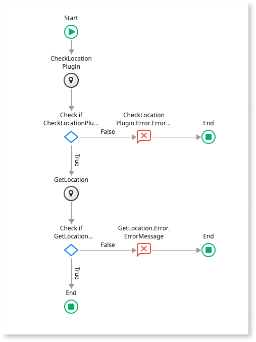
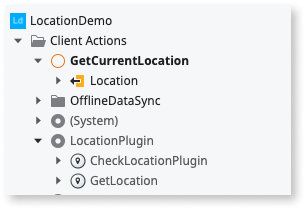

# Create a Client Action with Code Mentor

You can use [Code Mentor](ai-assisted-dev.md) in Service Studio to
quickly define the logic of an action flow.

In the following example, you build a Client Action for obtaining and returning
the user's current GPS location. By using the Code Mentor suggestions in
Service Studio you can implement the required logic faster.

The starting point is a Mobile App where you must determine the current GPS
location of a user. Make sure you install the [Location
Plugin](https://www.outsystems.com/forge/component-overview/1395/location-plugin)
available in the Forge in your OutSystems environment beforehand to determine
the user's location using the mobile device's GPS feature.

Since the suggestions provided by Code Mentor vary according to the
current context in Service Studio, the example starts from an empty mobile app
so that you get similar suggestions from Code Mentor, as in the example.

Your task is to implement a Client Action named `GetCurrentLocation` that
returns the current location in a `Location` output parameter. The desired
logic is the following:

1. Check if the **Location Plugin** is available on the mobile device. If it's
   available, proceed to the next step. If it's not, display an error message
   and terminate.

1. Try to get the current location and check if the operation was successful.
   If it was, proceed to the next step. If it wasn't, display an error message
   and terminate.

1. Fill the `Location` output parameter with the obtained location and
   terminate.

The implemented flow looks like the following:

Follow the steps presented in the next sections to create the logic flow using
Code Mentor assisted development.

## Create the Client Action

1. In Service Studio, create a new empty mobile app. Choose **Start from
   scratch** > **Phone App** in the new app wizard.

1. Open **Module** > **Manage dependencies...**

1. Choose `LocationPlugin` on the list of producer modules (on the left) and
   check the following elements on the right to add a dependency on them to the
   current module:

    * Client Action `CheckLocationPlugin`
    * Client Action `GetLocation`
    * Structure `Location`

    

    If the **LocationPlugin** isn't listed, make sure you installed the
    [Location
    Plugin](https://www.outsystems.com/forge/component-overview/1395/location-plugin)
    from the Forge.

    

1. Click **Apply**.

1. In the **Logic** tab, create a new Client Action named `GetCurrentLocation`.

1. Right-click the Client Action in the tree and select **Add Output
   Parameter**. Enter `Location` as the parameter name and make sure that its
   data type is set to `Location`.

The resulting Client Action and output parameter should look like the
following:

Naming actions and setting input/output parameters before defining the action
flow gives more context to Code Mentor, making it able to provide better
suggestions.

## Define the logic flow

1. In the flow, in the middle of the connector between the **Start** and
   **End** elements of the flow, click the blue circle with a white **+** (plus
   sign), also called the **AI radar**. Some suggestions appear.

1. Select **Call CheckLocationPlugin**. Service Studio adds a new element to
   the flow and shows a new list of suggestions.

1. Select **Check if CheckLocationPlugin IsAvailable**. Service Studio creates
   a new **If** element and some stars pop, meaning that Service Studio filled
   in some properties of the new element for you.

    <iframe src="https://player.vimeo.com/video/927271146" width="750" height="823" frameborder="0" allow="autoplay; fullscreen" allowfullscreen="">Video demonstrating the selection of Code Mentor suggestions for checking location plugin availability.</iframe>

1. Right-click **Check if CheckLocationPlugin IsAvailable** and select **Swap
   Connectors**.

    

    It's a good practice to have the success path going down toward the
    **End**** element, in this case, the **True** branch of the **If**.

    

1. Drag a connector from **Check if CheckLocationPlugin IsAvailable** to the
   right and drop it in the flow area. Some suggestions appear.

1. Select **Show Error message**. Some stars pop again.

    Flow elements to display error messages to the user require you to enter
    the message text. You can immediately provide this text, when the element
    gets added to the flow, but the following instructions assume that you'll
    perform this task in the end.

1. Drag a connector from the **Message** element to the right and drop it in
   the flow area.

1. Select **End flow** from the suggestions.

    <iframe src="https://player.vimeo.com/video/927275599" width="750" height="722" frameborder="0" allow="autoplay; fullscreen" allowfullscreen="">Video showing the flow for handling the scenario where the location plugin is not available.</iframe>

1. Click the AI radar between **Check if CheckLocationPlugin IsAvailable** and
   **End** and select **Call GetLocation**. Some more suggestions appear for
   the next flow element.

1. Select **Check if GetLocation Success** from the suggestions. Some stars
   pop.

1. Swap the **If** connectors again: right-click the **Check if GetLocation
   Success** element and select **Swap Connectors**.

1. Drag a connector from **Check if GetLocation Success** to the right and drop
   it in the flow area. Some suggestions appear.

1. Select **Show Error message**.

1. Drag a connector from the **Message** element to the right and drop it in
   the flow area. Some suggestions appear.

1. Select **End flow**.

1. Click the AI radar between **Check if GetLocation Success** and the **End**
   element.

1. Select **Set Location to GetLocation.Location** from the suggestions. Some
   stars pop again.

    <iframe src="https://player.vimeo.com/video/927280306" width="750" height="832" frameborder="0" allow="autoplay; fullscreen" allowfullscreen="">Video showing the process of setting the obtained location to the output parameter.</iframe>

1. Fill in the error messages in the **Message** elements, if you haven't done
   it yet.

The logic flow is now finished. Double-check your flow for any errors, then
publish your app, and test it on a mobile device.
