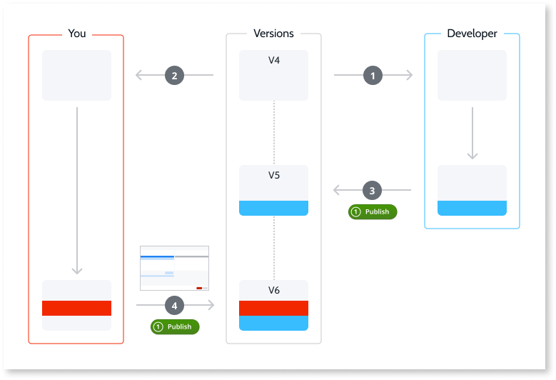
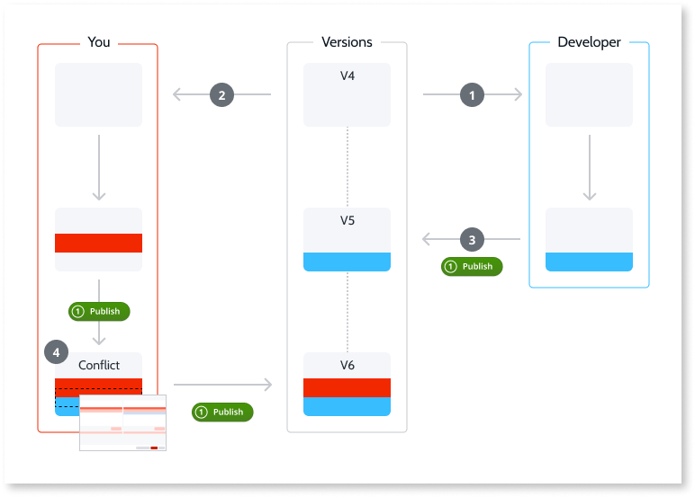

# The merge feature and team collaboration

OutSystems implements a simple versioning system that labels the modules with an incremental version number on each successful publish. You can restore or compare a module to any previous version that is available on the server.

Several developers can work on the same module at the same time. When you publish your changes, OutSystems tries to merge your new code with the changes that other developers published in the meantime. When you click the 1-Click Publish button, the following can happen:

* **The version on the server is the same.** Service Studio updates the server version with your local version.

* **The version on the server is different.** Service Studio will offer three options in [Modified version detected](<intro.md#modified-version-detected>) window: to merge automatically, to compare the versions, or to overwrite changes on the server.

This document outlines the merge operations in OutSystems. For a more detailed explanation of the merge feature, please check [Using the Compare and Merge window](<intro.md>).

## Automatic merge of module versions

This merge is automatic if there are no conflicts, and applies to both visual elements (screens, widgets, etc.) and textual elements (CSS, JavaScript).

1. The other developers open the version 4 of the module. They start developing. 
1. You open the version 4 of the module. You also start developing. 
1. The other developers publish their changes.
1. You publish your changes. OutSystems detects there are changes to be merged, based on the version from where both started developing (V4). The **Modified Version Detected** window is displayed and you choose **Merge and Publish**. OutSystems automatically merges and publishes the module for you. 

## Resolve merge conflicts

When you and other developers work on the same module and change the same
elements, OutSystems cannot automatically merge the work. It's not possible to automatically know how to merge the conflicting changes. You have to resolve the conflicts manually by choosing which changes to publish.

1. The other developers open version 4 of the module in Service Studio. They start developing.
1. You open version 4 of the module in Service Studio. You start developing.
1. The other developers publish their changes. 
1. You publish your changes. OutSystems determines that there are changes to be merged based on the version from where both parties started developing (V4). The  **Modified Version Detected**  window is displayed, and you choose **Merge and Publish**. There are conflicts because you have changed some elements that the other developers also changed. Service Studio displays the **Compare and Merge** window. The non-conflicting changes are selected for you, but you have to decide which conflicting changes you want to keep.

## Compare and merge versions

You don't have to wait for a conflict to happen to compare the versions. In Service Studio you can compare changes of your local module with a previously published version of the module on the server. In the **File** menu there are the entries:

* **Compare and Merge with Published Version** – enables you to compare the published version of the module with the module that is currently open.
* **Compare and Merge with another Version or File** – fetches the list of the module's available versions from the server, enabling you to load one and compare with the currently opened module. You can load a module from the file systems as well.
