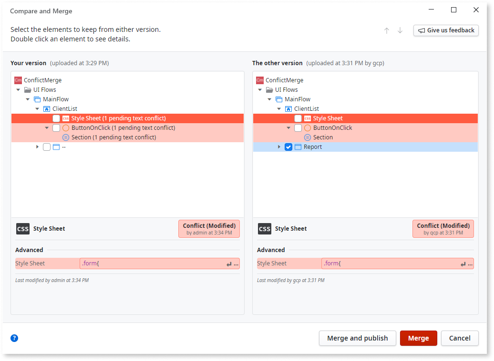
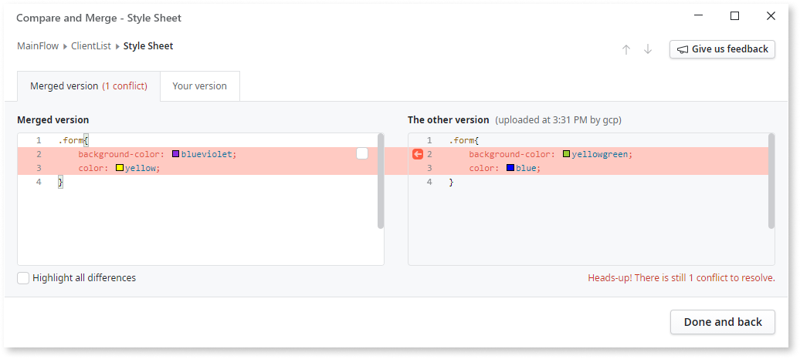
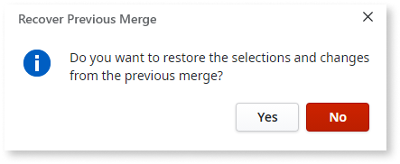

# Merging and versioning

In an environment where many developers work on the same module, you often need to incorporate other people's changes. If there are no conflicting changes, Service Studio automatically integrates the differences. If conflicting changes are detected, you are prompted to resolve them manually. To publish the module, update your local module, resolve all conflicts, and then publish it.

The merge capabilities are designed with the OutSystems visual language in mind, letting you review changes for both visual and textual elements.

What follows is an overview of the merge feature. For step-by-step instructions on conflict resolution, refer to [Compare and merge example](merge-example.md). For more information about merge operations in OutSystems, refer to [The merge feature and team collaboration](concepts.md).

## Conflicting version found

The **Conflicting version found** window appears when you try to publish your module and Service Studio detects differences between your version and the version on the server. The following buttons are available:

**Override with this version**
:   Overwrites the version of the module on the server with your local version. This is a destructive operation that discards all changes in the server version.

**Compare versions**
:   Opens the **Compare and Merge** window where you preview the changes between both versions and edit the local version before publishing.

**Cancel**
:   Closes the window without publishing or merging.

## Compare and merge window

Open the **Compare and Merge** window by clicking **Compare versions** in the **Conflicting version found** window. The **Compare and Merge** window shows the local and the server version side by side. You select and incorporate both textual and visual elements. Elements with conflicting changes are labeled **(merged with conflicts)**. Double-click an element to navigate to the details screen.

## Editing the textual elements

The textual elements you edit during the merge are CSS, JavaScript, and the values of properties inside elements. Examples include a variable value in the Assign tool, SQL expressions, descriptions, and text in widgets. After you double-click a textual element, two tabs show the different versions and origins of the textual element.

The **Merged version (# of conflicts)** tab shows the editable text and comparison:

* **Merged version** pane – the textual element that you save locally during a merge. It contains **both** the automatically merged text and the conflicting changes you need to resolve. You edit this text.
* **The other version** pane – the textual element in the server version of the module. You cannot edit this text.

The **Your version** tab shows the comparison:

* **Your version** pane – the textual element in the local version of the module. You cannot edit this text.
* **The other version** pane – the textual element in the server version of the module. You cannot edit this text.

### Resolving conflicts in the textual elements

To select the changes that are saved in the local version, and that can be uploaded to the server, do the following in the **Merged version (# of conflicts)** tab:

* To accept the changes from the server version, click the arrow in **The other version** pane.
* To accept the changes from the local version, select the check box in **Merged version** pane.
* To change the resulting local version, edit the text in **Merged version** pane.

### Highlight all differences

By default, the pane for editing the changes highlights only the lines with conflicts. To highlight all changes, select the **Highlight all differences** check box.

### Color reference

The highlights in different colors help identify the differences between the versions. Hover the mouse over the highlights to see a tooltip description.

Here are the color descriptions.

| Color | Name | Meaning |
| --- | --- | --- |
|  | Gray | Deleted line |
|  | Green | Inserted line |
|  | Light blue | Modified line with no conflicts, no changes in this version |
|  | Dark blue | Modified line with no conflicts, this version was changed |
|  | Red | Modified in both versions, has conflicts |

### "Merge and publish" vs "Merge"

After you select which changes to accept, choose one of the following actions to finalize the integration:

* **Merge and publish** – updates the local version of the module and publishes it.
* **Merge** – updates the local module so you continue working, and then publish using the **1-Click Publish** button.
* **Cancel** – opens a confirmation dialog asking "Do you want to cancel merge?". Click **Cancel merge** to exit the merge, or click **Keep comparing** to return to the **Compare and Merge** window.

## Recover previous merge

Service Studio saves merge selections and changes automatically. If you cancel a merge by clicking **Cancel merge** in the confirmation dialog, or if Service Studio closes unexpectedly during a merge, the **Recover Previous Merge** dialog appears. The dialog appears the next time you start a merge for the same module. The dialog asks "Do you want to restore the selections and changes from the previous merge?"

* Click **Yes** to resume from where you left off without losing the previous edits.
* Click **No** to discard the saved merge edits and start fresh.

