# OutSystems Mobile Best Practices

Mobile apps bring a completely [new mindset for the development model](https://www.outsystems.com/blog/from-web-to-mobile-development-5-things-to-consider.html). On the one hand, users have very high expectations regarding their experience with mobile apps. On the other hand, device limitations together with network restrictions can have a major impact on that experience. No matter the circumstances or limitations, users expect mobile apps to work like a charm!

If you want to develop a mobile app that offers your users the best mobile experience, there are some key rules that you should always keep in mind:

**Focus on mobile use cases to guide your development**

Choose the best use cases for a great mobile experience. Start small and iterate. Use less and optimized content. Show what's more important first. Use common mobile patterns such as the ones provided by the [OutSystems UI](https://www.outsystems.com/outsystems-ui/) framework.

**Keep heavy logic on the server side**

Keep client-side information as simple as possible. Execute complex data processing and calculations on the server side, using the minimum number of server requests as possible. Cache your results on the client side.

**Choose OutSystems low-code over JavaScript**

OutSystems automatically optimizes the code for the best runtime performance. Use JavaScript only if it cannot be done with the OutSystems low-code language or in advanced extensibility scenarios.

**Test your app in real world scenarios**

Understand how your mobile app will be used and thoroughly test it before deploying to production. Assure that, device limitations, [network restrictions](https://www.outsystems.com/blog/lie-fi.html), or [offline periods](https://www.outsystems.com/blog/offline.html) will not prevent users having a great experience.

Focusing on these ground rules, this article contains a set of best practices that will help you avoid common pitfalls which would impact user experience and the performance of your OutSystems mobile app. If you haven't done so already, you should learn how to develop high-quality mobile apps by following the [Becoming a Mobile Developer](https://learn.outsystems.com/training/journeys/mobile-developer-679) online training first.

We'll be updating and adding new content to this article along the way!

## User Interface

A [great UI experience](https://www.outsystems.com/blog/10-rules-for-creating-a-mobile-look-and-feel.html) increases the user perception of a fast and fluid mobile app. This section presents a set of best practices to improve the UI experience of your OutSystems mobile app.

### Discover and Use OutSystems Components

Developing common mobile patterns from scratch takes a huge effort and feels like reinventing the wheel.

**Recommendation**

Use the [OutSystems UI](https://www.outsystems.com/outsystems-ui/) framework or other [OutSystems Forge](https://www.outsystems.com/forge/) components, which provide you with a large set of common mobile patterns. Remember to keep them up to date to benefit from the latest improvements.

### Design an Empty State for Content Being Fetched

When a user navigates to a screen, the static content is usually rendered first, while the dynamic content takes more time since it is [fetched asynchronously](https://success.outsystems.com/documentation/11/developing_an_application/implement_application_logic/screen_and_block_lifecycle_events/). This results in a poor UI experience, where an apparently incomplete screen is displayed with content moving around while the dynamic data is being rendered.

**Recommendation**

Improve the user experience by [designing and displaying an empty state image](https://success.outsystems.com/documentation/how_to_guides/front_end/how_to_improve_list_slowness_on_low_end_devices/) while the dynamic content is being fetched. A couple of good examples are Facebook or LinkedIn.

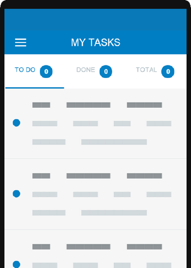

This strategy is valid for all dynamic content in the screen such as blocks, cards or list items. When the empty state turns into the fetched content you may experience some flickering. To avoid flickering when the empty state turns into the fetched content, choose one image that assures a smooth transition, such as a blurred gray line or a spinner.

### Prioritize Screen Content Rendering

By default, OutSystems mobile apps fetch screen data without a specific priority. If your screen has content that is more relevant and should be displayed first but you are not prioritizing its rendering, it may lead to a bad user experience. For example, displaying an advertising banner before the main information of the screen.

**Recommendation**

Delay the rendering of the secondary content so that the main content is rendered first. To do this:

1. Place the secondary content in a Block inside the _True_ branch of a*n If w*idget. The Block must enclose all the logic to fetch the secondary content so that data fetching of the secondary content only runs when the Block is rendered.

1. On the*False*branch of the _If_ widget, place [an empty state](#design-an-empty-state-for-content-being-fetched) to avoid content from moving around when the secondary content is fetched.

1. Set the _If_ condition to a variable holding _False_ by default.

1. In the On Render event of the screen, add logic to set the variable to _True_ so that the secondary content starts to render.

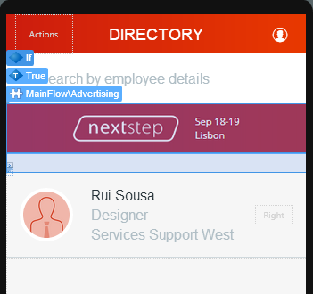

### Set the Width and Height of Image Widgets

If you do not set the width and height of an Image widget, the user can get a flickering effect while the final image is being downloaded. For example, not setting the image height might cause the total height of the screen to change until the image loads completely since the widget height will be changing from 0px to the height of the final image.

**Recommendation**

Set the width and height of the Image widget to the expected size of the final image.

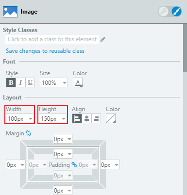

## Performance

Handling data or implementing logic specifically for mobile scenarios can have a significant impact on a mobile app performance. Follow the best practices in this section to develop performant mobile apps. Also check the other sections for best practices that, although not directly related to performance, can contribute to improving it.

### Fix the Performance Warnings

OutSystems automatically detects potential performance issues while you are developing your mobile app in Development Environment. Not paying attention to them may result in a bad performance of the application.

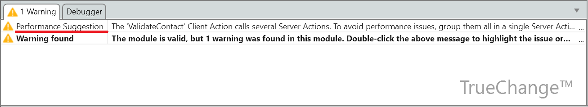

**Recommendation**

Check the performance warnings displayed in the TrueChange™ tab and fix them.

### Design a Lightweight Local Storage { #lightweight-local-storage }

Keeping a large amount of data in the device's local storage, for example in offline or cache scenarios, might become a performance killer in low-end devices, causing `Failed to allocate X bytes` errors.

**Recommendation**

Use the following techniques to design a lightweight local storage:

* Design the local storage data model using only the attributes that you need, instead of all attributes of the corresponding server entity. Consider [denormalizing](https://en.wikipedia.org/wiki/Denormalization) the local data model to avoid complex queries like having multiple JOINS.
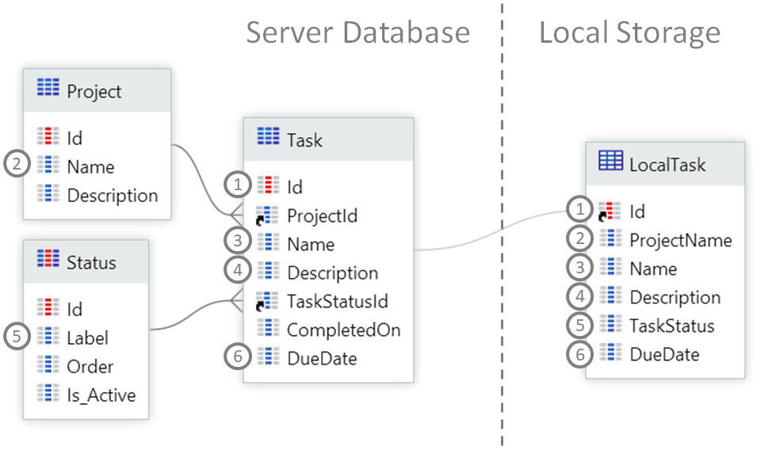

* Identify the best [data synchronization patterns](https://success.outsystems.com/documentation/11/developing_an_application/use_data/offline/) for your use case and define exactly when to run them.

* Keep only the entity records you need for your use case in the local storage, instead of all records. For example, get only the open tasks for a given time period, instead of all tasks.

* Consider synchronizing data in small chunks, starting with the most relevant data first (e.g. synchronize only text information first; photos and other images can be synchronized later).

* If your synchronization process must include images, try to compress them.

### Keep the Splash Screen Simple and Fast

When your mobile app starts, it displays a splash screen while internal operations are running. Adding heavy or lengthy operations to the splash screen will increase the time that the users must wait to use the app. Additionally, if the splash screen has a complex UI, the users may see a blank screen before the splash screen renders.

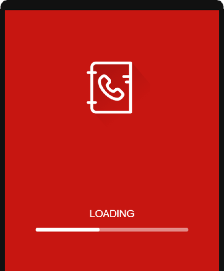

**Recommendation**

To keep the splash screen simple and fast to load you should avoid:

* Requests to the server

* Heavy logic

* Complex UI, namely too many Blocks

For example, consider the following possible approaches:

* Make server requests preferably in an event handler run at a later stage, like On Ready. If you really need to obtain server data in the app initialization stage, minimize the number of server calls (e.g. by obtaining several pieces of data using a single server action designed for the loading stage).

* Do not perform lengthy operations when the mobile app starts. For example, if you must synchronize data that is used in the first screen of the app, keep the data transfer to a minimum and postpone the transfer of secondary data.

**Tip**: To provide an amazing user experience, we also recommend that you [customize the native splash screen](https://success.outsystems.com/documentation/11/delivering_mobile_apps/customize_your_mobile_app/use_custom_splash_screens/).

### Optimize Fetching Server Data for a Screen

Using the On After Fetch of server aggregates to execute other aggregates in sequence will generate several server requests and slow down the application.

**Recommendation**

Create a Data Action containing aggregates in the correct order. This action will run in the server in a single request and return all data.

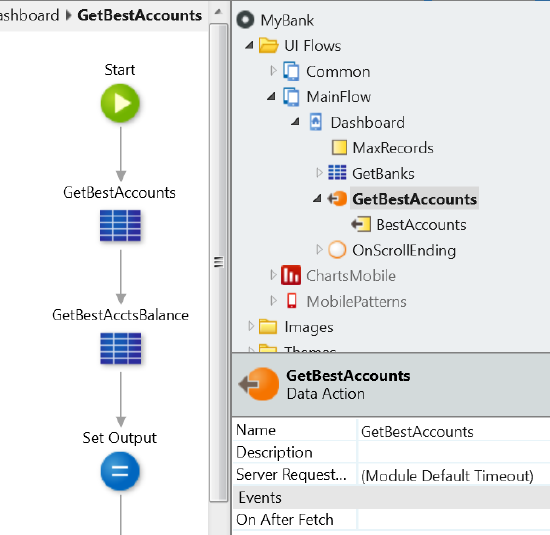

### Optimize the Loading of Lists

Lists involve fetching and rendering multiple records at the same time. If not done carefully, the experience can become cumbersome, especially on low-end devices or with bad network connectivity.

**Recommendation**

To get the most out of lists and provide a good experience, follow these rules:

**Fetch data on demand**

Fetch records as you need them instead of all at once. Start with a minimum set, for example, 10 records. As the user scrolls down, use the On Scroll Ending event to fetch the next set of records — for example, the following 10 records.

To understand how this works, scaffold a list on a screen and this mechanism is provided by default.

**Keep list items simple**

Avoid designing list items with complex logic or complex widgets like JavaScript to load a map from Google Maps, for example. That complexity is multiplied by the number of items being rendered in the list.

**Avoid expanding content in list items**

Do not design list items with content that can be expanded, such as a description that is trimmed and has a 'Show All...' link. This will impact the behavior of the list while rendering. Use OutSystems UI patterns such as [MasterDetail](https://success.outsystems.com/documentation/11/developing_an_application/design_ui/patterns/using_mobile_and_reactive_patterns/adaptive/master_detail/) instead.

**Fine tune how lists fetch data on demand**

Adjust the number of records that are initially loaded, the increment when scrolling down and the scroll threshold to trigger the On Scroll Ending event. It will provide a better user experience when using lists by avoiding visual glitches and slow list scrolls.

The values to use depend on the size of the records:

* The **initial number of fetched items** should ensure a balance between a fast data fetch and a sensible amount of scrolling until a request for more data occurs;

* The **incremental number of fetched items** triggered by scrolling should generally be similar to the initial amount of fetched items, but you may need to tune it according to the usage of your app. If users will frequently use the list to search for entries, your app should be prepared to fetch data faster and load more items at a time;

* The **scroll threshold** that triggers fetching new items is the distance in pixels before the scroll hits the end of the list and should be set to 2000 pixels. If you need to tune this threshold to improve the usability of your application, you can add the attribute infinite-scroll-threshold to the list widget with a new integer value in pixels.

The next picture shows examples of values to use in different situations. You should start with these as initial guidelines and then test and adjust to your specific case.

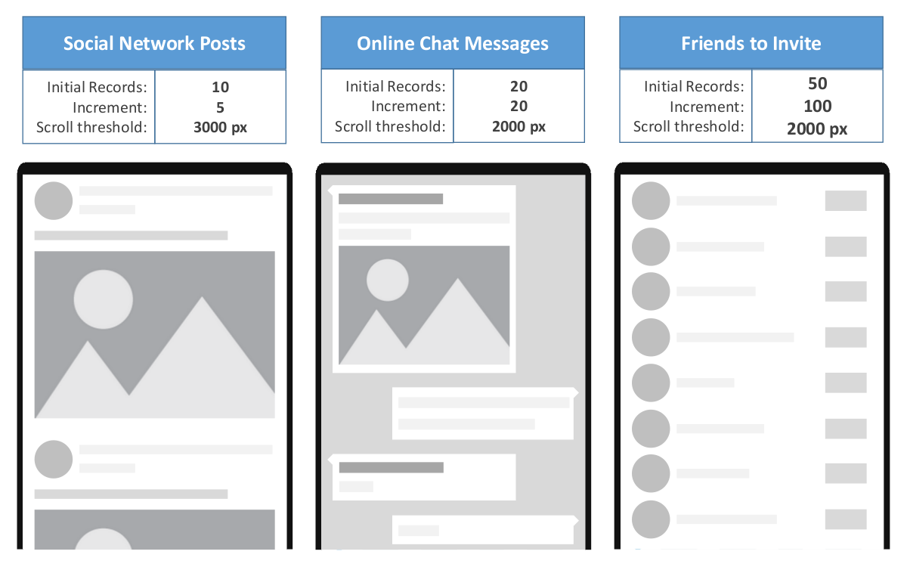

**Provide visual feedback while fetching data on demand**

Users need a clear indication that the list has more items to show and that it is actually doing something. An animated image should be enough to provide this message to the user. Even so, as a performance target, keep in mind that during typical application usage the users should never hit a loading wall at the end of a list.

### Optimize the File Size of Images

Using big image files in your mobile app can increase the download time (or even block the download) and lead to poor performance, especially in older devices or in low connectivity scenarios. They also consume storage space and might be too big for the screens of mobile devices, even high-DPI models.

**Recommendation**

Reduce image size (in bytes) and adapt its dimensions (height/width) considering your target user's experience — follow [Google's Image Optimization](https://developers.google.com/web/fundamentals/performance/optimizing-content-efficiency/image-optimization) recommendations. Also, consider delaying the fetch of images to a later stage. Refer to the best practice to [Prioritize Screen Content Rendering](#prioritize-screen-content-rendering).

## JavaScript

OutSystems generates mobile apps with fast and optimized JavaScript code. You should carefully assess whether to add or not your own JavaScript code. To help you with that, follow these guidelines:

**Use OutSystems low-code instead of custom JavaScript**

The most common components for implementing a mobile app are provided in [OutSystems UI](https://www.outsystems.com/outsystems-ui/) and in the [OutSystems Forge](https://www.outsystems.com/forge/). You can probably find the ones you need for your scenario and customize them accordingly.

**Use JavaScript if strictly necessary and follow the best practices**

Keep in mind that OutSystems low-code is more performant but if you decide to use your own JavaScript, it's important that you read and follow the best practices in this section.

**Use the OutSystems public [JavaScript API](https://success.outsystems.com/documentation/11/reference/outsystems_apis/javascript_api/) and not internal APIs**

Internal APIs are not supported and can change in any upgrade, thus breaking your JavaScript code.

### Follow the Industry JavaScript Best Practices

When writing JavaScript, make sure you know the code you're implementing and how it affects the app.

**Recommendation**

Follow the best practices for JavaScript development like the ones described in [W3Schools](https://www.w3schools.com/js/js_best_practices.asp) or these [JavaScript Coding Standards and Best Practices](https://github.com/stevekwan/best-practices/blob/master/javascript/best-practices.md).

For example, use performant [JavaScript selectors](https://www.w3schools.com/w3js/w3js_selectors.asp) to obtain elements from the DOM, and avoid [properties and methods](https://gist.github.com/paulirish/5d52fb081b3570c81e3a) that trigger the browser to recalculate geometric information for the elements — known as [Layout or Reflow](https://developers.google.com/web/fundamentals/performance/rendering/avoid-large-complex-layouts-and-layout-thrashing).

### Avoid Using External JavaScript Libraries

External JavaScript libraries can be too complex to run on mobile devices.

**Recommendation**

Find OutSystems components in [OutSystems UI](https://www.outsystems.com/outsystems-ui/) or in the [OutSystems Forge](https://www.outsystems.com/forge/) and use them instead of external JavaScript libraries.

However, if it is clear that you really need to [use the JavaScript library](https://success.outsystems.com/documentation/11/extensibility_and_integration/javascript/extend_your_mobile_and_reactive_apps_using_javascript/use_javascript_code_from_an_external_library/), use it in a Script element and not in JavaScript nodes.

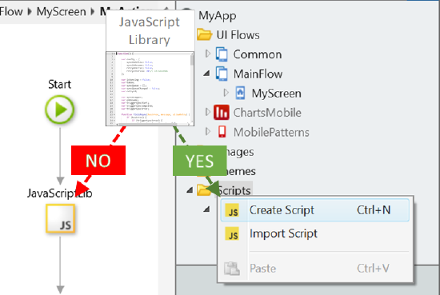

Using JavaScript code in Script elements allows:

* A cleaner implementation of JavaScript libraries in your app.

* Having a single source for each JavaScript library, thus avoiding multiple parses of the same JavaScript code.

### Refactor JavaScript Code into Client Actions

Repeating the same JavaScript code in several JavaScript nodes increases maintainability efforts and makes your app more prone to errors.

**Recommendation**

Encapsulate the repeated JavaScript code in a JavaScript node inside a client action. Call this client action whenever you need to run that JavaScript. This way, the JavaScript code is in a single place which improves the maintainability of the app.

For example, encapsulate troubleshooting JavaScript functions such as console.log(), console.error() and alert() in client actions.

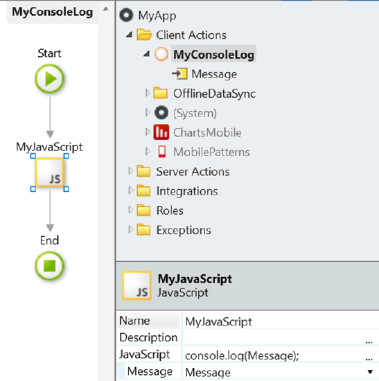

### Avoid Manipulating the DOM

OutSystems mobile apps use React and manipulating the DOM with JavaScript can lead to unpredictable or undesirable behaviors.

**Recommendation**

Do not use JavaScript that manipulates the DOM. This is only for advanced use cases.

If you are implementing a known mobile pattern, look for it in [OutSystems UI](https://www.outsystems.com/outsystems-ui/) or the [OutSystems Forge](https://www.outsystems.com/forge/).

### Avoid Using Global Objects

OutSystems uses [single-page applications](https://en.wikipedia.org/wiki/Single-page_application) to optimize the runtime execution of mobile apps. As such, the window object isn't cleared between navigations and global objects are not destroyed, increasing memory usage in the long run.

**Recommendation**

Avoid using objects that get attached to the window object, like global variables, cache objects, or listeners. Do the following instead:

* Use browser features like [localStorage and sessionStorage](https://www.w3schools.com/html/html5_webstorage.asp) objects.

* Use the 'var' keyword when declaring JavaScript variables to limit their scope.
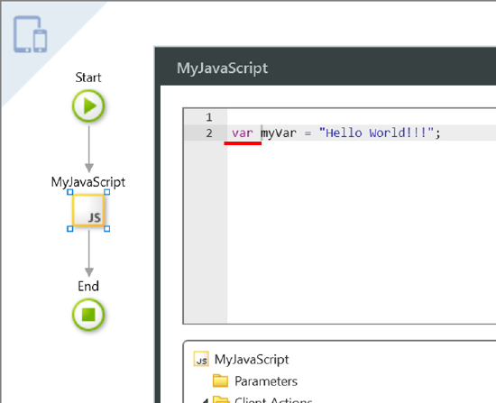

### Change Widgets Style using OutSystems Low-code

Using JavaScript to add/remove CSS classes to change the style of widgets may be a possible source of problems such as less code visibility and integrity, or flickering while rendering.

**Recommendation**

Use the Style Classes property of widgets to change the CSS classes applied to them. In this property you can use expressions that are evaluated at runtime to change the styles dynamically.

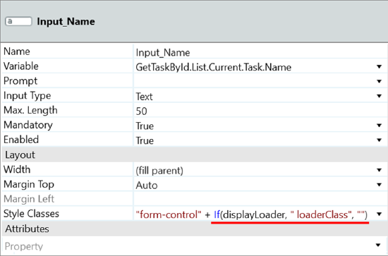

### Use CSS for Animations instead of JavaScript

JavaScript animations typically run on the device's Central Processing Unit (CPU) with direct impact on the mobile app performance.

**Recommendation**

Use OutSystems low-code and style classes to run animations on the device's Graphics Processing Unit (GPU) and remove load from the CPU. For example, in [Making Magic with WebSockets and CSS3](https://www.outsystems.com/blog/magic.html), cards are animated using CSS.

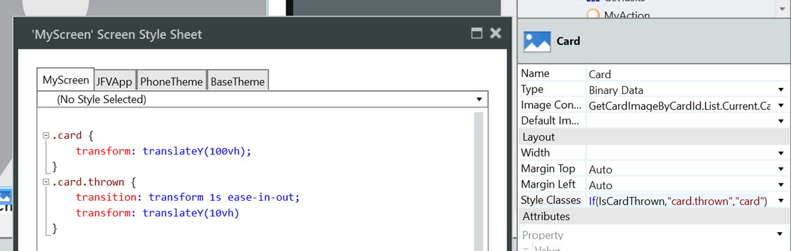

Learn more about how to properly animate elements in your mobile apps in [Smooth as Butter: Achieving 60 FPS Animations with CSS3](https://medium.com/outsystems-experts/how-to-achieve-60-fps-animations-with-css3-db7b98610108) and [FLIP Your 60 FPS Animations, FLIP 'Em Good](https://www.outsystems.com/blog/flip-60-fps-animations-flip-em-good.html).

However, if you really must use JavaScript, use the window.requestAnimationFrame() method to run the animation using the GPU.

## Troubleshooting

Understanding bugs in your mobile apps can sometimes be a hard task, but there are [a few techniques](https://success.outsystems.com/documentation/11/developing_an_application/troubleshooting_applications/solve_common_mobile_app_development_issues/) that facilitate that troubleshooting process. Also following the development guidelines presented below allows you to more easily replicate and fix a problem in your mobile app.

### Define Fallbacks for Your Native Plugins

When you are troubleshooting your app in a desktop browser, the native plugins will not be available. This might prevent you from troubleshooting issues detected in real mobile devices.

**Recommendation**

Include sensible fallbacks in your apps to account for when the plugins are missing or do not work. This helps ensuring that apps can be tested using desktop browsers. You can do so by wrapping your plugin calls in client actions that return an error (or mock data for testing purposes instead) when a given plugin is not available.

In the following example, the AddToContacts action of the Contacts native plugin was wrapped in a client action called AddToContacts_Safe that first validates if the plugin is available:

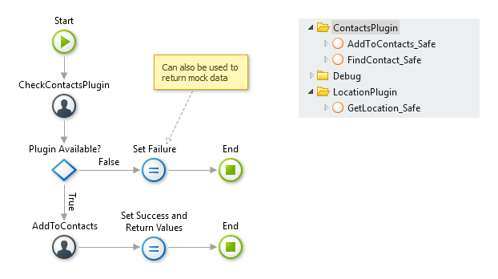

Having these fallbacks in place also helps avoiding issues in the apps running in devices that do not support a given plugin.

### Create a Simple Client-Side Logging System

Client-side issues can be hard to troubleshoot, especially when they seem to occur in a single user's device in production. If you cannot replicate the issues, it will be much difficult to find and fix them.

**Recommendation**

OutSystems provides [a way for you to log information](https://success.outsystems.com/documentation/11/developing_an_application/troubleshooting_applications/log_information_in_action_flows/) in a mobile app. However, you can also create your client-side logging system that stores log entries in local storage. Then provide a way for the user to upload these logs in case of errors. This will allow you to analyze what might have caused an issue in that specific user's device.
