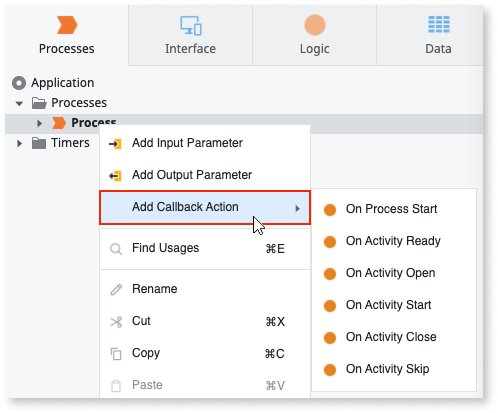

# Use Callback Actions

When developing the process flow of your process, you can implement business rules to validate the process execution using process callback options. Additionally, you can implement business rules to validate the execution of your process activities using activity callback actions. For more information on how to add these actions to your process flow, see [Using Process Callback Actions](actions-callback.md) and [Using Process Activities Callback Actions](actions-activities-callback.md).

